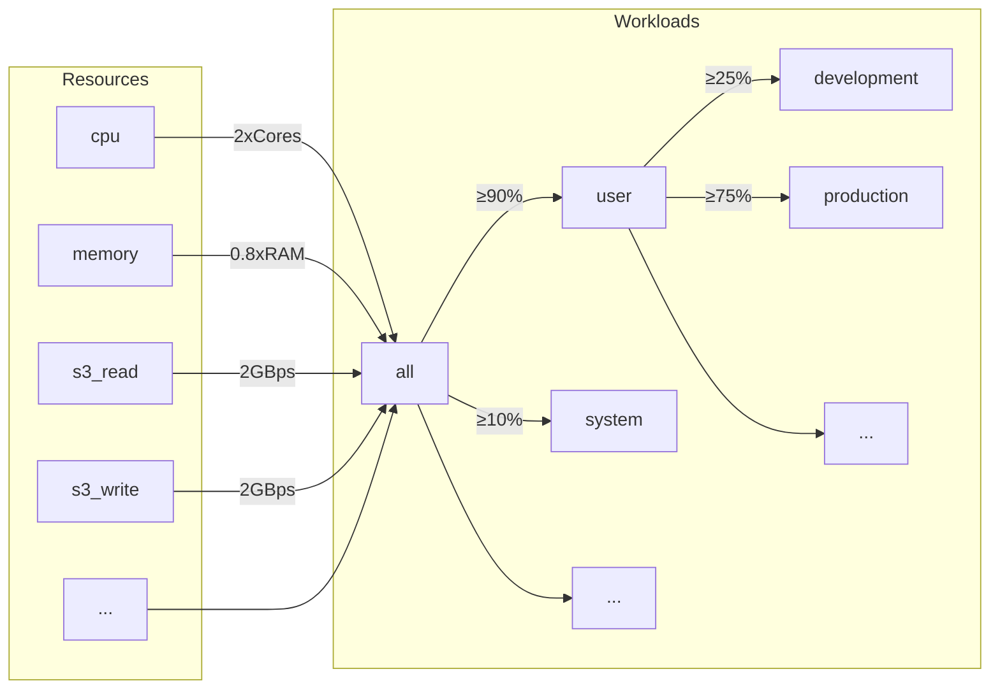
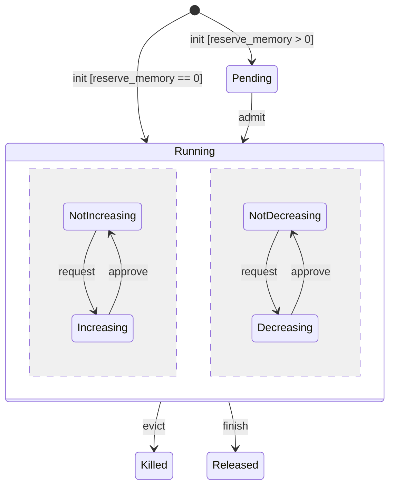
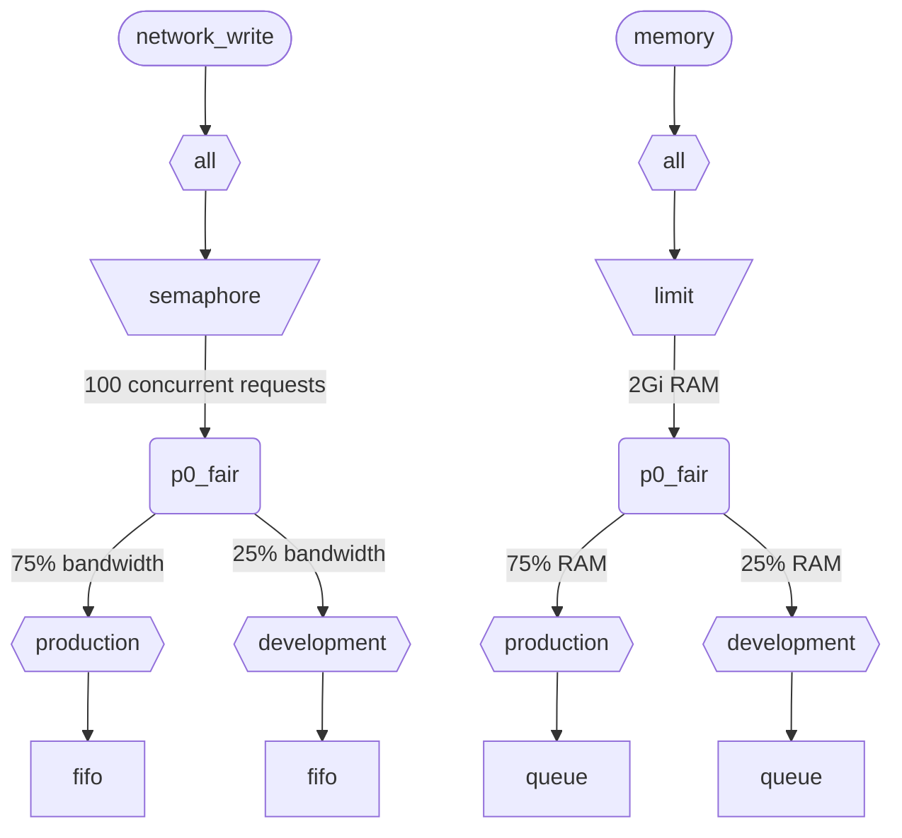

عندما ينفّذ ClickHouse عدة استعلامات في الوقت نفسه، فإنها تستخدم موارد مشتركة (CPU والذاكرة وIO). ويمكن تطبيق قيود وسياسات الجدولة لتنظيم كيفية استخدام الموارد ومشاركتها بين أعباء العمل المختلفة. كما يمكن تهيئة تسلسل هرمي موحّد للجدولة لجميع الموارد. ويمثّل جذر هذا التسلسل الهرمي الموارد المشتركة، بينما تمثّل العقد الطرفية أعباء عمل محددة تحتفظ بطلبات الموارد وتخصيصات استعلامات معيّنة وأنشطة الخلفية.

<div id="resources">
  ## الموارد
</div>

تكون جدولة أعباء العمل معطّلة افتراضيًا. ولتمكينها، يجب إنشاء الموارد التي ستُستخدم في الجدولة، بالإضافة إلى عبء عمل واحد على الأقل. جميع الموارد مستقلة، ويمكن استخدامها بأي مجموعة.

لتمكين جدولة CPU، يجب إنشاء مورد CPU لخيوط MASTER أو WORKER (راجع [جدولة CPU](#cpu_scheduling) لمزيد من التفاصيل):

```sql
CREATE RESOURCE cpu (MASTER THREAD, WORKER THREAD)
```

لتمكين حجز الذاكرة لعبء العمل، يجب إنشاء مورد MEMORY (راجع [حجز الذاكرة](#memory-reservations) للتفاصيل):

```sql
CREATE RESOURCE memory (MEMORY RESERVATION)
```

لتفعيل جدولة خانات الاستعلام، يجب إنشاء مورد QUERY (راجع [جدولة خانات الاستعلام](#query_scheduling) للتفاصيل):

```sql
CREATE RESOURCE query (QUERY)
```

لتمكين جدولة IO لقرص معيّن، يجب إنشاء موارد للقراءة والكتابة لصلاحيتي WRITE وREAD:

```sql
CREATE RESOURCE resource_name (WRITE DISK disk_name, READ DISK disk_name)
-- or
CREATE RESOURCE read_resource_name (WRITE DISK write_disk_name)
CREATE RESOURCE write_resource_name (READ DISK read_disk_name)
```

يمكن استخدام مورد مع أي عدد من الأقراص لعمليات READ أو WRITE أو لكلتيهما معًا، READ وWRITE. وتوجد صياغة تتيح استخدام مورد مع جميع الأقراص:

```sql
CREATE RESOURCE all_io (READ ANY DISK, WRITE ANY DISK);
```

تُصنَّف الموارد بحسب وضع المشاركة:

* **الموارد المشتركة زمنيًا** (CPU, IO, فتحات الاستعلام) - تدير طلبات الموارد التي توضع في قائمة الانتظار عند العقد الطرفية في التسلسل الهرمي للجدولة. تُجدول الطلبات وفقًا للسياسات والقيود التي يحددها هذا التسلسل الهرمي. تُنشأ طلبات الموارد عندما يستخدم الاستعلام المورد المقابل. على سبيل المثال، عندما يقرأ استعلام بيانات من disk، أو يستخدم CPU للمعالجة، تُنشأ طلبات موارد لكل حصة زمنية من العمل المنجز أو لكل عدد من البايتات المرسلة أو المستقبلة عبر socket.
* **الموارد المشتركة من حيث المساحة** (الذاكرة) - تدير تخصيصات الموارد عند العقد الطرفية في التسلسل الهرمي للجدولة. يمكن أن تكون التخصيصات قيد التشغيل أو معلّقة. تُحجب التخصيصات المعلّقة إلى أن تتوفر مساحة كافية أو يُزال تخصيص آخر (يُقتل). تستند القرارات إلى الحدود والسياسات التي يحددها التسلسل الهرمي. توجد مطابقة واحد إلى واحد بين التخصيصات والاستعلامات (أو الأنشطة الخلفية). يُنشأ التخصيص عندما يبدأ الاستعلام التنفيذ، ويُحرَّر عند انتهائه. ويمكن أن يزيد حجم التخصيصات قيد التشغيل أو ينقص ديناميكيًا.

<div id="workloads">
  ## التسلسل الهرمي لأحمال العمل
</div>

يوفّر ClickHouse صياغة SQL مناسبة لتعريف التسلسل الهرمي للجدولة. تُوزَّع جميع الموارد عبر تسلسل هرمي مشترك لـ WORKLOAD. وقد تُعدَّل قواعد التوزيع في بعض الجوانب لموارد معيّنة، لكن التسلسل الهرمي يبقى نفسه. ويتضمن كل WORKLOAD عُقَد الجدولة اللازمة لكل مورد. ويمكن إنشاء عبء عمل فرعي داخل أي عبء عمل، بما يبني هذا التسلسل الهرمي. ولا يفرض ClickHouse أي بنية محددة أو معرّفة مسبقًا للتسلسل الهرمي لأعباء العمل.

في ما يلي مثال على تسلسل هرمي يقسم جميع الموارد بين عبئي العمل &quot;user&quot; و&quot;system&quot; مع ضمان بنسبة 90% و10% على التوالي. لاحظ أن الأوزان المعرّفة لأعباء العمل تُستخدم لتحقيق إنصاف max-min، ولذلك فهي لا توفّر سوى ضمان بأفضل جهد من الأسفل (وليست حدًا أو حصة من الأعلى). وتُنفَّذ الجدولة بالكامل على كل مضيف بشكل مستقل، ولذلك فإن الحدود المعرّفة بواسطة إعدادات `max_*` تكون لكل مضيف. ويقسّم عبء العمل &quot;user&quot; موارده بين عبئي العمل &quot;development&quot; و&quot;production&quot;، بحيث يمتلك &quot;production&quot; موارد تزيد 3 مرات على &quot;development&quot;:

```sql
CREATE RESOURCE cpu (MASTER THREAD, WORKER THREAD)
CREATE RESOURCE memory (MEMORY RESERVATION)
CREATE RESOURCE s3_read (READ DISK s3)
CREATE RESOURCE s3_write (WRITE DISK s3)
CREATE WORKLOAD all SETTINGS max_concurrent_threads_ratio_to_cores = 2, max_memory_ratio = 0.8, max_bytes_per_second = '2Gi'
CREATE WORKLOAD user IN all SETTINGS weight = 9
CREATE WORKLOAD system IN all
CREATE WORKLOAD development IN user
CREATE WORKLOAD production IN user SETTINGS weight = 3
```



يمكن استخدام اسم عبء عمل طرفي لا يحتوي على عناصر فرعية في إعدادات الاستعلام `SETTINGS workload = 'name'`. راجع [وسم عبء العمل](#workload-markup) للحصول على التفاصيل.

لتخصيص عبء العمل، يمكن استخدام الإعدادات التالية:

* `priority` - (للمشاركة الزمنية فقط) تتم خدمة أعباء العمل الشقيقة وفقًا لقيم ثابتة (القيمة الأقل تعني أولوية أعلى). ويؤثر ذلك في الاستباق.
* `precedence` - (للمشاركة المكانية فقط) تُقبَل أعباء العمل الشقيقة وفقًا لقيم ثابتة (القيمة الأقل تعني أسبقية أعلى). ويؤثر ذلك في الإخلاء والقبول.
* `weight` - تتشارك أعباء العمل الشقيقة ذات الأولوية أو الأسبقية الثابتة نفسها الموارد وفقًا للأوزان بطريقة عادلة. ويؤثر ذلك في الاستباق والإخلاء والقبول.
* `max_io_requests` - الحد الأقصى لعدد طلبات IO المتزامنة في عبء العمل هذا.
* `max_bytes_inflight` - الحد الأقصى لإجمالي البايتات قيد المعالجة للطلبات المتزامنة في عبء العمل هذا.
* `max_bytes_per_second` - الحد الأقصى لمعدل قراءة أو كتابة البايتات في عبء العمل هذا.
* `max_burst_bytes` - الحد الأقصى لعدد البايتات التي يمكن أن يعالجها عبء العمل من دون تقييد المعدل (لكل مورد على حدة).
* `max_concurrent_threads` - الحد الأقصى لعدد خيوط التنفيذ الخاصة بالاستعلامات في عبء العمل هذا.
* `max_concurrent_threads_ratio_to_cores` - مثل `max_concurrent_threads`، ولكن محسوب نسبةً إلى عدد أنوية CPU المتاحة.
* `max_cpus` - الحد الأقصى لعدد أنوية CPU المستخدمة لخدمة الاستعلامات في عبء العمل هذا.
* `max_cpu_share` - مثل `max_cpus`، ولكن محسوب نسبةً إلى عدد أنوية CPU المتاحة.
* `max_burst_cpu_seconds` - الحد الأقصى لعدد ثواني CPU التي يمكن أن يستهلكها عبء العمل من دون تقييد المعدل بسبب `max_cpus`.
* `max_memory` - الحد الأقصى لإجمالي الذاكرة المحجوزة لعبء العمل هذا.

جميع الحدود المحددة عبر إعدادات عبء العمل مستقلة لكل مورد. على سبيل المثال، فإن عبء العمل الذي له `max_bytes_per_second = '10Mi'` ستكون له سعة نطاق قدرها 10 MB/s لكل مورد قراءة ومورد كتابة على حدة. إذا كان مطلوبًا حدٌّ مشترك للقراءة والكتابة، ففكّر في استخدام المورد نفسه لوصول READ وWRITE.

لا توجد طريقة لتحديد هياكل هرمية مختلفة لأعباء العمل لموارد مختلفة. ولكن توجد طريقة لتحديد قيمة مختلفة لإعداد عبء العمل لمورد معيّن:

```sql
CREATE OR REPLACE WORKLOAD all SETTINGS max_io_requests = 100, max_bytes_per_second = '1Mi' FOR network_read, max_bytes_per_second = '2Mi' FOR network_write
```

لاحظ أيضًا أنه لا يمكن حذف عبء العمل أو المورد إذا كان يُشار إلى أيٍّ منهما من عبء العمل آخر. ولتحديث تعريف عبء العمل، استخدم استعلام `CREATE OR REPLACE WORKLOAD`.

<Note>
  تُترجم إعدادات عبء العمل إلى مجموعة مناسبة من عُقَد الجدولة. ولمزيد من التفاصيل ذات المستوى الأدنى، راجع وصف [أنواع عُقَد الجدولة وخياراتها](#hierarchy).
</Note>

<div id="workload-markup">
  ## وسم عبء العمل
</div>

يمكن وسم الاستعلامات بالإعداد `workload` لتمييز أعباء العمل المختلفة. وإذا لم يتم تعيين `workload`، فستُستخدم القيمة &quot;default&quot;. لاحظ أنه يمكنك أيضًا تحديد قيمة أخرى باستخدام ملفات تعريف الإعدادات. ويمكن استخدام قيود الإعداد لجعل `workload` ثابتًا إذا كنت تريد وسم جميع استعلامات المستخدم بقيمة ثابتة لإعداد `workload`.

<Warning>
  لا يمكن أن يشير إعداد الاستعلام `workload` إلا إلى أعباء العمل الطرفية (أي أعباء العمل التي ليس لها أعباء عمل فرعية).
</Warning>

```sql
SELECT count() FROM my_table WHERE value = 42 SETTINGS workload = 'production'
SELECT count() FROM my_table WHERE value = 13 SETTINGS workload = 'development'
```

يمكن تعيين الإعداد `workload` لعمليات الخلفية. وتستخدم عمليات الدمج والطفرات إعدادَي الخادم `merge_workload` و`mutation_workload` على الترتيب. ويمكن أيضًا تجاوز هذه القيم لجداول محددة باستخدام إعدادَي MergeTree ‏`merge_workload` و`mutation_workload`.

<div id="cpu_scheduling">
  ## جدولة CPU
</div>

لتمكين جدولة CPU لأحمال العمل، أنشئ مورد CPU وحدّد حدًا أقصى لعدد خيوط التنفيذ المتزامنة:

```sql
CREATE RESOURCE cpu (MASTER THREAD, WORKER THREAD)
CREATE WORKLOAD all SETTINGS max_concurrent_threads = 100
```

عندما ينفّذ خادم ClickHouse العديد من الاستعلامات المتزامنة باستخدام [عدّة خيوط](/ar/reference/settings/session-settings#max_threads)، وتكون جميع فتحات CPU قيد الاستخدام، يتم الوصول إلى حالة التحميل الزائد. في حالة التحميل الزائد، يُعاد جدولة كل فتحة CPU يتم تحريرها إلى عبء العمل المناسب وفقًا لسياسات الجدولة. وبالنسبة إلى الاستعلامات التي تشترك في عبء العمل نفسه، تُخصَّص الفتحات باستخدام أسلوب التناوب الدوري. أمّا الاستعلامات الموجودة في أعباء عمل منفصلة، فتُخصَّص لها الفتحات وفقًا للأوزان والأولويات والحدود المحددة لأعباء العمل.

يُستهلك وقت CPU بواسطة الخيوط عندما لا تكون متوقفة وتعمل على مهام كثيفة الاستهلاك للمعالج. ولأغراض الجدولة، يُميَّز بين نوعين من الخيوط:

* الخيط الرئيسي — أول خيط يبدأ العمل على استعلام أو نشاط في الخلفية مثل عملية دمج أو عملية mutation.
* خيط العامل — الخيوط الإضافية التي يمكن للخيط الرئيسي إنشاؤها للعمل على المهام كثيفة الاستهلاك للمعالج.

قد يكون من المرغوب استخدام موارد منفصلة للخيط الرئيسي وخيوط العامل لتحقيق استجابة أفضل. إذ يمكن لعدد كبير من خيوط العامل أن يحتكر موارد CPU بسهولة عند استخدام قيم مرتفعة لإعداد الاستعلام `max_threads`. وعندئذٍ ينبغي أن تُحجب الاستعلامات الواردة وتنتظر توفّر فتحة CPU حتى تتمكن خيوطها الرئيسية من بدء التنفيذ. ولتجنّب ذلك، يمكن استخدام الإعداد التالي:

```sql
CREATE RESOURCE worker_cpu (WORKER THREAD)
CREATE RESOURCE master_cpu (MASTER THREAD)
CREATE WORKLOAD all SETTINGS max_concurrent_threads = 100 FOR worker_cpu, max_concurrent_threads = 1000 FOR master_cpu
```

سيؤدي ذلك إلى إنشاء حدود منفصلة لخيوط التنفيذ الرئيسية وخيوط التنفيذ العاملة. وحتى إذا كانت جميع فتحات CPU العاملة البالغ عددها 100 مشغولة، فلن تُحجَب الاستعلامات الجديدة ما دامت فتحات CPU الرئيسية متاحة. وستبدأ هذه الاستعلامات التنفيذ بخيط تنفيذ واحد. لاحقًا، إذا أصبحت فتحات CPU العاملة متاحة، فيمكن لهذه الاستعلامات أن تتوسع وتُنشئ خيوط التنفيذ العاملة الخاصة بها. ومن ناحية أخرى، فإن هذا النهج لا يقيّد العدد الإجمالي للفتحات بعدد معالجات CPU، كما أن تشغيل عدد كبير جدًا من خيوط التنفيذ المتزامنة سيؤثر في الأداء.

إن تقييد تزامن خيوط التنفيذ الرئيسية لن يقيّد عدد الاستعلامات المتزامنة. فقد تُحرَّر فتحات CPU أثناء تنفيذ الاستعلام ثم تستحوذ عليها خيوط تنفيذ أخرى من جديد. على سبيل المثال، يمكن تنفيذ 4 استعلامات متزامنة مع فرض حدّ قدره خيطان رئيسيان متزامنان، كلها بالتوازي. في هذه الحالة، سيحصل كل استعلام على 50% من معالج CPU. ينبغي استخدام منطق منفصل لتقييد عدد الاستعلامات المتزامنة، وهذا غير مدعوم حاليًا لأحمال العمل.

يمكن استخدام حدود تزامن منفصلة لخيوط التنفيذ لأحمال العمل:

```sql
CREATE RESOURCE cpu (MASTER THREAD, WORKER THREAD)
CREATE WORKLOAD all
CREATE WORKLOAD admin IN all SETTINGS max_concurrent_threads = 10
CREATE WORKLOAD production IN all SETTINGS max_concurrent_threads = 100
CREATE WORKLOAD analytics IN production SETTINGS max_concurrent_threads = 60, weight = 9
CREATE WORKLOAD ingestion IN production
```

يوفّر مثال على التهيئة هذا تجمعات مستقلة لفتحات CPU لكلٍّ من المسؤول وبيئة الإنتاج. ويكون تجمع بيئة الإنتاج مشتركًا بين التحليلات والإدخال. علاوة على ذلك، إذا كان تجمع بيئة الإنتاج مثقلاً، فستُعاد جدولة 9 من كل 10 فتحات يتم تحريرها إلى الاستعلامات التحليلية عند الحاجة. ولن تحصل استعلامات الإدخال إلا على فتحة واحدة من كل 10 فتحات خلال فترات الحمل الزائد. وقد يساعد ذلك في تحسين زمن الاستجابة للاستعلامات الموجّهة للمستخدم. وللتحليلات حدّ خاص بها يبلغ 60 خيط تنفيذ متزامنًا، ما يترك دائمًا 40 خيطًا على الأقل لدعم الإدخال. وعندما لا يكون هناك حمل زائد، يمكن للإدخال استخدام الخيوط المئة كلها.

لاستبعاد استعلام من جدولة CPU، اضبط إعداد الاستعلام [use&#95;concurrency&#95;control](/ar/reference/settings/session-settings#use_concurrency_control) على 0.

لا تدعم جدولة CPU عمليات الدمج والطفرات بعد.

ولتوفير تخصيصات عادلة لعبء العمل، من الضروري تنفيذ الاستباق والتقليص أثناء تنفيذ الاستعلام. يُفعَّل الاستباق باستخدام إعداد الخادم `cpu_slot_preemption`. وإذا كان مفعّلًا، يجدّد كل خيط تنفيذ فتحة CPU الخاصة به دوريًا (وفقًا لإعداد الخادم `cpu_slot_quantum_ns`). وقد يؤدي هذا التجديد إلى حظر التنفيذ إذا كان CPU مثقلاً. وعندما يُحظر التنفيذ لفترة طويلة (راجع إعداد الخادم `cpu_slot_preemption_timeout_ms`)، يُقلَّص الاستعلام وينخفض عدد خيوط التنفيذ المتزامنة العاملة ديناميكيًا. لاحظ أن عدالة وقت CPU مضمونة بين أعباء العمل، لكنها قد لا تتحقق بين الاستعلامات داخل عبء العمل نفسه في بعض الحالات الطرفية.

<Warning>
  توفّر جدولة الفتحات وسيلة للتحكم في [تزامن الاستعلامات](/ar/reference/settings/session-settings#max_threads)، لكنها لا تضمن تخصيصًا عادلًا لوقت CPU ما لم يكن إعداد الخادم `cpu_slot_preemption` مضبوطًا على `true`؛ وإلا فستُوفَّر العدالة استنادًا إلى عدد تخصيصات فتحات CPU بين أعباء العمل المتنافسة. وهذا لا يعني تساوي مقدار ثواني CPU، لأنه من دون الاستباق قد تبقى فتحة CPU محجوزة إلى أجل غير مسمى. يحصل خيط التنفيذ على فتحة في البداية ويحررها عند اكتمال العمل.
</Warning>

<Note>
  يؤدي تعريف مورد CPU إلى إبطال مفعول الإعدادين [`concurrent_threads_soft_limit_num`](/ar/reference/settings/server-settings/settings#concurrent_threads_soft_limit_num) و[`concurrent_threads_soft_limit_ratio_to_cores`](/ar/reference/settings/server-settings/settings#concurrent_threads_soft_limit_ratio_to_cores). وبدلاً من ذلك، يُستخدم إعداد عبء العمل `max_concurrent_threads` لتقييد عدد وحدات CPU المخصّصة لعبء عمل معيّن. وللحصول على السلوك السابق، أنشئ فقط مورد WORKER THREAD، واضبط `max_concurrent_threads` لعبء العمل `all` على القيمة نفسها لـ `concurrent_threads_soft_limit_num`، واستخدم إعداد الاستعلام `workload = "all"`. ويتوافق هذا الضبط مع تعيين الإعداد [`concurrent_threads_scheduler`](/ar/reference/settings/server-settings/settings#concurrent_threads_scheduler) إلى القيمة &quot;fair&#95;round&#95;robin&quot;.
</Note>

<div id="threads_vs_cpus">
  ## الخيوط مقابل وحدات CPU
</div>

هناك طريقتان للتحكم في استهلاك CPU لعبء العمل:

* حد عدد الخيوط: `max_concurrent_threads` و `max_concurrent_threads_ratio_to_cores`
* خنق CPU: `max_cpus` و `max_cpu_share` و `max_burst_cpu_seconds`

<Warning>
  لا تكون إعدادات خنق CPU فعّالة إلا إذا كان إعداد الخادم `cpu_slot_preemption` مُمكّنًا، وإلا فسيتم تجاهلها.
</Warning>

تتيح الطريقة الأولى التحكم ديناميكيًا في عدد الخيوط التي يتم إنشاؤها للاستعلام، وذلك بحسب الحمل الحالي على الخادم. وهي تقلّل فعليًا مما تفرضه إعدادات الاستعلام `max_threads`. أما الطريقة الثانية فتقوم بخنق استهلاك CPU لعبء العمل باستخدام خوارزمية token bucket. وهي لا تؤثر مباشرةً في عدد الخيوط، لكنها تحدّ من إجمالي استهلاك CPU لجميع الخيوط في عبء العمل.

يعني خنق token bucket باستخدام `max_cpus` و `max_burst_cpu_seconds` ما يلي: خلال أي interval مقداره `delta` ثانية، لا يُسمح بأن يزيد إجمالي استهلاك CPU لجميع الاستعلامات في عبء العمل على `max_cpus * delta + max_burst_cpu_seconds` ثانية CPU. وهو يقيّد متوسط الاستهلاك عند `max_cpus` على المدى الطويل، لكن قد يتم تجاوز هذا الحد على المدى القصير. على سبيل المثال، إذا كانت `max_burst_cpu_seconds = 60` و `max_cpus=0.001`، فيُسمح بتشغيل خيط واحد لمدة 60 ثانية، أو خيطين لمدة 30 ثانية، أو 60 خيطًا لمدة ثانية واحدة، من دون خنق. القيمة الافتراضية لـ `max_burst_cpu_seconds` هي ثانية واحدة. وقد تؤدي القيم الأقل إلى عدم الاستفادة الكاملة من الأنوية المسموح بها في `max_cpus` عند وجود عدد كبير من الخيوط المتزامنة.

أثناء احتفاظ خيط بفتحة CPU، يمكن أن يكون في واحدة من ثلاث حالات رئيسية:

* **Running:** يستهلك مورد CPU فعليًا. ويُحتسب الوقت المقضي في هذه الحالة ضمن خنق CPU.
* **Ready:** ينتظر حتى تصبح وحدة CPU متاحة. لا يُحتسب الوقت المقضي في هذه الحالة ضمن خنق CPU.
* **Blocked:** ينفّذ عمليات IO أو استدعاءات نظام حاجبة أخرى (مثل انتظار mutex). لا يُحتسب الوقت المقضي في هذه الحالة ضمن خنق CPU.

لننظر إلى مثال على configuration يجمع بين خنق CPU وحدود عدد الخيوط:

```sql
CREATE RESOURCE cpu (MASTER THREAD, WORKER THREAD)
CREATE WORKLOAD all SETTINGS max_concurrent_threads_ratio_to_cores = 2
CREATE WORKLOAD admin IN all SETTINGS max_concurrent_threads = 2, priority = -1
CREATE WORKLOAD production IN all SETTINGS weight = 4
CREATE WORKLOAD analytics IN production SETTINGS max_cpu_share = 0.7, weight = 3
CREATE WORKLOAD ingestion IN production
CREATE WORKLOAD development IN all SETTINGS max_cpu_share = 0.3
```

نقيّد هنا العدد الإجمالي للخيوط لجميع الاستعلامات ليكون ضعف عدد وحدات CPU المتاحة. ويُقيَّد عبء العمل Admin بخيطين كحد أقصى، بغضّ النظر عن عدد وحدات CPU المتاحة. وتكون أولوية Admin هي ‎-1‎ (أقل من `default` ذي القيمة 0)، ويحصل أولًا على أي فتحة CPU عند الحاجة. وعندما لا يُشغّل Admin أي استعلامات، تُوزَّع موارد CPU بين أعباء عمل الإنتاج والتطوير. وتعتمد الحصص المضمونة من وقت CPU على الأوزان (4 إلى 1): يذهب ما لا يقل عن 80% إلى الإنتاج (عند الحاجة)، ويذهب ما لا يقل عن 20% إلى التطوير (عند الحاجة). وبينما توفّر الأوزان هذه الضمانات، يفرض تقييد CPU حدودًا: فالإنتاج غير مقيَّد ويمكنه استهلاك 100%، بينما للتطوير حدّ قدره 30%، ويُطبَّق هذا الحد حتى إذا لم تكن هناك استعلامات من أعباء عمل أخرى. وعبء عمل الإنتاج ليس عقدة طرفية، لذا تُقسَّم موارده بين التحليلات والاستيعاب وفقًا للأوزان (3 إلى 1). وهذا يعني أن التحليلات لها حصة مضمونة لا تقل عن ‎0.8 * 0.75 = 60%‎، وبالاستناد إلى `max_cpu_share`، فلها حد أقصى يبلغ 70% من إجمالي موارد CPU. أما الاستيعاب، فرغم أن حصته المضمونة لا تقل عن ‎0.8 * 0.25 = 20%‎، فلا يوجد له حد أعلى.

<Note>
  إذا كنت تريد زيادة استخدام CPU إلى أقصى حد على ClickHouse server، فتجنّب استخدام `max_cpus` و`max_cpu_share` لعبء العمل الجذر `all`. وبدلًا من ذلك، اضبط قيمة أعلى لـ `max_concurrent_threads`. على سبيل المثال، في نظام يحتوي على 8 وحدات CPU، اضبط `max_concurrent_threads = 16`. يتيح ذلك تشغيل 8 خيوط لمهام CPU، بينما يمكن لـ 8 خيوط أخرى التعامل مع عمليات I/O. وستُحدِث الخيوط الإضافية ضغطًا على CPU، ما يضمن تطبيق قواعد الجدولة. وعلى النقيض من ذلك، فإن ضبط `max_cpus = 8` لن يُحدِث أبدًا ضغطًا على CPU لأن الخادم لا يمكنه تجاوز وحدات CPU الثماني المتاحة.
</Note>

<div id="memory-reservations">
  ## حجوزات الذاكرة
</div>

<Note>
  جدولة حجوزات الذاكرة تجريبية. ولا تسري إلا عند وجود مورد `MEMORY RESERVATION`، وقد تتغير صيغتها في SQL وسلوكها في الإصدارات المستقبلية. وهي غير مدعومة بعد لعمليات الدمج والطفرات، كما أن إخلاء استعلام قيد التشغيل يتم على أساس أفضل جهد: إذ يسري عند نقطة مزامنة الذاكرة التالية للاستعلام بدلًا من أن يحدث فورًا.
</Note>

لتمكين حجوزات الذاكرة لأعباء العمل، أنشئ مورد `MEMORY RESERVATION` واضبط حدًا واحدًا على الأقل لإجمالي الذاكرة المحجوزة باستخدام إعدادات أعباء العمل:

```sql
CREATE RESOURCE memory (MEMORY RESERVATION)
CREATE WORKLOAD all SETTINGS max_memory = '2Gi'
```

يتتبّع ClickHouse تخصيصات الذاكرة لجميع الاستعلامات والأنشطة التي تعمل في الخلفية. ويُجمَّع عدد البايتات المخصَّصة عبر التسلسل الهرمي للجدولة حتى يصل إلى الجذر. ولكل استعلام تخصيص مرتبط به ضمن عبء العمل النهائي الذي ينتمي إليه. وإذا كانت قيمة الإعداد `reserve_memory` للاستعلام أكبر من صفر، فسيُنشأ التخصيص في حالة معلّقة. ويحجز التخصيص المعلّق مقدار الذاكرة المطلوب ضمن التسلسل الهرمي لعبء العمل. وإذا لم تكن هناك ذاكرة متاحة كافية، فسيظل التخصيص معلّقًا إلى أن تتحرر ذاكرة كافية أو تُزال تخصيصات أخرى (تُقتل). وعندما يُقبَل التخصيص، يصبح قيد التشغيل. ويمكن أن يزيد التخصيص قيد التشغيل حجمه أو يقلّصه ديناميكيًا وفقًا لاستهلاك الاستعلام للذاكرة. ويمكن تمثيل دورة حياة التخصيص بمخطط الحالات التالي:



تُقبَل تخصيصات عبء العمل الطرفي المعلّقة وفق ترتيب FIFO. وعندما تكون هناك عدة أعباء عمل لديها تخصيصات معلّقة، تُقبَل وفق إعدادات الأسبقية والأوزان. وتُخدَم أعباء العمل ذات الأسبقية الأعلى أولًا. أما أعباء العمل الشقيقة ذات الأسبقية نفسها فتتقاسم الذاكرة وفق الأوزان بطريقة عادلة من نوع max-min، ما يعني أن عبء العمل ذو استخدام الذاكرة المعياري الأقل (الاستخدام الحالي مضافًا إليه الزيادة المطلوبة ثم مقسومًا على الوزن) يُخدَم أولًا. ويُطبَّق المنطق العكسي أثناء الإخلاء. وعندما يلزم تحرير الذاكرة، تُخلى أولًا أعباء العمل ذات الأسبقية الأدنى واستخدام الذاكرة المعياري الأعلى.

لاحظ أن الموارد المشتركة زمنيًا تستخدم الأولوية، بينما الموارد المشتركة من حيث السعة تستخدم الأسبقية. وهما إعدادان مستقلان ويمكن ضبطهما على قيم مختلفة. فالأولوية الأعلى تعني استباقًا غير هدّام (تأخيرًا أو تقييدًا)، بينما قد تعني الأسبقية الأعلى إخلاءً هدّامًا (إيقافًا مصحوبًا بخطأ). وقد يكون لعبء العمل أولوية عالية لجدولة CPU، مع احتفاظه بالأسبقية نفسها لحجز الذاكرة، لتجنّب إخلاء أعباء عمل أخرى وفقدان العمل الذي أُنجز فيها بالفعل.

يضمن كل عبء عمل لديه حد `max_memory` ألا يتجاوز إجمالي الذاكرة المخصّصة في شجرته الفرعية هذا الحد. وإذا كان تخصيص معلّق أو زيادة في تخصيص قائم سيتجاوز هذا الحد، فسيبدأ إجراء الإخلاء لتحرير الذاكرة. ويختار إجراء الإخلاء ضحيةً لإنهائها. ويمنع عبء العمل الذي يمثّل السلف المشترك الأدنى بين المتسبّب بالإخلاء والضحية عملية الإخلاء في الحالات التالية:

* لا يمكن للتخصيص المعلّق أن يُخلي تخصيصات قيد التشغيل داخل عبء العمل نفسه. (يتطابق عبءا العمل: المتسبّب بالإخلاء والضحية).
* لا يمكن مطلقًا لتخصيص معلّق ذي أسبقية أدنى أن يُنهي عبء عمل ذي أسبقية أعلى.
* لا يمكن للتخصيص المعلّق أن يُنهي تخصيصًا له الأسبقية نفسها. لاحظ أن التخصيصات قيد التشغيل ذات الأسبقية نفسها قد تُخلي بعضها بعضًا استنادًا إلى استخدام الذاكرة المعياري.
  وإذا مُنع الإخلاء أو لم يحرر قدرًا كافيًا من الذاكرة، فسيُحظر التخصيص الجديد حتى تتحرر ذاكرة كافية. وتسمح هذه القواعد بوضع الاستعلامات الزائدة في قائمة الانتظار استنادًا إلى ضغط الذاكرة، وتوفّر طريقة ملائمة لتجنّب أخطاء MEMORY&#95;LIMIT&#95;EXCEEDED.

<Note>
  حدود عبء العمل مستقلة عن الطرق الأخرى لتقييد استهلاك الذاكرة، مثل إعداد الاستعلام [max&#95;memory&#95;usage](/ar/reference/settings/session-settings#max_memory_usage). ويمكن استخدامها معًا لتحقيق تحكم أفضل في استهلاك الذاكرة. ومن الممكن تعيين حدود مستقلة للذاكرة استنادًا إلى المستخدمين (وليس أعباء العمل). وهذا أقل مرونة ولا يوفّر ميزات مثل حجز الذاكرة ووضع الاستعلامات المعلّقة في قائمة الانتظار. راجع [Memory overcommit](/ar/concepts/features/configuration/settings/memory-overcommit)
</Note>

يحد إعداد عبء العمل `max_waiting_queries` من عدد التخصيصات المعلّقة لعبء العمل. وعند بلوغ الحد، يُرجع الخادم الخطأ `SERVER_OVERLOADED`. لاحظ أن `max_waiting_queries` لا يُورَّث إلى أعباء العمل الفرعية، ولا يكون ذا معنى إلا لأعباء العمل الطرفية.

لا تزال جدولة حجز الذاكرة غير مدعومة لعمليات الدمج والطفرات حتى الآن.

فقط الاستعلامات التي يكون فيها الإعداد `reserve_memory` أكبر من الصفر تكون عرضةً للحجب أثناء انتظار حجز الذاكرة. ومع ذلك، فإن الاستعلامات التي تكون فيها قيمة `reserve_memory` صفراً تُحتسب أيضاً ضمن البصمة الذاكرية لعبء العمل الخاص بها، ويمكن إزاحتها عند الحاجة لتحرير الذاكرة من أجل تخصيصات أخرى معلّقة أو متزايدة. أما الاستعلامات التي لا تحتوي على وسم عبء عمل مناسب، فلا تخضع لجدولة حجز الذاكرة، ولا يمكن للمجدول إزاحتها.

لتوفير حجز ذاكرة غير مرن لاستعلام ما، اضبط كلاً من إعدادَي الاستعلام `reserve_memory` و`max_memory_usage` على القيمة نفسها. في هذه الحالة، سيحجز الاستعلام مقداراً ثابتاً من الذاكرة، ولن يكون قادراً على زيادة تخصيصه ديناميكياً. لاحظ أن حجز الذاكرة المرن يمكن زيادته فوق `reserve_memory` حتى `max_memory_usage` من دون إنهاء الاستعلام، ما لم يكن هناك ضغط على الذاكرة. لكنه لا يمكن أن ينخفض إلى ما دون `reserve_memory` حتى عندما يكون الاستهلاك الفعلي أقل.

لننظر إلى مثال على إعداد:

```sql
CREATE RESOURCE memory (MEMORY RESERVATION)
CREATE WORKLOAD all SETTINGS max_memory = '10Gi'
CREATE WORKLOAD system IN all SETTINGS weight = 1
CREATE WORKLOAD user IN all SETTINGS weight = 9
CREATE WORKLOAD production IN user SETTINGS precedence = 1, weight = 3
CREATE WORKLOAD staging IN user SETTINGS precedence = 1, weight = 1
CREATE WORKLOAD testing IN user SETTINGS precedence = 2
```

في هذا المثال، لا يمكن أن يتجاوز إجمالي الذاكرة المحجوزة لجميع الاستعلامات والأنشطة الخلفية 10 GiB. يتمتع عبء عمل النظام بحدٍّ أدنى مضمون قدره 1 GiB ‏(10% من 10 GiB)، بينما يتمتع عبء عمل المستخدم بحدٍّ أدنى مضمون قدره 9 GiB ‏(90% من 10 GiB). داخل عبء عمل المستخدم، يتشارك عبءا العمل production وstaging الذاكرة وفقًا للأوزان (3 إلى 1) وبأسبقية متساوية مقدارها 1. أما عبء عمل testing فأسبقيته 2، وهي أقل من production وstaging. لذلك، لا يمكن لعبء عمل testing استخدام إلا الذاكرة غير المستخدمة من قِبل production وstaging.

إذا حدث ضغط على الذاكرة، فستُزال تخصيصات عبء عمل testing أولًا. ثم إذا دعت الحاجة إلى تحرير مزيد من الذاكرة، فستُزال تخصيصات عبء عمل staging قبل تخصيصات عبء عمل production إذا تجاوزت حدودها المضمونة. لاحظ أن الاستعلامات المعلّقة في production وstaging يمكنها إزالة التخصيصات قيد التشغيل في عبء عمل testing لتحرير الذاكرة، لكنها لا تستطيع إزالة تخصيصات بعضها بعضًا لأن لهما الأسبقية نفسها. وفي حالة ضغط الذاكرة، ستنتظر في قوائم الانتظار، مما يتيح للنظام تجنّب أخطاء MEMORY&#95;LIMIT&#95;EXCEEDED الناتجة عن تنفيذ عدد كبير جدًا من الاستعلامات بالتوازي.

لاحظ أن عبء عمل النظام له أسبقية 0 (default)، وهي أعلى من أعباء العمل production وstaging وtesting، لكنها ليست أعباء عمل شقيقة له. وأقرب سلف مشترك هو عبء العمل all، إذ إن كلا الفرعين التابعين له لهما الأسبقية نفسها. لذلك، لا يمكن لعبء عمل النظام المعلّق إزالة أيٍّ منها، والعكس صحيح. وهذا يضمن عدم سهولة إزالة أنشطة النظام.

<div id="query_scheduling">
  ## جدولة حصص الاستعلام
</div>

لتمكين جدولة حصص الاستعلام لأعباء العمل، أنشئ مورد QUERY وحدّد حدًا لعدد الاستعلامات المتزامنة أو عدد الاستعلامات في الثانية:

```sql
CREATE RESOURCE query (QUERY)
CREATE WORKLOAD all SETTINGS max_concurrent_queries = 100, max_queries_per_second = 10, max_burst_queries = 20
```

يحدّ إعداد عبء العمل `max_concurrent_queries` من عدد الاستعلامات المتزامنة التي يمكن تشغيلها في الوقت نفسه لعبء عمل معيّن. وهو مماثل لإعداد الاستعلام [`max_concurrent_queries_for_all_users`](/ar/reference/settings/session-settings#max_concurrent_queries_for_all_users) وإعداد الخادم [max&#95;concurrent&#95;queries](/ar/reference/settings/server-settings/settings#max_concurrent_queries). ولا تُحتسب استعلامات async insert وبعض الاستعلامات المحددة، مثل KILL، ضمن هذا الحد.

يحدّ إعدادا عبء العمل `max_queries_per_second` و`max_burst_queries` عدد الاستعلامات لعبء العمل باستخدام مُقيِّد من نوع token bucket. ويضمن ذلك أنه خلال أي فترة زمنية `T` لن يبدأ تنفيذ أكثر من `max_queries_per_second * T + max_burst_queries` من الاستعلامات الجديدة.

يحدّ إعداد عبء العمل `max_waiting_queries` من عدد الاستعلامات المنتظرة لعبء العمل. وعند بلوغ هذا الحد، يعيد الخادم الخطأ `SERVER_OVERLOADED`. لاحظ أن `max_waiting_queries` لا يُورَّث إلى أعباء العمل الفرعية ولا يكون ذا معنى إلا لأعباء العمل الطرفية.

<Note>
  ستنتظر الاستعلامات المحجوبة إلى أجل غير مسمّى، ولن تظهر في `SHOW PROCESSLIST` حتى تُستوفى جميع القيود.
</Note>

<div id="workload_entity_storage">
  ## تخزين أحمال العمل والموارد
</div>

تُخزَّن تعريفات جميع أحمال العمل والموارد، بصيغة استعلامات `CREATE WORKLOAD` و`CREATE RESOURCE`، تخزينًا دائمًا إما على القرص في `workload_path` أو في ZooKeeper عند `workload_zookeeper_path`. ويُوصى باستخدام التخزين في ZooKeeper لتحقيق الاتساق بين العُقد. وبدلًا من ذلك، يمكن استخدام البند `ON CLUSTER` إلى جانب التخزين على القرص.

<div id="config_based_workloads">
  ## أحمال العمل والموارد المستندة إلى التهيئة
</div>

إضافةً إلى التعريفات المستندة إلى SQL، يمكن أيضًا تعريف أحمال العمل والموارد مسبقًا في ملف تهيئة الخادم. ويكون ذلك مفيدًا في البيئات السحابية، حيث تفرض البنية التحتية بعض القيود، بينما يمكن للعملاء تغيير حدود أخرى. وتكون الكيانات المستندة إلى التهيئة ذات أولوية على تلك المعرَّفة باستخدام SQL، ولا يمكن تعديلها أو حذفها باستخدام أوامر SQL.

<div id="config_based_workloads_format">
  ### تنسيق التهيئة
</div>

```xml
<clickhouse>
    <resources_and_workloads>
        CREATE RESOURCE memory (MEMORY RESERVATION);
        CREATE RESOURCE s3disk_read (READ DISK s3);
        CREATE RESOURCE s3disk_write (WRITE DISK s3);
        CREATE WORKLOAD all SETTINGS max_memory = '2Gi', max_io_requests = 500 FOR s3disk_read, max_io_requests = 1000 FOR s3disk_write, max_bytes_per_second = '1280Mi' FOR s3disk_read, max_bytes_per_second = '3200Mi' FOR s3disk_write;
        CREATE WORKLOAD production IN all SETTINGS weight = 3;
    </resources_and_workloads>
</clickhouse>
```

تستخدم هذه التهيئة صياغة SQL نفسها المستخدمة في عبارتي `CREATE WORKLOAD` و`CREATE RESOURCE`. يجب أن تكون جميع الاستعلامات صحيحة.

<div id="config_based_workloads_usage_recommendations">
  ### توصيات الاستخدام
</div>

في البيئات السحابية، قد تتضمن التهيئة النموذجية ما يلي:

1. حدِّد عبء العمل الجذري وموارد IO للشبكة في التهيئة لوضع حدود البنية التحتية
2. اضبط `throw_on_unknown_workload` لفرض هذه الحدود
3. أنشئ `CREATE WORKLOAD default IN all` لتطبيق الحدود تلقائيًا على جميع الاستعلامات (لأن القيمة الافتراضية لإعداد الاستعلام `workload` هي &#39;default&#39;)
4. اسمح للمستخدمين بإنشاء أعباء عمل إضافية ضمن التسلسل الهرمي المُعدّ

يضمن ذلك أن تلتزم جميع الأنشطة التي تعمل في الخلفية وجميع الاستعلامات بقيود البنية التحتية، مع إتاحة المرونة لسياسات الجدولة الخاصة بالمستخدمين.

ومن حالات الاستخدام الأخرى وجود تهيئات مختلفة لعُقد مختلفة في عنقود غير متجانس.

<div id="strict_resource_access">
  ## الوصول المقيّد إلى الموارد
</div>

لفرض التزام جميع الاستعلامات بسياسات جدولة الموارد، يوجد إعداد على مستوى الخادم باسم `throw_on_unknown_workload`. إذا ضُبط على `true`، فسيُطلب من كل استعلام استخدام إعداد `workload` صالح، وإلا فسيُرفع الاستثناء `RESOURCE_ACCESS_DENIED`. وإذا ضُبط على `false`، فلن يستخدم هذا الاستعلام مجدول الموارد، أي سيحصل على وصول غير محدود إلى أي `RESOURCE`. يتيح إعداد الاستعلام &#39;use&#95;concurrency&#95;control = 0&#39; للاستعلام تجاوز مجدول CPU والحصول على وصول غير محدود إلى CPU. ولفرض جدولة CPU، أنشئ قيدًا على الإعداد للإبقاء على &#39;use&#95;concurrency&#95;control&#39; كقيمة ثابتة للقراءة فقط.

<Note>
  لا تضبط `throw_on_unknown_workload` على `true` ما لم يكن `CREATE WORKLOAD default` قد نُفِّذ. فقد يؤدي ذلك إلى مشكلات في بدء تشغيل الخادم إذا نُفِّذ أثناء بدء التشغيل استعلام بدون إعداد `workload` صريح.
</Note>

<div id="hierarchy">
  ### التسلسل الهرمي لعُقد الجدولة
</div>

من منظور النظام الفرعي للجدولة، يمثّل كل مورد تسلسلاً هرميًا من عُقد الجدولة. ينشئ ClickHouse تلقائيًا جميع عُقد الجدولة اللازمة استنادًا إلى تعريفات WORKLOAD وRESOURCE. وتُعد عُقد الجدولة تفاصيل تنفيذ داخلية منخفضة المستوى، ويمكن الوصول إليها عبر جدول [system.scheduler](/ar/reference/system-tables/scheduler).

```sql
CREATE RESOURCE network_write (WRITE DISK s3)
CREATE RESOURCE memory (MEMORY RESERVATION)
CREATE WORKLOAD all SETTINGS max_io_requests = 100, max_memory = '2Gi'
CREATE WORKLOAD development IN all
CREATE WORKLOAD production IN all SETTINGS weight = 3
```



**أنواع العقد ذات المشاركة الزمنية:**

* `inflight_limit` (قيد) - يمنع التنفيذ إذا تجاوز عدد الطلبات الجارية المتزامنة `max_requests`، أو إذا تجاوزت تكلفتها الإجمالية `max_cost`؛ ويجب أن تكون له عقدة فرعية واحدة.
* `bandwidth_limit` (قيد) - يمنع التنفيذ إذا تجاوز عرض النطاق الحالي `max_speed` (0 تعني غير محدود) أو تجاوز الاندفاع `max_burst` (يساوي `max_speed` افتراضيًا)؛ ويجب أن تكون له عقدة فرعية واحدة.
* `fair` (سياسة) - يختار الطلب التالي للخدمة من إحدى عقده الفرعية وفقًا للإنصاف الأقصى-الأدنى؛ ويمكن للعقد الفرعية تحديد `weight` (القيمة الافتراضية هي 1).
* `priority` (سياسة) - يختار الطلب التالي للخدمة من إحدى عقده الفرعية وفقًا للأولويات الثابتة (القيمة الأقل تعني أولوية أعلى)؛ ويجب على العقد الفرعية تحديد `priority` (القيمة الافتراضية هي 0).
* `fifo` (طابور) - عقدة طرفية في التسلسل الهرمي قادرة على الاحتفاظ بالطلبات التي تتجاوز سعة الموارد.

**أنواع العقد ذات المشاركة المكانية:**

* `limit` - يضمن ألا يتجاوز إجمالي تخصيصات العقدة الفرعية حدًا معينًا، ويبدأ إجراء الإخلاء في شجرة فرعية عند الحاجة؛ ويجب أن تكون له عقدة فرعية واحدة.
* `fair_allocation` - يفرض الإخلاء وفقًا للإنصاف الأقصى-الأدنى؛ ولا تُخلي التخصيصات المعلّقة التخصيصات قيد التشغيل مطلقًا؛ ويمكن للعقد الفرعية تحديد `weight` (القيمة الافتراضية هي 1).
* `precedence_allocation` - يفرض الإخلاء وفقًا للأسبقية الثابتة (القيمة الأقل تعني أسبقية أعلى)؛ وتُخلي التخصيصات المعلّقة ذات الأسبقية الأعلى التخصيصات ذات الأسبقية الأقل؛ ويجب على العقد الفرعية تحديد `precedence` (القيمة الافتراضية هي 0).
* `queue` - عقدة طرفية في التسلسل الهرمي قادرة على الاحتفاظ بالتخصيصات قيد التشغيل والمعلّقة.

<div id="deprecated-configuration">
  ## تهيئة XML المهملة
</div>

هناك طريقة بديلة لتحديد الأقراص التي يستخدمها مورد ما، وذلك من خلال `storage_configuration` الخاصة بالخادم:

لتمكين جدولة IO لقرص معيّن، يجب تحديد `read_resource` و/أو `write_resource` في إعدادات التخزين. يحدّد ذلك لـ ClickHouse المورد الذي يجب استخدامه لكل طلب قراءة وكتابة على القرص المحدد. ويمكن أن يشير مورد القراءة ومورد الكتابة إلى اسم المورد نفسه، وهو ما يفيد مع أقراص Local SSD أو HDD. كما يمكن أن تشير عدة أقراص مختلفة إلى المورد نفسه، وهو ما يفيد مع الأقراص البعيدة إذا كنت تريد إتاحة تقسيم عادل لعرض نطاق الشبكة بين أعباء العمل مثلًا &quot;الإنتاج&quot; و&quot;التطوير&quot;.

مثال:

```xml
<clickhouse>
    <storage_configuration>
        ...
        <disks>
            <s3>
                <type>s3</type>
                <endpoint>https://clickhouse-public-datasets.s3.amazonaws.com/my-bucket/root-path/</endpoint>
                <access_key_id>your_access_key_id</access_key_id>
                <secret_access_key>your_secret_access_key</secret_access_key>
                <read_resource>network_read</read_resource>
                <write_resource>network_write</write_resource>
            </s3>
        </disks>
        <policies>
            <s3_main>
                <volumes>
                    <main>
                        <disk>s3</disk>
                    </main>
                </volumes>
            </s3_main>
        </policies>
    </storage_configuration>
</clickhouse>
```

لاحظ أن خيارات إعدادات الخادم لها أولوية على أسلوب SQL في تعريف الموارد.

<div id="see-also">
  ## راجع أيضًا
</div>

* [system.scheduler](/ar/reference/system-tables/scheduler)
* [system.workloads](/ar/reference/system-tables/workloads)
* [system.resources](/ar/reference/system-tables/resources)
* [merge&#95;workload](/ar/reference/settings/merge-tree-settings#merge_workload) إعداد MergeTree
* [merge&#95;workload](/ar/reference/settings/server-settings/settings#merge_workload) إعداد عام على مستوى الخادم
* [mutation&#95;workload](/ar/reference/settings/merge-tree-settings#mutation_workload) إعداد MergeTree
* [mutation&#95;workload](/ar/reference/settings/server-settings/settings#mutation_workload) إعداد عام على مستوى الخادم
* [workload&#95;path](/ar/reference/settings/server-settings/settings#workload_path) إعداد عام على مستوى الخادم
* [workload&#95;zookeeper&#95;path](/ar/reference/settings/server-settings/settings#workload_zookeeper_path) إعداد عام على مستوى الخادم
* [cpu&#95;slot&#95;preemption](/ar/reference/settings/server-settings/settings#cpu_slot_preemption) إعداد عام على مستوى الخادم
* [cpu&#95;slot&#95;quantum&#95;ns](/ar/reference/settings/server-settings/settings#cpu_slot_quantum_ns) إعداد عام على مستوى الخادم
* [cpu&#95;slot&#95;preemption&#95;timeout&#95;ms](/ar/reference/settings/server-settings/settings#cpu_slot_preemption_timeout_ms) إعداد عام على مستوى الخادم