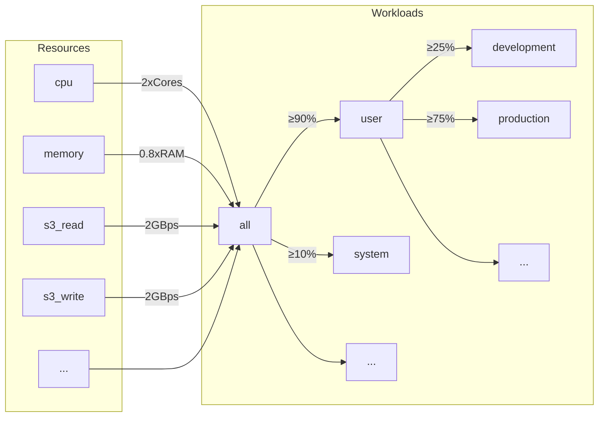
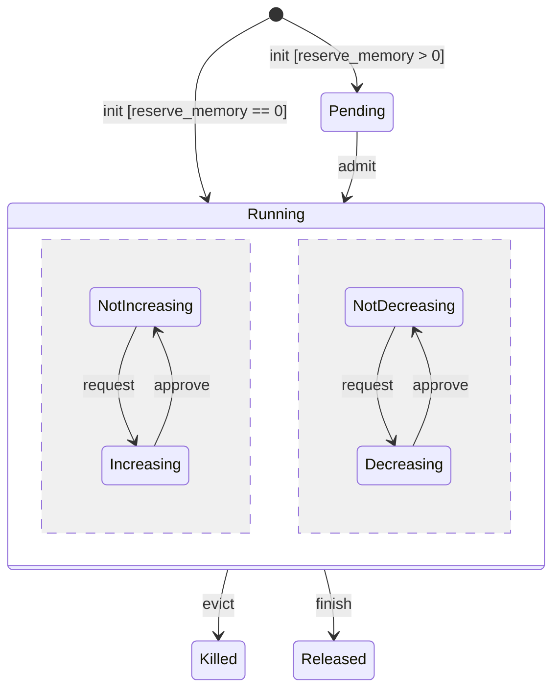
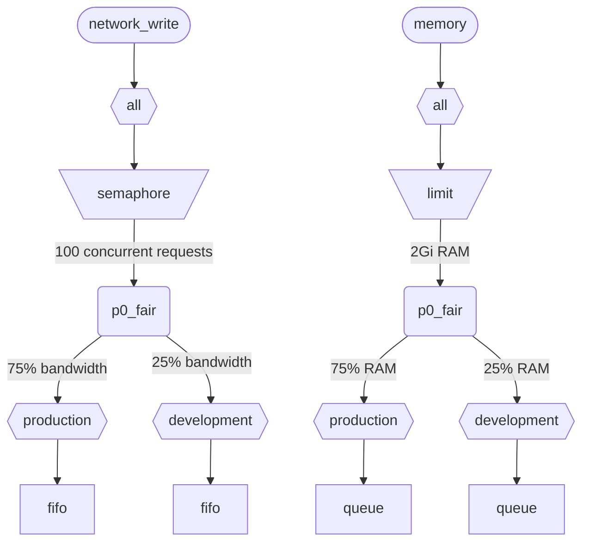

ClickHouse が複数のクエリを同時に実行する場合、それらは共有リソース (CPU、メモリ、I/O) を使用します。リソースの利用方法や、異なるワークロード間での共有方法を制御するために、スケジューリングの制約とポリシーを適用できます。すべてのリソースに対して、共通のスケジューリング階層を設定できます。階層のルートは共有リソースを表し、リーフは個々のワークロードを表します。リーフには、特定のクエリおよびバックグラウンドアクティビティのリソースリクエストと割り当てが保持されます。

<div id="resources">
  ## リソース
</div>

デフォルトでは、ワークロードスケジューリングは無効です。これを有効にするには、スケジューリングに使用するリソースと、少なくとも 1 つのワークロードを作成する必要があります。各リソースは独立しており、任意の組み合わせで使用できます。

CPU スケジューリングを有効にするには、MASTER または WORKER スレッド用の CPU リソースを作成する必要があります (詳細は [CPU scheduling](#cpu_scheduling) を参照してください) :

```sql
CREATE RESOURCE cpu (MASTER THREAD, WORKER THREAD)
```

ワークロードのメモリ予約を有効にするには、MEMORY リソースを作成する必要があります (詳細は[メモリ予約](#memory-reservations)を参照してください) ：

```sql
CREATE RESOURCE memory (MEMORY RESERVATION)
```

クエリスロットのスケジューリングを有効にするには、QUERY リソースを作成する必要があります (詳細は[クエリスロットのスケジューリング](#query_scheduling)を参照してください) ：

```sql
CREATE RESOURCE query (QUERY)
```

特定のディスクで I/O スケジューリングを有効にするには、WRITE アクセス用の書き込みリソースと READ アクセス用の読み取りリソースを作成する必要があります:

```sql
CREATE RESOURCE resource_name (WRITE DISK disk_name, READ DISK disk_name)
-- or
CREATE RESOURCE read_resource_name (WRITE DISK write_disk_name)
CREATE RESOURCE write_resource_name (READ DISK read_disk_name)
```

1 つの resource は、任意の数のディスクに対して、READ、WRITE、またはその両方に使用できます。すべてのディスクで resource を使用できる構文もあります:

```sql
CREATE RESOURCE all_io (READ ANY DISK, WRITE ANY DISK);
```

リソースは、共有モードによって次のように分類されます。

* **時間共有リソース** (CPU, I/O, クエリスロット) - スケジューリング階層の葉ノードでエンキューされるリソース要求を管理します。要求は、階層で定義されたポリシーと制約に従ってスケジュールされます。リソース要求は、クエリが対応するリソースにアクセスしたときに作成されます。たとえば、クエリがディスクからデータを読み取るときや、処理のために CPU を使用するときには、処理量子ごと、またはソケット経由で送受信されたバイト数ごとにリソース要求が作成されます。
* **空間共有リソース** (メモリ) - スケジューリング階層の葉ノードにおけるリソース割り当てを管理します。割り当ては、実行中または保留中のいずれかです。保留中の割り当ては、十分な空き容量が確保されるか、ほかの割り当てが追い出される (強制終了される) までブロックされます。判断は、階層で定義された制限とポリシーに基づいて行われます。割り当てとクエリ (またはバックグラウンドアクティビティ) は 1 対 1 で対応します。割り当ては、クエリの実行開始時に作成され、終了時に解放されます。実行中の割り当ては、そのサイズを動的に増減できます。

<div id="workloads">
  ## ワークロード階層
</div>

ClickHouse では、スケジューリング階層を定義するための便利な SQL 構文を利用できます。すべてのリソースは共通の WORKLOAD 階層に分散されます。分散ルールは特定のリソースについて一部変更できる場合がありますが、階層自体は同じです。各 WORKLOAD では、すべてのリソースに必要なスケジューリングノードが維持されます。子ワークロードは、階層を構成する任意のワークロードの下に作成できます。ClickHouse は、ワークロード階層に対して特定の構造や事前定義された構造を強制しません。

以下は、すべてのリソースを &quot;user&quot; ワークロードと &quot;system&quot; ワークロードの間で、それぞれ 90% と 10% の保証付きで分割する階層の例です。ワークロードに定義された重みは max-min fairness に使用されるため、下限としてのベストエフォート保証しか提供しないことに注意してください (上限やクォータではありません)。すべてのスケジューリングは各 host ごとに独立して行われるため、`max_*` 設定で定義された上限は host ごとに適用されます。ワークロード &quot;user&quot; は、そのリソースを &quot;development&quot; ワークロードと &quot;production&quot; ワークロードの間でさらに分割し、&quot;production&quot; は &quot;development&quot; の 3 倍のリソースを持ちます:

```sql
CREATE RESOURCE cpu (MASTER THREAD, WORKER THREAD)
CREATE RESOURCE memory (MEMORY RESERVATION)
CREATE RESOURCE s3_read (READ DISK s3)
CREATE RESOURCE s3_write (WRITE DISK s3)
CREATE WORKLOAD all SETTINGS max_concurrent_threads_ratio_to_cores = 2, max_memory_ratio = 0.8, max_bytes_per_second = '2Gi'
CREATE WORKLOAD user IN all SETTINGS weight = 9
CREATE WORKLOAD system IN all
CREATE WORKLOAD development IN user
CREATE WORKLOAD production IN user SETTINGS weight = 3
```



子を持たないリーフワークロードの名前は、クエリ設定 `SETTINGS workload = 'name'` で使用できます。詳細については、[Workload markup](#workload-markup)を参照してください。

ワークロードをカスタマイズするには、次の設定を使用できます。

* `priority` - (time-shared のみ) 兄弟ワークロードは静的な値に従って処理されます (値が小さいほど優先度が高くなります) 。プリエンプションに影響します。
* `precedence` - (space-shared のみ) 兄弟ワークロードは静的な値に従って受け入れられます (値が小さいほど優先順位 が高くなります) 。エビクションと admission に影響します。
* `weight` - 同じ静的 priority または 優先順位 を持つ兄弟ワークロードは、重みに応じて公平にリソースを共有します。プリエンプション、エビクション、および admission に影響します。
* `max_io_requests` - このワークロードにおける同時実行 I/O リクエスト数の上限です。
* `max_bytes_inflight` - このワークロードにおける同時実行リクエストの処理中バイト総量の上限です。
* `max_bytes_per_second` - このワークロードの読み取りまたは書き込みのバイトレートの上限です。
* `max_burst_bytes` - スロットリングされることなくこのワークロードで処理できる最大バイト数です (リソースごとに個別に適用されます) 。
* `max_concurrent_threads` - このワークロード内のクエリに対するスレッド数の上限です。
* `max_concurrent_threads_ratio_to_cores` - `max_concurrent_threads` と同じですが、使用可能な CPU コア 数に対して正規化されます。
* `max_cpus` - このワークロード内のクエリを処理する CPU コア 数の上限です。
* `max_cpu_share` - `max_cpus` と同じですが、使用可能な CPU コア 数に対して正規化されます。
* `max_burst_cpu_seconds` - `max_cpus` によってスロットリングされることなく、このワークロードが消費できる最大 CPU 秒数です。
* `max_memory` - このワークロード用に予約されるメモリ総量の上限です。

ワークロード設定で指定されるすべての上限は、リソースごとに独立しています。たとえば、`max_bytes_per_second = '10Mi'` を持つワークロードには、各読み取りリソースおよび各書き込みリソースに対して、それぞれ独立した 10 MB/s の帯域幅上限が適用されます。読み取りと書き込みに共通の上限が必要な場合は、READ アクセスと WRITE アクセスに同じリソースを使用することを検討してください。

リソースごとに異なるワークロード階層を指定する方法はありません。ただし、特定のリソースに対して異なるワークロード設定値を指定する方法はあります。

```sql
CREATE OR REPLACE WORKLOAD all SETTINGS max_io_requests = 100, max_bytes_per_second = '1Mi' FOR network_read, max_bytes_per_second = '2Mi' FOR network_write
```

また、別のワークロードから参照されているワークロードやリソースは削除できない点にも注意してください。ワークロードの定義を更新するには、`CREATE OR REPLACE WORKLOAD`クエリを使用します。

<Note>
  ワークロード設定は、適切なスケジューリングノードのセットに変換されます。より下位レベルの詳細については、スケジューリングノードの[種類とオプション](#hierarchy)の説明を参照してください。
</Note>

<div id="workload-markup">
  ## ワークロードの指定
</div>

異なるワークロードを区別するために、クエリには設定 `workload` を指定できます。`workload` が設定されていない場合は、値 &quot;default&quot; が使用されます。なお、設定プロファイルを使用して別の値を指定することもできます。ユーザーからのすべてのクエリに `workload` 設定の固定値を付与したい場合は、設定の制約を使用して `workload` を定数にできます。

<Warning>
  クエリ設定 `workload` は、リーフワークロード (つまり、子ワークロードを持たないワークロード) のみを参照できます。
</Warning>

```sql
SELECT count() FROM my_table WHERE value = 42 SETTINGS workload = 'production'
SELECT count() FROM my_table WHERE value = 13 SETTINGS workload = 'development'
```

バックグラウンドアクティビティに `workload` 設定を割り当てることも可能です。マージとミューテーションでは、それぞれ `merge_workload` および `mutation_workload` サーバー設定が使用されます。これらの値は、`merge_workload` および `mutation_workload` MergeTree 設定を使用して、特定のテーブルごとに上書きすることもできます。

<div id="cpu_scheduling">
  ## CPU スケジューリング
</div>

ワークロードの CPU スケジューリングを有効にするには、CPU リソースを作成し、同時実行するスレッド数の上限を設定します:

```sql
CREATE RESOURCE cpu (MASTER THREAD, WORKER THREAD)
CREATE WORKLOAD all SETTINGS max_concurrent_threads = 100
```

ClickHouse server が[複数スレッド](/ja/reference/settings/session-settings#max_threads)を使用する同時実行クエリを多数実行しており、すべての CPU スロット が使用中になると、過負荷状態に入ります。過負荷状態では、解放された CPU スロット はすべて、スケジューリングポリシーに従って適切なワークロードに再割り当てされます。同じワークロードを共有するクエリでは、スロットはラウンドロビン方式で割り当てられます。別々のワークロードに属するクエリでは、ワークロードに設定された重み、優先度、制限に基づいてスロットが割り当てられます。

CPU 時間は、スレッドがブロックされておらず、CPU 負荷の高いタスクを実行しているときに消費されます。スケジューリングの目的上、スレッドは次の 2 種類に区別されます。

* マスタースレッド — クエリ、または merge や mutation のようなバックグラウンド処理で最初に動作を開始するスレッド。
* ワーカースレッド — CPU 負荷の高いタスクを処理するために、マスターが追加で生成できるスレッド。

応答性を高めるために、マスタースレッドとワーカースレッドで別々のリソースを使用したい場合があります。`max_threads` クエリ設定の値が大きいと、多数のワーカースレッドが CPU リソースを容易に占有してしまいます。すると、新たに到着したクエリは、マスタースレッドが実行を開始するための CPU スロット が空くまでブロックされて待機することになります。これを避けるには、次の設定を使用できます。

```sql
CREATE RESOURCE worker_cpu (WORKER THREAD)
CREATE RESOURCE master_cpu (MASTER THREAD)
CREATE WORKLOAD all SETTINGS max_concurrent_threads = 100 FOR worker_cpu, max_concurrent_threads = 1000 FOR master_cpu
```

これにより、マスタースレッド と ワーカースレッド に個別の制限を設定できます。100 個の worker CPU スロットがすべて使用中であっても、利用可能な master CPU スロットがある限り、新しいクエリはブロックされません。そうしたクエリは 1 つの thread で実行を開始します。その後、worker CPU スロットが利用可能になれば、そのようなクエリはスケールアップして ワーカースレッド を生成できます。一方、このアプローチではスロット総数が CPUプロセッサの数に制約されないため、同時実行する thread が多すぎるとパフォーマンスに影響します。

マスタースレッド の同時実行数を制限しても、同時実行クエリ数は制限されません。CPU スロットはクエリ実行の途中で解放され、他の thread によって再取得されることがあります。たとえば、マスタースレッド の同時実行制限が 2 であっても、4 つの同時実行クエリをすべて並列に実行できます。この場合、各クエリは 1 つの CPUプロセッサの 50% を受け取ることになります。同時実行クエリ数を制限するには別のロジックが必要ですが、現時点ではワークロードではサポートされていません。

ワークロードに対しては、thread ごとに個別の同時実行制限を使用できます:

```sql
CREATE RESOURCE cpu (MASTER THREAD, WORKER THREAD)
CREATE WORKLOAD all
CREATE WORKLOAD admin IN all SETTINGS max_concurrent_threads = 10
CREATE WORKLOAD production IN all SETTINGS max_concurrent_threads = 100
CREATE WORKLOAD analytics IN production SETTINGS max_concurrent_threads = 60, weight = 9
CREATE WORKLOAD ingestion IN production
```

この設定例では、管理用と本番用に独立した CPU スロットプールを用意します。本番用プールは analytics とインジェストで共有されます。さらに、本番用プールが過負荷になると、解放された 10 個のスロットのうち 9 個は、必要に応じて分析クエリに再割り当てされます。過負荷時にインジェストクエリが受け取れるのは、10 個のスロットのうち 1 個だけです。これにより、ユーザー向けクエリのレイテンシが改善される可能性があります。analytics には同時実行スレッド数の上限が 60 という独自の制限があり、インジェストを支えるために常に少なくとも 40 スレッドが確保されます。過負荷でない場合、インジェストは 100 スレッドすべてを使用できます。

CPU スケジューリングの対象からクエリを除外するには、クエリ設定 [use&#95;concurrency&#95;control](/ja/reference/settings/session-settings#use_concurrency_control) を 0 に設定します。

CPU スケジューリングは、merges と mutations ではまだサポートされていません。

ワークロードに公平な割り当てを提供するには、クエリ実行中にプリエンプションとスケールダウンを行う必要があります。プリエンプションは `cpu_slot_preemption` サーバー設定で有効にします。これが有効な場合、各スレッドは CPU スロットを定期的に更新します (`cpu_slot_quantum_ns` サーバー設定に従います) 。この更新によって、CPU が過負荷のときは実行がブロックされることがあります。実行が長時間ブロックされると (`cpu_slot_preemption_timeout_ms` サーバー設定を参照) 、クエリはスケールダウンし、同時実行中のスレッド数が動的に減少します。CPU 時間の公平性はワークロード間では保証されますが、同じワークロード内のクエリ間では、一部の特殊なケースで損なわれる可能性があることに注意してください。

<Warning>
  スロットスケジューリングは [query concurrency](/ja/reference/settings/session-settings#max_threads) を制御する手段を提供しますが、サーバー設定 `cpu_slot_preemption` が `true` に設定されていない限り、公平な CPU 時間の割り当ては保証されません。`true` でない場合、公平性は競合するワークロード間での CPU スロット割り当て数に基づいて提供されます。これは CPU 秒数が等しくなることを意味しません。プリエンプションがないと、CPU スロットが無期限に保持される可能性があるためです。スレッドは開始時にスロットを取得し、処理が完了すると解放します。
</Warning>

<Note>
  CPU リソースを宣言すると、[`concurrent_threads_soft_limit_num`](/ja/reference/settings/server-settings/settings#concurrent_threads_soft_limit_num) および [`concurrent_threads_soft_limit_ratio_to_cores`](/ja/reference/settings/server-settings/settings#concurrent_threads_soft_limit_ratio_to_cores) 設定は効かなくなります。代わりに、特定のワークロードに割り当てる CPU 数の制限には、ワークロード設定 `max_concurrent_threads` が使用されます。従来の動作を再現するには、WORKER THREAD リソースのみを作成し、ワークロード `all` の `max_concurrent_threads` を `concurrent_threads_soft_limit_num` と同じ値に設定したうえで、クエリ設定 `workload = "all"` を使用してください。この構成は、[`concurrent_threads_scheduler`](/ja/reference/settings/server-settings/settings#concurrent_threads_scheduler) 設定を &quot;fair&#95;round&#95;robin&quot; にした場合に相当します。
</Note>

<div id="threads_vs_cpus">
  ## スレッドと CPU
</div>

ワークロードの CPU 消費を制御する方法は 2 つあります。

* スレッド数の制限: `max_concurrent_threads` と `max_concurrent_threads_ratio_to_cores`
* CPU スロットリング: `max_cpus`、`max_cpu_share`、`max_burst_cpu_seconds`

<Warning>
  CPU スロットリング設定は、`cpu_slot_preemption` サーバー設定が有効な場合にのみ有効で、それ以外では無視されます。
</Warning>

1 つ目は、現在のサーバー負荷に応じて、クエリごとに生成されるスレッド数を動的に制御できるようにするものです。実質的には、クエリ設定 `max_threads` で指定される値を引き下げます。2 つ目は、トークンバケットアルゴリズムを使ってワークロードの CPU 消費をスロットリングします。これはスレッド数自体には直接影響しませんが、ワークロード内のすべてのスレッドによる CPU の総消費量をスロットリングします。

`max_cpus` と `max_burst_cpu_seconds` によるトークンバケットスロットリングは、次のことを意味します。任意の `delta` 秒の期間において、ワークロード内のすべてのクエリによる CPU 総消費量は `max_cpus * delta + max_burst_cpu_seconds` CPU 秒を超えてはなりません。長期的には平均消費量が `max_cpus` によって制限されますが、短期的にはこの上限を超える場合があります。たとえば、`max_burst_cpu_seconds = 60` かつ `max_cpus=0.001` の場合、スロットリングされることなく、1 スレッドを 60 秒間、2 スレッドを 30 秒間、または 60 スレッドを 1 秒間実行できます。`max_burst_cpu_seconds` のデフォルト値は 1 秒です。値を小さくしすぎると、同時実行スレッドが多い場合に、許可された `max_cpus` コアを十分に使い切れないことがあります。

CPU スロットを保持している間、スレッドは次の 3 つの主要な状態のいずれかになります。

* **Running:** 実際に CPU リソースを消費している状態。この状態で費やされた時間は CPU スロットリングの対象として計上されます。
* **Ready:** CPU が利用可能になるのを待っている状態。この状態で費やされた時間は CPU スロットリングの対象にはなりません。
* **Blocked:** I/O 操作やその他のブロッキング syscall (例: mutex の待機) を行っている状態。この状態で費やされた時間は CPU スロットリングの対象にはなりません。

CPU スロットリングとスレッド数制限の両方を組み合わせた設定例を見てみましょう。

```sql
CREATE RESOURCE cpu (MASTER THREAD, WORKER THREAD)
CREATE WORKLOAD all SETTINGS max_concurrent_threads_ratio_to_cores = 2
CREATE WORKLOAD admin IN all SETTINGS max_concurrent_threads = 2, priority = -1
CREATE WORKLOAD production IN all SETTINGS weight = 4
CREATE WORKLOAD analytics IN production SETTINGS max_cpu_share = 0.7, weight = 3
CREATE WORKLOAD ingestion IN production
CREATE WORKLOAD development IN all SETTINGS max_cpu_share = 0.3
```

ここでは、すべてのクエリで使用できるスレッド総数を、利用可能な CPU 数の 2 倍に制限します。Admin ワークロードは、利用可能な CPU 数に関係なく、最大 2 スレッドまでに制限されます。Admin の優先度は -1 (デフォルトの 0 より低い) で、必要な場合は最優先で CPU スロット を取得します。Admin がクエリを実行していない場合、CPU リソースは production ワークロードと development ワークロードの間で分配されます。CPU 時間の保証シェアは重み (4:1) に基づきます。つまり、少なくとも 80% が production に割り当てられ (必要な場合) 、少なくとも 20% が development に割り当てられます (必要な場合) 。重みは保証を表しますが、CPU throttling は上限を定めます。production には上限がなく、100% まで使用できます。一方、development には 30% の上限があり、この上限は他のワークロードからクエリがない場合でも適用されます。Production ワークロードはリーフではないため、そのリソースは重み (3:1) に従って analytics とインジェストの間で分割されます。つまり、analytics には少なくとも 0.8 * 0.75 = 60% が保証され、`max_cpu_share` に基づく上限は CPU リソース全体の 70% です。一方、インジェストには少なくとも 0.8 * 0.25 = 20% が保証され、上限はありません。

<Note>
  ClickHouse server で CPU 使用率を最大化したい場合は、ルート ワークロード `all` に対して `max_cpus` や `max_cpu_share` を使用しないでください。代わりに、`max_concurrent_threads` により大きな値を設定してください。たとえば、8 CPU のシステムでは、`max_concurrent_threads = 16` に設定します。これにより、8 スレッドが CPU タスクを実行している間に、別の 8 スレッドで I/O 操作を処理できます。追加のスレッドによって CPU 負荷が生じるため、スケジューリングルールが確実に適用されます。これに対して、`max_cpus = 8` を設定しても CPU 負荷は発生しません。これは、server が利用可能な 8 CPU を超えて使用できないためです。
</Note>

<div id="memory-reservations">
  ## メモリ予約
</div>

<Note>
  メモリ予約のスケジューリングは実験的な機能です。これは `MEMORY RESERVATION` リソースが存在する場合にのみ有効であり、SQL インターフェースおよび動作は今後のリリースで変更される可能性があります。現時点では、マージとミューテーションにはまだ対応しておらず、実行中のクエリのエビクションはベストエフォートです。つまり、即時に反映されるのではなく、そのクエリの次回のメモリ同期ポイントで有効になります。
</Note>

ワークロードでメモリ予約を有効にするには、`MEMORY RESERVATION` リソースを作成し、ワークロード設定 を使用して予約される総メモリの上限を少なくとも 1 つ設定します。

```sql
CREATE RESOURCE memory (MEMORY RESERVATION)
CREATE WORKLOAD all SETTINGS max_memory = '2Gi'
```

ClickHouse は、すべてのクエリとバックグラウンド処理のメモリ割り当てを追跡します。割り当てられたバイト数は、スケジューリング階層に沿ってルートまで集計されます。各クエリには、それが属するリーフワークロードに対応する割り当てがあります。クエリの `reserve_memory` 設定が 0 より大きい場合、その割り当ては pending 状態で作成されます。pending の割り当ては、ワークロード階層内で要求された量のメモリを予約します。使用可能なメモリが不足している場合、その割り当ては、十分なメモリが解放されるか、ほかの割り当てが追い出される (強制終了される) まで pending のままです。割り当てが受理されると、running になります。running の割り当ては、クエリのメモリ使用量に応じてサイズを動的に増減できます。割り当てのライフサイクルは、次の状態図で表せます。



リーフワークロードの保留中の割り当ては、FIFO 順で受け入れられます。複数のワークロードに保留中の割り当てがある場合は、優先順位 と weight の設定に従って受け入れられます。優先順位 が高いワークロードほど先に処理されます。同じ 優先順位 を持つ兄弟ワークロードは、max-min fair な方式で weight に応じてメモリを共有します。つまり、正規化されたメモリ使用量 (現在の使用量に要求された増加分を加え、それを weight で割った値) が小さいワークロードほど優先して処理されます。エビクション時には逆のロジックが適用されます。メモリを解放する必要がある場合は、優先順位 が低く、正規化されたメモリ使用量が大きいワークロードから先に追い出されます。

時間共有リソースでは priority を使用し、空間共有リソースでは 優先順位 を使用する点に注意してください。これらは独立した設定であり、異なる値を設定できます。priority が高い場合は非破壊的なプリエンプション (遅延またはスロットリング) を意味し、優先順位 が高い場合は破壊的なエビクション (エラーで停止) を伴う可能性があります。たとえば、あるワークロードでは CPU スケジューリングのために高い priority を設定しつつ、メモリ予約については他のワークロードを追い出して、それまでに完了した作業を失わせないよう、同じ 優先順位 にしておくことができます。

`max_memory` 制限を持つすべてのワークロードでは、そのサブツリー内で割り当てられるメモリの合計が制限を超えないことが保証されます。保留中または増加中の割り当てによって制限を超える場合は、メモリを解放するためにエビクション手順が開始されます。エビクション手順では、kill する対象が選択されます。killer と対象の最小共通祖先ワークロードは、次の状況ではエビクションを防ぎます。

* 保留中の割り当ては、同じワークロード内で実行中の割り当てを追い出すことはできません。 (killer と対象のワークロードが一致するため) 。
* 優先順位 が低い保留中の割り当てが、優先順位 が高いワークロードを kill することはありません。
* 保留中の割り当ては、同じ 優先順位 の割り当てを kill できません。同じ 優先順位 の実行中の割り当て同士は、正規化されたメモリ使用量に基づいて互いを追い出す可能性がある点に注意してください。
  エビクションが防がれるか、十分なメモリを解放できない場合、新しい割り当ては十分なメモリが解放されるまでブロックされます。これらのルールにより、メモリ負荷に応じて過剰なクエリをキューに入れられるようになり、MEMORY&#95;LIMIT&#95;EXCEEDED エラーを回避する便利な方法が提供されます。

<Note>
  ワークロードの制限は、[max&#95;memory&#95;usage](/ja/reference/settings/session-settings#max_memory_usage) クエリ設定のような、メモリ消費量を制限するほかの方法とは独立しています。これらを組み合わせて使用することで、メモリ消費量をより適切に制御できます。ユーザー単位 (ワークロード単位ではなく) で個別のメモリ制限を設定することも可能です。ただし、こちらは柔軟性が低く、メモリ予約や保留中クエリのキューイングといった機能は提供しません。[メモリオーバーコミット](/ja/concepts/features/configuration/settings/memory-overcommit) を参照してください
</Note>

ワークロード設定 `max_waiting_queries` は、そのワークロードで保留できる割り当て数を制限します。制限に達すると、server はエラー `SERVER_OVERLOADED` を返します。`max_waiting_queries` は子ワークロードには継承されず、リーフワークロードでのみ意味を持つ点に注意してください。

メモリ予約スケジューリングは、merges と mutations ではまだサポートされていません。

`reserve_memory` 設定が 0 より大きいクエリのみが、メモリ予約の完了を待つ間にブロックされる対象になります。ただし、`reserve_memory` が 0 のクエリも ワークロード のメモリ使用量には計上され、他の保留中または増加中の割り当てのためにメモリを解放する必要がある場合は、追い出される可能性があります。ワークロード の適切なマークアップがないクエリは、メモリ予約のスケジューリングの対象にならず、スケジューラによって追い出されることもありません。

クエリに対して非弾力的なメモリ予約を行うには、`reserve_memory` と `max_memory_usage` の両方のクエリ設定を同じ値に設定します。この場合、そのクエリは一定量のメモリを固定で予約し、割り当てを動的に増やすことはできません。なお、弾力的なメモリ予約は、メモリ逼迫がない限り停止されることなく、`reserve_memory` を超えて `max_memory_usage` まで増やせます。ただし、実際の使用量がそれより少なくても、`reserve_memory` 未満に減らすことはできません。

設定例を見てみましょう。

```sql
CREATE RESOURCE memory (MEMORY RESERVATION)
CREATE WORKLOAD all SETTINGS max_memory = '10Gi'
CREATE WORKLOAD system IN all SETTINGS weight = 1
CREATE WORKLOAD user IN all SETTINGS weight = 9
CREATE WORKLOAD production IN user SETTINGS precedence = 1, weight = 3
CREATE WORKLOAD staging IN user SETTINGS precedence = 1, weight = 1
CREATE WORKLOAD testing IN user SETTINGS precedence = 2
```

この例では、すべてのクエリとバックグラウンド処理によって予約されるメモリの総量は 10 GiB を超えられません。system ワークロードには少なくとも 1 GiB (10 GiB の 10%) が保証され、user ワークロードには少なくとも 9 GiB (10 GiB の 90%) が保証されます。user ワークロード内では、production ワークロードと staging ワークロードが、同じ優先順位 1 のもとで重み (3 対 1) に従ってメモリを共有します。testing ワークロードの優先順位は 2 で、production と staging より低くなっています。したがって、testing ワークロードが使用できるのは、production と staging で使われていないメモリだけです。

メモリ逼迫が発生した場合、まず testing ワークロードの割り当てが追い出されます。さらにメモリを解放する必要がある場合は、保証量を超過しているとき、production ワークロードの割り当てより先に staging ワークロードの割り当てが追い出されます。なお、production と staging で保留中のクエリは、メモリを解放するために testing ワークロードで実行中の割り当てを追い出すことはできますが、互いの優先順位は同じであるため、相手を追い出すことはできません。メモリ逼迫時には、それらはキューで待機します。これにより、同時実行されるクエリが多すぎることによる MEMORY&#95;LIMIT&#95;EXCEEDED エラーをシステムが回避できるようになります。

system ワークロードの優先順位は 0 (default) であり、production、staging、testing の各ワークロードより高いことにも注意してください。ただし、これらは兄弟ワークロードではありません。最小共通祖先は ワークロード all であり、その 2 つの子はいずれも同じ優先順位を持ちます。そのため、保留中の system ワークロードはそれらのいずれも追い出すことができず、逆も同様です。これにより、system の処理は簡単には追い出されないようになっています。

<div id="query_scheduling">
  ## クエリスロットのスケジューリング
</div>

ワークロードでクエリスロットのスケジューリングを有効にするには、QUERY リソースを作成し、同時実行クエリ数または 1 秒あたりのクエリ数の上限を設定します。

```sql
CREATE RESOURCE query (QUERY)
CREATE WORKLOAD all SETTINGS max_concurrent_queries = 100, max_queries_per_second = 10, max_burst_queries = 20
```

ワークロード設定 `max_concurrent_queries` は、特定のワークロードで同時に実行できるクエリ数を制限します。これは、クエリ設定 [`max_concurrent_queries_for_all_users`](/ja/reference/settings/session-settings#max_concurrent_queries_for_all_users) およびサーバー設定 [max&#95;concurrent&#95;queries](/ja/reference/settings/server-settings/settings#max_concurrent_queries) に相当します。非同期 INSERT クエリと、KILL のような一部の特殊なクエリは、この上限にはカウントされません。

ワークロード設定 `max_queries_per_second` と `max_burst_queries` は、トークンバケットスロットラーを使用して、そのワークロードのクエリ数を制限します。これにより、任意の時間間隔 `T` において、実行を開始する新規クエリ数が `max_queries_per_second * T + max_burst_queries` を超えないことが保証されます。

ワークロード設定 `max_waiting_queries` は、そのワークロードの待機中クエリ数を制限します。上限に達すると、サーバーはエラー `SERVER_OVERLOADED` を返します。`max_waiting_queries` は子ワークロードには継承されず、リーフワークロードでのみ意味を持つことに注意してください。

<Note>
  ブロックされたクエリは、すべての制約が満たされるまで無期限に待機し、`SHOW PROCESSLIST` には表示されません。
</Note>

<div id="workload_entity_storage">
  ## ワークロードとリソースの保存
</div>

`CREATE WORKLOAD` および `CREATE RESOURCE` クエリ形式の、すべてのワークロードとリソースの定義は、`workload_path` のディスク上、または `workload_zookeeper_path` の ZooKeeper に永続的に保存されます。ノード間の整合性を確保するには、ZooKeeper ストレージの使用を推奨します。あるいは、ディスクストレージとあわせて `ON CLUSTER` 句を使用することもできます。

<div id="config_based_workloads">
  ## 設定ベースのワークロードとリソース
</div>

SQL ベースの定義に加えて、ワークロードとリソースはサーバーの設定ファイルで事前定義することもできます。これは、Cloud 環境では一部の制限がインフラストラクチャによって規定される一方で、別の制限は顧客が変更できる場合に有用です。設定ベースのエンティティは SQL で定義されたものよりも優先され、SQL コマンドで変更または削除することはできません。

<div id="config_based_workloads_format">
  ### Configuration のフォーマット
</div>

```xml
<clickhouse>
    <resources_and_workloads>
        CREATE RESOURCE memory (MEMORY RESERVATION);
        CREATE RESOURCE s3disk_read (READ DISK s3);
        CREATE RESOURCE s3disk_write (WRITE DISK s3);
        CREATE WORKLOAD all SETTINGS max_memory = '2Gi', max_io_requests = 500 FOR s3disk_read, max_io_requests = 1000 FOR s3disk_write, max_bytes_per_second = '1280Mi' FOR s3disk_read, max_bytes_per_second = '3200Mi' FOR s3disk_write;
        CREATE WORKLOAD production IN all SETTINGS weight = 3;
    </resources_and_workloads>
</clickhouse>
```

この設定では、`CREATE WORKLOAD` 文および `CREATE RESOURCE` 文と同じ SQL 構文を使用します。すべてのクエリは有効である必要があります。

<div id="config_based_workloads_usage_recommendations">
  ### 使用時の推奨事項
</div>

Cloud 環境では、一般的な構成として次のようなものが考えられます。

1. インフラストラクチャの制限を設定するため、設定内でルートワークロードとネットワーク I/O リソースを定義します
2. これらの制限を確実に適用するため、`throw_on_unknown_workload` を設定します
3. すべてのクエリに制限を自動適用するため、`CREATE WORKLOAD default IN all` を作成します (`workload` クエリ設定のデフォルト値は &#39;default&#39; であるため)
4. 設定された階層内で、ユーザーが追加のワークロードを作成できるようにします

これにより、すべてのバックグラウンド処理とクエリがインフラストラクチャの制限を遵守しつつ、ユーザー固有のスケジューリングポリシーに対する柔軟性も確保できます。

もう 1 つのユースケースとして、異種混在クラスター内のノードごとに異なる設定を用意する方法があります。

<div id="strict_resource_access">
  ## 厳格なリソースアクセス
</div>

すべてのクエリにリソーススケジューリングポリシーを確実に適用するためのサーバー設定として、`throw_on_unknown_workload` があります。これを `true` に設定すると、すべてのクエリで有効な `workload` クエリ設定の指定が必須になり、指定しない場合は `RESOURCE_ACCESS_DENIED` 例外が発生します。これを `false` に設定すると、そのようなクエリはリソーススケジューラを使用せず、つまり任意の `RESOURCE` に無制限にアクセスできます。クエリ設定 `use_concurrency_control = 0` を指定すると、クエリは CPU スケジューラを回避し、CPU を無制限に使用できます。CPU スケジューリングを強制するには、`use_concurrency_control` を読み取り専用の定数値として維持する設定制約を作成してください。

<Note>
  `CREATE WORKLOAD default` を実行していない限り、`throw_on_unknown_workload` を `true` に設定しないでください。起動中に `workload` が明示的に設定されていないクエリが実行されると、サーバーの起動時に問題が発生する可能性があります。
</Note>

<div id="hierarchy">
  ### スケジューリングノードの階層
</div>

スケジューリングサブシステムの観点では、各リソースはスケジューリングノードの階層として表現されます。ClickHouse は、WORKLOAD と RESOURCE の定義に基づいて、必要なスケジューリングノードをすべて自動的に作成します。スケジューリングノードは低レベルの実装詳細であり、[system.scheduler](/ja/reference/system-tables/scheduler) テーブルを通じて参照できます。

```sql
CREATE RESOURCE network_write (WRITE DISK s3)
CREATE RESOURCE memory (MEMORY RESERVATION)
CREATE WORKLOAD all SETTINGS max_io_requests = 100, max_memory = '2Gi'
CREATE WORKLOAD development IN all
CREATE WORKLOAD production IN all SETTINGS weight = 3
```



**時間共有ノードの種類:**

* `inflight_limit` (constraint) - 処理中の同時実行リクエスト数が `max_requests` を超えるか、それらの合計コストが `max_cost` を超える場合にブロックします。子ノードは 1 つだけである必要があります。
* `bandwidth_limit` (constraint) - 現在の帯域幅が `max_speed` を超える場合 (0 は無制限を意味します) 、またはバーストが `max_burst` を超える場合 (デフォルトでは `max_speed` に等しい) にブロックします。子ノードは 1 つだけである必要があります。
* `fair` (policy) - max-min 公平性に基づいて、子ノードのいずれかから次に処理するリクエストを選択します。子ノードでは `weight` を指定できます (デフォルトは 1) 。
* `priority` (policy) - 静的な優先度に基づいて、子ノードのいずれかから次に処理するリクエストを選択します (値が小さいほど優先度が高くなります) 。子ノードでは `priority` を指定する必要があります (デフォルトは 0) 。
* `fifo` (queue) - リソース容量を超えるリクエストを保持できる階層のリーフです。

**空間共有ノードの種類:**

* `limit` - 子ノードの合計割り当てが上限を超えないようにし、必要に応じてサブツリーでエビクション手順を開始します。子ノードは 1 つだけである必要があります。
* `fair_allocation` - max-min 公平性に基づいてエビクションを実施します。保留中の割り当てが実行中の割り当てをエビクションすることはありません。子ノードでは `weight` を指定できます (デフォルトは 1) 。
* `precedence_allocation` - 静的な優先順位に基づいてエビクションを実施します (値が小さいほど優先順位が高くなります) 。優先順位の高い保留中の割り当ては、優先順位の低い割り当てをエビクションします。子ノードでは `precedence` を指定する必要があります (デフォルトは 0) 。
* `queue` - 実行中および保留中の割り当てを保持できる階層のリーフです。

<div id="deprecated-configuration">
  ## 非推奨の XML 設定
</div>

リソースでどのディスクを使用するかを指定する別の方法として、server の `storage_configuration` があります。

特定のディスクで I/O スケジューリングを有効にするには、ストレージ構成で `read_resource` および/または `write_resource` を指定する必要があります。これにより ClickHouse に、そのディスクに対する各読み取りリクエストおよび書き込みリクエストでどのリソースを使うかを指定できます。読み取りリソースと書き込みリソースは同じリソース名を参照でき、これはローカルSSD や HDD で有用です。複数の異なるディスクが同じリソースを参照することもでき、これはリモートディスクで有用です。たとえば、`"production"` ワークロードと `"development"` ワークロードの間でネットワーク帯域幅を公平に分配できるようにしたい場合に役立ちます。

例:

```xml
<clickhouse>
    <storage_configuration>
        ...
        <disks>
            <s3>
                <type>s3</type>
                <endpoint>https://clickhouse-public-datasets.s3.amazonaws.com/my-bucket/root-path/</endpoint>
                <access_key_id>your_access_key_id</access_key_id>
                <secret_access_key>your_secret_access_key</secret_access_key>
                <read_resource>network_read</read_resource>
                <write_resource>network_write</write_resource>
            </s3>
        </disks>
        <policies>
            <s3_main>
                <volumes>
                    <main>
                        <disk>s3</disk>
                    </main>
                </volumes>
            </s3_main>
        </policies>
    </storage_configuration>
</clickhouse>
```

サーバー構成オプションは、SQLでリソースを定義する方法よりも優先される点に注意してください。

<div id="see-also">
  ## 関連項目
</div>

* [system.scheduler](/ja/reference/system-tables/scheduler)
* [system.workloads](/ja/reference/system-tables/workloads)
* [system.resources](/ja/reference/system-tables/resources)
* [merge&#95;workload](/ja/reference/settings/merge-tree-settings#merge_workload) MergeTree 設定
* [merge&#95;workload](/ja/reference/settings/server-settings/settings#merge_workload) グローバルなサーバー設定
* [mutation&#95;workload](/ja/reference/settings/merge-tree-settings#mutation_workload) MergeTree 設定
* [mutation&#95;workload](/ja/reference/settings/server-settings/settings#mutation_workload) グローバルなサーバー設定
* [workload&#95;path](/ja/reference/settings/server-settings/settings#workload_path) グローバルなサーバー設定
* [workload&#95;zookeeper&#95;path](/ja/reference/settings/server-settings/settings#workload_zookeeper_path) グローバルなサーバー設定
* [cpu&#95;slot&#95;preemption](/ja/reference/settings/server-settings/settings#cpu_slot_preemption) グローバルなサーバー設定
* [cpu&#95;slot&#95;quantum&#95;ns](/ja/reference/settings/server-settings/settings#cpu_slot_quantum_ns) グローバルなサーバー設定
* [cpu&#95;slot&#95;preemption&#95;timeout&#95;ms](/ja/reference/settings/server-settings/settings#cpu_slot_preemption_timeout_ms) グローバルなサーバー設定