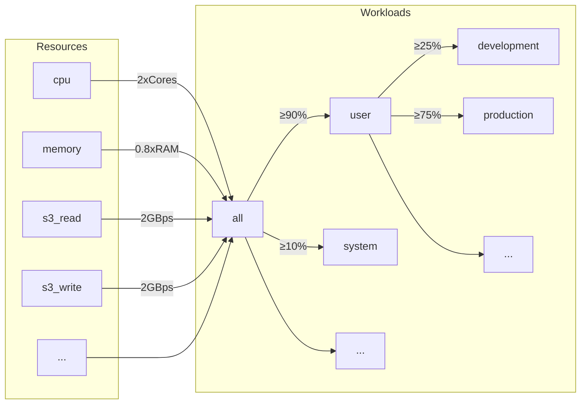
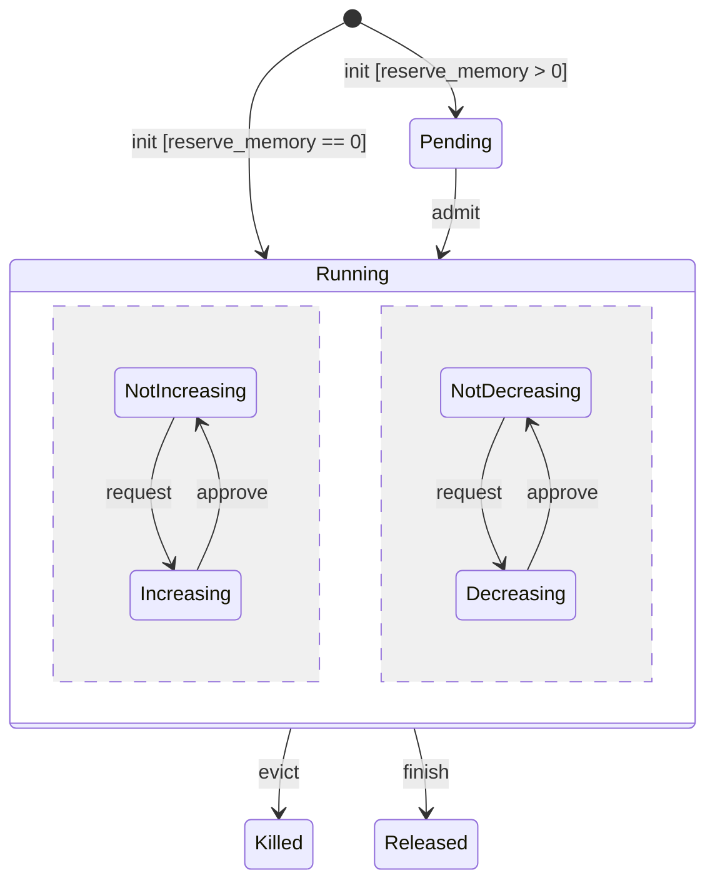
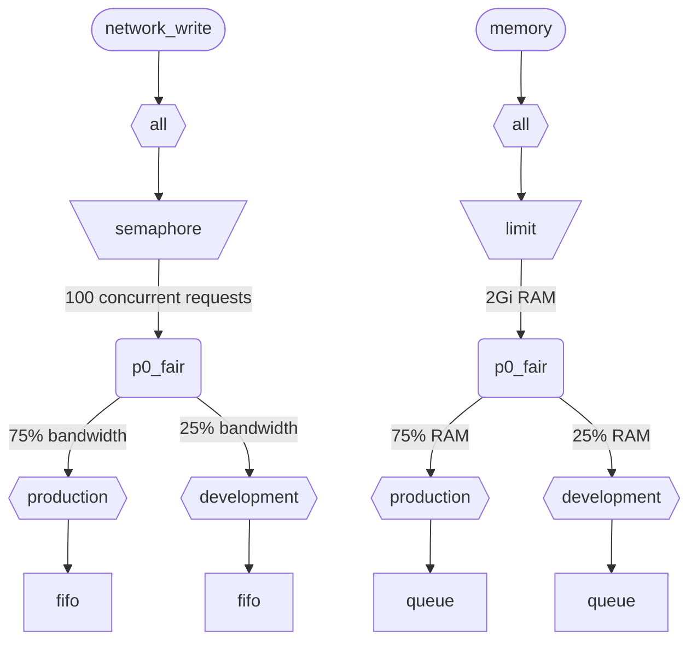

Quando o ClickHouse executa várias queries simultaneamente, elas usam recursos compartilhados (CPU, memória e E/S). Restrições e políticas de escalonamento podem ser aplicadas para regular como os recursos são utilizados e compartilhados entre diferentes cargas de trabalho. É possível configurar uma hierarquia de escalonamento comum para todos os recursos. A raiz da hierarquia representa os recursos compartilhados, enquanto as folhas correspondem a cargas de trabalho específicas, contendo solicitações de recursos e alocações de queries específicas e atividades em segundo plano.

<div id="resources">
  ## Recursos
</div>

Por padrão, o agendamento de cargas de trabalho está desabilitado. Para habilitá-lo, é preciso criar recursos que serão usados no agendamento e pelo menos uma carga de trabalho. Todos os recursos são independentes e podem ser usados em qualquer combinação.

Para habilitar o agendamento de CPU, é preciso criar um recurso de CPU para as threads MASTER ou WORKER (consulte [agendamento de CPU](#cpu_scheduling) para mais detalhes):

```sql
CREATE RESOURCE cpu (MASTER THREAD, WORKER THREAD)
```

Para habilitar a reserva de memória para cargas de trabalho, você precisa criar o recurso MEMORY (consulte [Reservas de memória](#memory-reservations) para mais detalhes):

```sql
CREATE RESOURCE memory (MEMORY RESERVATION)
```

Para habilitar o agendamento de slots de consulta, você precisa criar o recurso QUERY (consulte [Agendamento de slots de consulta](#query_scheduling) para detalhes):

```sql
CREATE RESOURCE query (QUERY)
```

Para habilitar o escalonamento de E/S para um disco específico, você precisa criar recursos de leitura e de gravação para os acessos WRITE e READ:

```sql
CREATE RESOURCE resource_name (WRITE DISK disk_name, READ DISK disk_name)
-- or
CREATE RESOURCE read_resource_name (WRITE DISK write_disk_name)
CREATE RESOURCE write_resource_name (READ DISK read_disk_name)
```

Um recurso pode ser usado em qualquer quantidade de disks, para READ, WRITE ou ambos, READ e WRITE. Há uma sintaxe que permite usar um recurso para todos os disks:

```sql
CREATE RESOURCE all_io (READ ANY DISK, WRITE ANY DISK);
```

Os recursos são classificados por modo de compartilhamento:

* **Recursos compartilhados no tempo** (CPU, E/S, slots de consulta) - gerenciam solicitações de recursos enfileiradas nas folhas da hierarquia de agendamento. As solicitações são agendadas de acordo com as políticas e restrições definidas pela hierarquia. As solicitações de recursos são criadas quando uma consulta acessa o recurso correspondente. Por exemplo, quando uma consulta lê dados do disco ou usa a CPU para processamento, são criadas solicitações de recursos para cada quantum de trabalho realizado ou para a quantidade de bytes enviados ou recebidos por um socket.
* **Recursos compartilhados no espaço** (Memória) - gerenciam alocações de recursos nas folhas da hierarquia de agendamento. As alocações podem estar em execução ou pendentes. As alocações pendentes ficam bloqueadas até que espaço suficiente seja liberado ou que outra alocação seja interrompida. As decisões se baseiam nos limites e nas políticas definidos pela hierarquia. Há uma correspondência de um para um entre alocações e consultas (ou atividades em segundo plano). Uma alocação é criada quando uma consulta começa a ser executada e é liberada quando termina. As alocações em execução podem aumentar ou diminuir de tamanho dinamicamente.

<div id="workloads">
  ## Hierarquia de cargas de trabalho
</div>

O ClickHouse fornece uma sintaxe SQL conveniente para definir a hierarquia de escalonamento. Todos os recursos são distribuídos em uma hierarquia comum de WORKLOAD. As regras de distribuição podem ser alteradas em alguns aspectos para recursos específicos, mas a hierarquia é a mesma. Cada WORKLOAD mantém os nós de escalonamento necessários para cada recurso. Uma carga de trabalho filha pode ser criada dentro de qualquer carga de trabalho, formando a hierarquia. O ClickHouse não impõe nenhuma estrutura específica ou predefinida para a hierarquia de cargas de trabalho.

Veja abaixo um exemplo de hierarquia que divide todos os recursos entre as cargas de trabalho &quot;user&quot; e &quot;system&quot;, com garantias de 90% e 10%, respectivamente. Observe que os pesos definidos para as cargas de trabalho são usados para justiça max-min e, por isso, fornecem apenas uma garantia mínima de best effort (não um limite ou uma quota máxima). Todo o escalonamento é feito independentemente em cada host e, portanto, os limites definidos pelas configurações `max_*` se aplicam por host. A carga de trabalho &quot;user&quot; subdivide seus recursos entre as cargas de trabalho &quot;development&quot; e &quot;production&quot;, sendo que &quot;production&quot; tem 3 vezes mais recursos que &quot;development&quot;:

```sql
CREATE RESOURCE cpu (MASTER THREAD, WORKER THREAD)
CREATE RESOURCE memory (MEMORY RESERVATION)
CREATE RESOURCE s3_read (READ DISK s3)
CREATE RESOURCE s3_write (WRITE DISK s3)
CREATE WORKLOAD all SETTINGS max_concurrent_threads_ratio_to_cores = 2, max_memory_ratio = 0.8, max_bytes_per_second = '2Gi'
CREATE WORKLOAD user IN all SETTINGS weight = 9
CREATE WORKLOAD system IN all
CREATE WORKLOAD development IN user
CREATE WORKLOAD production IN user SETTINGS weight = 3
```



O nome de uma carga de trabalho folha, sem filhos, pode ser usado nas configurações de consulta `SETTINGS workload = 'name'`. Consulte [Marcação de carga de trabalho](#workload-markup) para detalhes.

Para personalizar a carga de trabalho, as seguintes configurações podem ser usadas:

* `priority` - (somente compartilhamento por tempo) cargas de trabalho irmãs são atendidas de acordo com valores de prioridade estáticos (um valor menor significa prioridade mais alta). Determina a preempção.
* `precedence` - (somente compartilhamento por espaço) cargas de trabalho irmãs são admitidas de acordo com valores estáticos (um valor menor significa precedência mais alta). Determina a evicção e a admissão.
* `weight` - cargas de trabalho irmãs com a mesma prioridade estática ou precedência compartilham recursos de acordo com os pesos, de forma justa. Afeta a preempção, a evicção e a admissão.
* `max_io_requests` - o limite para o número de solicitações de E/S concurrentes nesta carga de trabalho.
* `max_bytes_inflight` - o limite para o total de bytes em trânsito de solicitações concurrentes nesta carga de trabalho.
* `max_bytes_per_second` - o limite da taxa de leitura ou gravação de bytes desta carga de trabalho.
* `max_burst_bytes` - o número máximo de bytes que pode ser processado pela carga de trabalho sem sofrer limitação de taxa (para cada recurso de forma independente).
* `max_concurrent_threads` - o limite para o número de threads de consultas nesta carga de trabalho.
* `max_concurrent_threads_ratio_to_cores` - o mesmo que `max_concurrent_threads`, mas normalized em relação ao número de CPU cores disponíveis.
* `max_cpus` - o limite para o número de CPU cores para atender consultas nesta carga de trabalho.
* `max_cpu_share` - o mesmo que `max_cpus`, mas normalized em relação ao número de CPU cores disponíveis.
* `max_burst_cpu_seconds` - o número máximo de segundos de CPU que pode ser consumido pela carga de trabalho sem sofrer limitação devido a `max_cpus`.
* `max_memory` - o limite para o total de memória reservada para esta carga de trabalho.

Todos os limites especificados por meio das configurações da carga de trabalho são independentes para cada recurso. Por exemplo, uma carga de trabalho com `max_bytes_per_second = '10Mi'` terá um limite de largura de banda de 10 MB/s para cada recurso de leitura e gravação, de forma independente. Se for necessário um limite comum para leitura e gravação, considere usar o mesmo recurso para acesso READ e WRITE.

Não há como especificar hierarquias diferentes de cargas de trabalho para recursos diferentes. Mas há uma forma de especificar um valor de configuração de carga de trabalho diferente para um recurso específico:

```sql
CREATE OR REPLACE WORKLOAD all SETTINGS max_io_requests = 100, max_bytes_per_second = '1Mi' FOR network_read, max_bytes_per_second = '2Mi' FOR network_write
```

Observe também que uma carga de trabalho ou recurso não pode ser excluído se estiver referenciado por outra carga de trabalho. Para atualizar a definição de uma carga de trabalho, use a consulta `CREATE OR REPLACE WORKLOAD`.

<Note>
  As configurações de carga de trabalho são convertidas em um conjunto apropriado de nós de escalonamento. Para detalhes mais específicos, consulte a descrição dos [tipos e opções](#hierarchy) de nós de escalonamento.
</Note>

<div id="workload-markup">
  ## Marcação de carga de trabalho
</div>

As consultas podem ser marcadas com a configuração `workload` para distinguir diferentes cargas de trabalho. Se `workload` não estiver definida, o valor &quot;default&quot; será usado. Observe que também é possível especificar outro valor usando perfis de configurações. Restrições de configuração podem ser usadas para tornar `workload` constante, caso você queira que todas as consultas do usuário sejam marcadas com um valor fixo da configuração `workload`.

<Warning>
  A configuração de consulta `workload` só pode se referir a cargas de trabalho folha (ou seja, cargas de trabalho sem filhos).
</Warning>

```sql
SELECT count() FROM my_table WHERE value = 42 SETTINGS workload = 'production'
SELECT count() FROM my_table WHERE value = 13 SETTINGS workload = 'development'
```

É possível atribuir uma configuração `workload` a atividades em segundo plano. Merges e mutações usam as configurações do servidor `merge_workload` e `mutation_workload`, respectivamente. Esses valores também podem ser substituídos para tabelas específicas usando as configurações do MergeTree `merge_workload` e `mutation_workload`.

<div id="cpu_scheduling">
  ## Escalonamento de CPU
</div>

Para habilitar o escalonamento de CPU para cargas de trabalho, crie um recurso de CPU e defina um limite para o número de threads concorrentes:

```sql
CREATE RESOURCE cpu (MASTER THREAD, WORKER THREAD)
CREATE WORKLOAD all SETTINGS max_concurrent_threads = 100
```

Quando o servidor ClickHouse executa muitas consultas simultâneas com [múltiplas threads](/pt-BR/reference/settings/session-settings#max_threads) e todos os slots de CPU estão em uso, o estado de sobrecarga é atingido. Nesse estado, cada slot de CPU liberado é reatribuído à carga de trabalho apropriada de acordo com as políticas de agendamento. Para consultas que compartilham a mesma carga de trabalho, os slots são alocados usando round-robin. Para consultas em cargas de trabalho separadas, os slots são alocados de acordo com os pesos, prioridades e limites especificados para as cargas de trabalho.

O tempo de CPU é consumido pelas threads quando elas não estão bloqueadas e executam tarefas intensivas em CPU. Para fins de agendamento, distinguem-se dois tipos de threads:

* Thread principal — a primeira thread que começa a trabalhar em uma consulta ou em uma atividade em segundo plano, como um merge ou uma mutação.
* Thread de trabalho — as threads adicionais que a thread principal pode gerar para executar tarefas intensivas em CPU.

Pode ser desejável usar recursos separados para threads principais e threads de trabalho para obter melhor capacidade de resposta. Um número elevado de threads de trabalho pode facilmente monopolizar os recursos de CPU quando são usados valores altos da configuração de consulta `max_threads`. Nesse caso, as consultas recebidas precisam ficar bloqueadas e aguardar um slot de CPU para que suas threads principais iniciem a execução. Para evitar isso, a configuração a seguir pode ser usada:

```sql
CREATE RESOURCE worker_cpu (WORKER THREAD)
CREATE RESOURCE master_cpu (MASTER THREAD)
CREATE WORKLOAD all SETTINGS max_concurrent_threads = 100 FOR worker_cpu, max_concurrent_threads = 1000 FOR master_cpu
```

Isso criará limites separados para threads master e worker. Mesmo que todos os 100 slots de CPU de worker estejam ocupados, novas consultas não serão bloqueadas enquanto houver slots de CPU de master disponíveis. Elas iniciarão a execução com uma thread. Depois, se slots de CPU de worker ficarem disponíveis, essas consultas poderão escalar e criar suas threads de worker. Por outro lado, essa abordagem não relaciona o número total de slots ao número de processadores de CPU, e executar threads concorrentes em excesso afetará o desempenho.

Limitar a concorrência das threads master não limitará o número de consultas concorrentes. Os slots de CPU podem ser liberados no meio da execução da consulta e readquiridos por outras threads. Por exemplo, 4 consultas concorrentes com limite de 2 threads master concorrentes podem ser executadas em paralelo. Nesse caso, cada consulta receberá 50% de um processador de CPU. Uma lógica separada deve ser usada para limitar o número de consultas concorrentes, e isso atualmente não é compatível com cargas de trabalho.

Limites separados de concorrência de threads podem ser usados para cargas de trabalho:

```sql
CREATE RESOURCE cpu (MASTER THREAD, WORKER THREAD)
CREATE WORKLOAD all
CREATE WORKLOAD admin IN all SETTINGS max_concurrent_threads = 10
CREATE WORKLOAD production IN all SETTINGS max_concurrent_threads = 100
CREATE WORKLOAD analytics IN production SETTINGS max_concurrent_threads = 60, weight = 9
CREATE WORKLOAD ingestion IN production
```

Este exemplo de configuração fornece pools independentes de slots de CPU para admin e produção. O pool de produção é compartilhado entre analytics e ingestão. Além disso, se o pool de produção estiver sobrecarregado, 9 em cada 10 slots liberados serão reatribuídos a consultas analíticas, se necessário. As consultas de ingestão receberão apenas 1 em cada 10 slots durante períodos de sobrecarga. Isso pode melhorar a latência das consultas voltadas ao usuário. Analytics tem seu próprio limite de 60 threads concorrentes, sempre deixando pelo menos 40 threads para dar suporte à ingestão. Quando não há sobrecarga, a ingestão pode usar todas as 100 threads.

Para excluir uma consulta do agendamento de CPU, defina a configuração de consulta [use&#95;concurrency&#95;control](/pt-BR/reference/settings/session-settings#use_concurrency_control) como 0.

O agendamento de CPU ainda não é compatível com merges e mutações.

Para fornecer alocações justas para as cargas de trabalho, é necessário realizar preempção e redução de escala durante a execução da consulta. A preempção é habilitada com a configuração de servidor `cpu_slot_preemption`. Se ela estiver habilitada, cada thread renova periodicamente seu slot de CPU (de acordo com a configuração de servidor `cpu_slot_quantum_ns`). Essa renovação pode bloquear a execução se a CPU estiver sobrecarregada. Quando a execução fica bloqueada por muito tempo (consulte a configuração de servidor `cpu_slot_preemption_timeout_ms`), a consulta reduz o número de threads em execução, que diminui dinamicamente. Observe que a distribuição justa de tempo de CPU é garantida entre cargas de trabalho, mas, entre consultas dentro da mesma carga de trabalho, isso pode falhar em alguns casos extremos.

<Warning>
  O agendamento de slots oferece uma forma de controlar a [concorrência de consultas](/pt-BR/reference/settings/session-settings#max_threads), mas não garante uma alocação justa do tempo de CPU, a menos que a configuração de servidor `cpu_slot_preemption` esteja definida como `true`; caso contrário, a justiça é fornecida com base no número de alocações de slots de CPU entre cargas de trabalho concorrentes. Isso não implica a mesma quantidade de segundos de CPU porque, sem preempção, um slot de CPU pode ser mantido indefinidamente. Uma thread adquire um slot no início e o libera quando o trabalho é concluído.
</Warning>

<Note>
  Definir um recurso de CPU desabilita o efeito das configurações [`concurrent_threads_soft_limit_num`](/pt-BR/reference/settings/server-settings/settings#concurrent_threads_soft_limit_num) e [`concurrent_threads_soft_limit_ratio_to_cores`](/pt-BR/reference/settings/server-settings/settings#concurrent_threads_soft_limit_ratio_to_cores). Em vez disso, a configuração de carga de trabalho `max_concurrent_threads` é usada para limitar o número de CPUs alocadas a uma carga de trabalho específica. Para obter o comportamento anterior, crie apenas o recurso WORKER THREAD, defina `max_concurrent_threads` para a carga de trabalho `all` com o mesmo valor de `concurrent_threads_soft_limit_num` e use a configuração de consulta `workload = "all"`. Essa configuração corresponde à configuração [`concurrent_threads_scheduler`](/pt-BR/reference/settings/server-settings/settings#concurrent_threads_scheduler) definida com o valor &quot;fair&#95;round&#95;robin&quot;.
</Note>

<div id="threads_vs_cpus">
  ## Threads vs. CPUs
</div>

Há duas maneiras de controlar o consumo de CPU de uma carga de trabalho:

* Limite no número de threads: `max_concurrent_threads` e `max_concurrent_threads_ratio_to_cores`
* Limitação de CPU: `max_cpus`, `max_cpu_share` e `max_burst_cpu_seconds`

<Warning>
  As configurações de limitação de CPU ficam ativas somente se a configuração de servidor `cpu_slot_preemption` estiver habilitada; caso contrário, serão ignoradas.
</Warning>

A primeira permite controlar dinamicamente quantas threads são criadas para uma consulta, dependendo da carga atual do servidor. Na prática, ela reduz o que a configuração de consulta `max_threads` determina. A segunda limita o consumo de CPU da carga de trabalho usando o algoritmo token bucket. Ela não afeta diretamente o número de threads, mas limita o consumo total de CPU de todas as threads na carga de trabalho.

A limitação por token bucket com `max_cpus` e `max_burst_cpu_seconds` significa o seguinte. Durante qualquer intervalo de `delta` segundos, o consumo total de CPU por todas as consultas na carga de trabalho não pode ser maior que `max_cpus * delta + max_burst_cpu_seconds` segundos de CPU. Isso limita o consumo médio a `max_cpus` no longo prazo, mas esse limite pode ser excedido no curto prazo. Por exemplo, com `max_burst_cpu_seconds = 60` e `max_cpus=0.001`, é permitido executar 1 thread por 60 segundos, ou 2 threads por 30 segundos, ou 60 threads por 1 segundo sem limitação. O valor padrão de `max_burst_cpu_seconds` é 1 segundo. Valores menores podem levar à subutilização dos núcleos permitidos por `max_cpus` quando há muitas threads concorrentes.

Ao manter um slot de CPU, uma thread pode estar em um destes três estados principais:

* **Running:** Consumindo efetivamente recursos de CPU. O tempo gasto nesse estado é contabilizado pela limitação de CPU.
* **Ready:** Aguardando uma CPU ficar disponível. O tempo gasto nesse estado não é contabilizado pela limitação de CPU.
* **Blocked:** Executando operações de E/S ou outras syscalls bloqueantes (por exemplo, aguardando um mutex). O tempo gasto nesse estado não é contabilizado pela limitação de CPU.

Vamos considerar um exemplo de configuração que combina limitação de CPU e limites no número de threads:

```sql
CREATE RESOURCE cpu (MASTER THREAD, WORKER THREAD)
CREATE WORKLOAD all SETTINGS max_concurrent_threads_ratio_to_cores = 2
CREATE WORKLOAD admin IN all SETTINGS max_concurrent_threads = 2, priority = -1
CREATE WORKLOAD production IN all SETTINGS weight = 4
CREATE WORKLOAD analytics IN production SETTINGS max_cpu_share = 0.7, weight = 3
CREATE WORKLOAD ingestion IN production
CREATE WORKLOAD development IN all SETTINGS max_cpu_share = 0.3
```

Aqui, limitamos o número total de threads de todas as queries a 2x o número de CPUs disponíveis. A carga de trabalho Admin fica limitada a no máximo duas threads, independentemente do número de CPUs disponíveis. Admin tem prioridade -1 (inferior ao padrão 0) e, se necessário, recebe primeiro qualquer slot de CPU. Quando o Admin não executa queries, os recursos de CPU são divididos entre as cargas de trabalho de produção e desenvolvimento. As cotas garantidas de tempo de CPU são baseadas nos pesos (4 para 1): pelo menos 80% vai para produção (se necessário), e pelo menos 20% vai para desenvolvimento (se necessário). Embora os pesos definam garantias, o throttling de CPU define limites: produção não tem limite e pode consumir 100%, enquanto desenvolvimento tem um limite de 30%, aplicado mesmo que não haja queries de outras cargas de trabalho. A carga de trabalho de produção não é uma folha, então seus recursos são divididos entre analytics e ingestão de acordo com os pesos (3 para 1). Isso significa que analytics tem uma garantia de pelo menos 0.8 * 0.75 = 60% e, com base em `max_cpu_share`, um limite de 70% dos recursos totais de CPU. Já a ingestão fica com uma garantia de pelo menos 0.8 * 0.25 = 20%, sem limite superior.

<Note>
  Se você quiser maximizar a utilização de CPU no seu servidor ClickHouse, evite usar `max_cpus` e `max_cpu_share` para a carga de trabalho raiz `all`. Em vez disso, defina um valor mais alto para `max_concurrent_threads`. Por exemplo, em um sistema com 8 CPUs, defina `max_concurrent_threads = 16`. Isso permite que 8 threads executem tarefas de CPU, enquanto outras 8 podem lidar com operações de E/S. Threads adicionais criarão pressão sobre a CPU, garantindo que as regras de agendamento sejam aplicadas. Em contraste, definir `max_cpus = 8` nunca criará pressão sobre a CPU, porque o servidor não pode exceder as 8 CPUs disponíveis.
</Note>

<div id="memory-reservations">
  ## Reservas de memória
</div>

<Note>
  O escalonamento de reserva de memória é experimental. Ele só entra em vigor quando existe um recurso `MEMORY RESERVATION`, e sua sintaxe SQL e seu comportamento podem mudar em lançamentos futuros. Ainda não há suporte para merges e mutações, e a remoção de uma consulta em execução ocorre em regime de melhor esforço: ela entra em vigor no próximo ponto de sincronização de memória da consulta, e não instantaneamente.
</Note>

Para habilitar reservas de memória para cargas de trabalho, crie um recurso MEMORY RESERVATION e defina pelo menos um limite para o total de memória reservada usando configurações de carga de trabalho:

```sql
CREATE RESOURCE memory (MEMORY RESERVATION)
CREATE WORKLOAD all SETTINGS max_memory = '2Gi'
```

O ClickHouse rastreia as alocações de memória de todas as consultas e atividades em segundo plano. O número de bytes alocados é agregado por toda a hierarquia de agendamento até a raiz. Cada consulta tem uma alocação associada na carga de trabalho folha à qual pertence. Se uma consulta tiver a configuração `reserve_memory` maior que zero, a alocação será criada em estado pendente. A alocação pendente reserva a quantidade de memória solicitada na hierarquia de cargas de trabalho. Se não houver memória suficiente disponível, a alocação permanecerá pendente até que memória suficiente seja liberada ou outras alocações sejam removidas (interrompidas). Quando a alocação é admitida, ela passa para o estado de execução. Uma alocação em execução pode aumentar ou diminuir de tamanho dinamicamente, de acordo com o consumo de memória da consulta. O ciclo de vida da alocação pode ser representado pelo seguinte diagrama de estados:



As alocações pendentes de uma carga de trabalho folha são aceitas de acordo com a ordem FIFO. Quando várias cargas de trabalho têm alocações pendentes, elas são aceitas de acordo com as configurações de precedência e peso. Cargas de trabalho com precedência mais alta são atendidas primeiro. Cargas de trabalho irmãs com a mesma precedência compartilham a memória de acordo com os pesos, de forma max-min justa, o que significa que a carga de trabalho com menor uso de memória normalizado (uso atual mais o aumento solicitado, dividido pelo peso) é atendida primeiro. A lógica inversa é aplicada durante a evicção. Quando é necessário liberar memória, as cargas de trabalho com menor precedência e maior uso de memória normalizado são removidas primeiro.

Observe que recursos compartilhados no tempo usam prioridade, enquanto recursos compartilhados no espaço usam precedência. São configurações independentes e podem ter valores diferentes. Prioridade mais alta implica preempção não destrutiva (atraso ou throttling), enquanto precedência mais alta pode implicar evicção destrutiva (interrupção com erro). Uma carga de trabalho pode ter alta prioridade para o scheduling de CPU, mas a mesma precedência para reserva de memória, para evitar a remoção de outras cargas de trabalho e a perda do trabalho já realizado por elas.

Toda carga de trabalho com um limite `max_memory` garante que a memória total alocada em sua subárvore não exceda esse limite. Se uma alocação pendente ou crescente exceder o limite, o procedimento de evicção é iniciado para liberar memória. O procedimento de evicção seleciona uma vítima a ser interrompida. A carga de trabalho ancestral comum mais baixa entre quem provoca a remoção e a vítima impede a evicção nas seguintes situações:

* Uma alocação pendente não pode remover alocações em execução na mesma carga de trabalho. (As cargas de trabalho de quem provoca a remoção e da vítima coincidem).
* Uma alocação pendente de menor precedência nunca interrompe uma carga de trabalho de maior precedência.
* Uma alocação pendente não pode interromper uma alocação da mesma precedência. Observe que alocações em execução com a mesma precedência podem remover umas às outras com base no uso de memória normalizado.
  Se a evicção for impedida ou não liberar memória suficiente, a nova alocação será bloqueada até que memória suficiente seja liberada. Essas regras permitem o enfileiramento de consultas em excesso com base na pressão de memória e fornecem uma maneira conveniente de evitar erros MEMORY&#95;LIMIT&#95;EXCEEDED.

<Note>
  Os limites da carga de trabalho são independentes de outras formas de limitar o consumo de memória, como a configuração de consulta [max&#95;memory&#95;usage](/pt-BR/reference/settings/session-settings#max_memory_usage). Eles podem ser usados em conjunto para obter melhor controle sobre o consumo de memória. É possível definir limites de memória independentes com base em usuários (não em cargas de trabalho). Isso é menos flexível e não oferece recursos como reserva de memória e enfileiramento de consultas pendentes. Consulte [Memory overcommit](/pt-BR/concepts/features/configuration/settings/memory-overcommit)
</Note>

A configuração de carga de trabalho `max_waiting_queries` limita o número de alocações pendentes da carga de trabalho. Quando o limite é atingido, o servidor retorna o erro `SERVER_OVERLOADED`. Observe que `max_waiting_queries` não é herdado por cargas de trabalho filhas e só faz sentido para cargas de trabalho folha.

O scheduling de reserva de memória ainda não é compatível com mesclagens e mutações.

Apenas consultas com a configuração `reserve_memory` maior que zero estão sujeitas a bloqueio enquanto aguardam a reserva de memória. No entanto, consultas com `reserve_memory` igual a zero também são contabilizadas no consumo de memória da respectiva carga de trabalho e podem ser removidas, se necessário, para liberar memória para outras alocações pendentes ou em crescimento. Consultas sem a marcação adequada de carga de trabalho não estão sujeitas ao agendamento da reserva de memória e não podem ser removidas pelo scheduler.

Para fornecer uma reserva de memória não elástica para uma consulta, defina as configurações de consulta `reserve_memory` e `max_memory_usage` com o mesmo valor. Nesse caso, a consulta reservará uma quantidade fixa de memória e não poderá aumentar sua alocação dinamicamente. Observe que a reserva de memória elástica pode ser aumentada acima de `reserve_memory` até `max_memory_usage` sem ser interrompida, a menos que haja pressão de memória. Porém, ela não pode ser reduzida abaixo de `reserve_memory`, mesmo quando o consumo real for menor.

Vamos considerar um exemplo de configuração:

```sql
CREATE RESOURCE memory (MEMORY RESERVATION)
CREATE WORKLOAD all SETTINGS max_memory = '10Gi'
CREATE WORKLOAD system IN all SETTINGS weight = 1
CREATE WORKLOAD user IN all SETTINGS weight = 9
CREATE WORKLOAD production IN user SETTINGS precedence = 1, weight = 3
CREATE WORKLOAD staging IN user SETTINGS precedence = 1, weight = 1
CREATE WORKLOAD testing IN user SETTINGS precedence = 2
```

Neste exemplo, a memória total reservada por todas as consultas e atividades em segundo plano não pode exceder 10 GiB. A carga de trabalho do sistema tem uma garantia de pelo menos 1 GiB (10% de 10 GiB), enquanto a carga de trabalho do usuário tem uma garantia de pelo menos 9 GiB (90% de 10 GiB). Dentro da carga de trabalho do usuário, as cargas de trabalho de produção e staging compartilham memória de acordo com os pesos (3 para 1), com precedência igual a 1. A carga de trabalho de teste tem precedência 2, que é inferior à de produção e staging. Portanto, a carga de trabalho de teste só pode usar memória que não esteja sendo usada por produção e staging.

Se houver pressão de memória, as alocações da carga de trabalho de teste serão desalojadas primeiro. Em seguida, se mais memória precisar ser liberada, as alocações da carga de trabalho de staging serão desalojadas antes das alocações da carga de trabalho de produção, se excederem suas garantias. Observe que consultas pendentes em produção e staging podem desalojar alocações em execução na carga de trabalho de teste para liberar memória, mas não podem se desalojar mutuamente porque têm a mesma precedência. Em caso de pressão de memória, elas aguardarão em filas, o que permite ao sistema evitar erros de MEMORY&#95;LIMIT&#95;EXCEEDED devido ao número excessivo de consultas executadas simultaneamente.

Observe que a carga de trabalho do sistema tem precedência 0 (padrão), que é superior à das cargas de trabalho de produção, staging e teste, mas elas não são cargas de trabalho irmãs. O ancestral comum mais próximo é a carga de trabalho all, cujos dois filhos têm a mesma precedência. Portanto, a carga de trabalho do sistema pendente não pode desalojar nenhuma delas, e vice-versa. Isso garante que as atividades do sistema não possam ser facilmente desalojadas.

<div id="query_scheduling">
  ## Agendamento de slots de consulta
</div>

Para habilitar o agendamento de slots de consulta para cargas de trabalho, crie o recurso QUERY e defina um limite para o número de consultas simultâneas ou de consultas por segundo:

```sql
CREATE RESOURCE query (QUERY)
CREATE WORKLOAD all SETTINGS max_concurrent_queries = 100, max_queries_per_second = 10, max_burst_queries = 20
```

A configuração de carga de trabalho `max_concurrent_queries` limita o número de consultas concorrentes que podem ser executadas simultaneamente para uma determinada carga de trabalho. Ela é análoga à configuração de consulta [`max_concurrent_queries_for_all_users`](/pt-BR/reference/settings/session-settings#max_concurrent_queries_for_all_users) e à configuração do servidor [max&#95;concurrent&#95;queries](/pt-BR/reference/settings/server-settings/settings#max_concurrent_queries). Consultas de async insert e algumas consultas específicas, como KILL, não são contabilizadas nesse limite.

As configurações de carga de trabalho `max_queries_per_second` e `max_burst_queries` limitam o número de consultas da carga de trabalho usando um throttler de token bucket. Isso garante que, durante qualquer intervalo de tempo `T`, não mais que `max_queries_per_second * T + max_burst_queries` novas consultas iniciarão a execução.

A configuração de carga de trabalho `max_waiting_queries` limita o número de consultas em espera para a carga de trabalho. Quando o limite é atingido, o servidor retorna o erro `SERVER_OVERLOADED`. Observe que `max_waiting_queries` não é herdada por cargas de trabalho filhas e faz sentido apenas para cargas de trabalho folha.

<Note>
  As consultas bloqueadas ficarão em espera indefinidamente e não aparecerão em `SHOW PROCESSLIST` até que todas as restrições sejam atendidas.
</Note>

<div id="workload_entity_storage">
  ## Armazenamento de cargas de trabalho e recursos
</div>

As definições de todas as cargas de trabalho e de todos os recursos, na forma de instruções `CREATE WORKLOAD` e `CREATE RESOURCE`, são armazenadas de forma persistente em disco, em `workload_path`, ou no ZooKeeper, em `workload_zookeeper_path`. Recomenda-se usar o armazenamento no ZooKeeper para garantir consistência entre os nós. Como alternativa, a cláusula `ON CLUSTER` pode ser usada em conjunto com o armazenamento em disco.

<div id="config_based_workloads">
  ## Cargas de trabalho e recursos baseados em configuração
</div>

Além das definições baseadas em SQL, cargas de trabalho e recursos podem ser predefinidos no arquivo de configuração do servidor. Isso é útil em ambientes em nuvem, nos quais algumas limitações são ditadas pela infraestrutura, enquanto outros limites podem ser alterados pelos clientes. As entidades baseadas em configuração têm prioridade sobre as definidas por SQL e não podem ser modificadas nem excluídas com comandos SQL.

<div id="config_based_workloads_format">
  ### Formato de configuração
</div>

```xml
<clickhouse>
    <resources_and_workloads>
        CREATE RESOURCE memory (MEMORY RESERVATION);
        CREATE RESOURCE s3disk_read (READ DISK s3);
        CREATE RESOURCE s3disk_write (WRITE DISK s3);
        CREATE WORKLOAD all SETTINGS max_memory = '2Gi', max_io_requests = 500 FOR s3disk_read, max_io_requests = 1000 FOR s3disk_write, max_bytes_per_second = '1280Mi' FOR s3disk_read, max_bytes_per_second = '3200Mi' FOR s3disk_write;
        CREATE WORKLOAD production IN all SETTINGS weight = 3;
    </resources_and_workloads>
</clickhouse>
```

A configuração usa a mesma sintaxe SQL das instruções `CREATE WORKLOAD` e `CREATE RESOURCE`. Todas as consultas devem ser válidas.

<div id="config_based_workloads_usage_recommendations">
  ### Recomendações de uso
</div>

Para ambientes em nuvem, uma configuração típica pode incluir:

1. Definir a carga de trabalho raiz e os recursos de E/S de rede na configuração para estabelecer os limites da infraestrutura
2. Definir `throw_on_unknown_workload` para impor esses limites
3. Criar um `CREATE WORKLOAD default IN all` para aplicar automaticamente os limites a todas as consultas (já que o valor padrão da configuração de consulta `workload` é &#39;default&#39;)
4. Permitir que os usuários criem cargas de trabalho adicionais dentro da hierarquia configurada

Isso garante que todas as atividades em segundo plano e consultas respeitem as limitações da infraestrutura, ao mesmo tempo em que mantém a flexibilidade para políticas de agendamento específicas de cada usuário.

Outro caso de uso é ter configurações diferentes para nós distintos em um cluster heterogêneo.

<div id="strict_resource_access">
  ## Acesso restrito a recursos
</div>

Para garantir que todas as consultas sigam as políticas de agendamento de recursos, há uma configuração do servidor chamada `throw_on_unknown_workload`. Se ela estiver definida como `true`, toda consulta deverá usar uma configuração de consulta `workload` válida; caso contrário, será gerada a exceção `RESOURCE_ACCESS_DENIED`. Se ela estiver definida como `false`, essa consulta não usará o agendador de recursos, ou seja, terá acesso ilimitado a qualquer `RESOURCE`. A configuração de consulta &#39;use&#95;concurrency&#95;control = 0&#39; permite que a consulta contorne o agendador de CPU e tenha acesso ilimitado à CPU. Para impor o agendamento de CPU, crie uma restrição de configuração para manter &#39;use&#95;concurrency&#95;control&#39; como um valor constante somente leitura.

<Note>
  Não defina `throw_on_unknown_workload` como `true` a menos que `CREATE WORKLOAD default` tenha sido executado. Isso pode causar problemas na inicialização do servidor se uma consulta sem a configuração explícita `workload` for executada durante a inicialização.
</Note>

<div id="hierarchy">
  ### Hierarquia de nós de scheduling
</div>

Do ponto de vista do subsistema de scheduling, cada recurso representa uma hierarquia de nós de scheduling. O ClickHouse cria automaticamente todos os nós de scheduling necessários com base nas definições de WORKLOAD e RESOURCE. Os nós de scheduling são detalhes de implementação de baixo nível, acessíveis por meio da tabela [system.scheduler](/pt-BR/reference/system-tables/scheduler).

```sql
CREATE RESOURCE network_write (WRITE DISK s3)
CREATE RESOURCE memory (MEMORY RESERVATION)
CREATE WORKLOAD all SETTINGS max_io_requests = 100, max_memory = '2Gi'
CREATE WORKLOAD development IN all
CREATE WORKLOAD production IN all SETTINGS weight = 3
```



**Tipos de nó com compartilhamento de tempo:**

* `inflight_limit` (restrição) - bloqueia se o número de solicitações simultâneas em andamento exceder `max_requests` ou se o custo total delas exceder `max_cost`; deve ter um único filho.
* `bandwidth_limit` (restrição) - bloqueia se a largura de banda atual exceder `max_speed` (0 significa ilimitada) ou se o pico exceder `max_burst` (por padrão, é igual a `max_speed`); deve ter um único filho.
* `fair` (política) - seleciona a próxima solicitação a ser atendida de um de seus nós filhos de acordo com a justiça max-min; os nós filhos podem especificar `weight` (o padrão é 1).
* `priority` (política) - seleciona a próxima solicitação a ser atendida de um de seus nós filhos de acordo com prioridades estáticas (um valor menor significa prioridade mais alta); os nós filhos devem especificar `priority` (o padrão é 0).
* `fifo` (fila) - folha da hierarquia capaz de armazenar solicitações que excedem a capacidade de recursos.

**Tipos de nó com compartilhamento de espaço:**

* `limit` - garante que a alocação total do filho nunca exceda um limite, iniciando o procedimento de evicção em uma subárvore, se necessário; deve ter um único filho.
* `fair_allocation` - aplica a evicção de acordo com a justiça max-min; alocações pendentes nunca removem alocações em execução; os nós filhos podem especificar `weight` (o padrão é 1).
* `precedence_allocation` - aplica a evicção de acordo com precedência estática (um valor menor significa precedência mais alta); uma alocação pendente de maior precedência remove alocações de menor precedência; os nós filhos devem especificar `precedence` (o padrão é 0).
* `queue` - folha da hierarquia capaz de armazenar alocações em execução e pendentes.

<div id="deprecated-configuration">
  ## Configuração XML obsoleta
</div>

Uma forma alternativa de indicar quais discos são usados por um recurso é o `storage_configuration` do servidor:

Para habilitar o agendamento de E/S para um disco específico, você precisa especificar `read_resource` e/ou `write_resource` na configuração de armazenamento. Isso informa ao ClickHouse qual recurso deve ser usado para cada solicitação de leitura e gravação do disco especificado. Os recursos de leitura e gravação podem se referir ao mesmo nome de recurso, o que é útil para Local SSDs ou HDDs. Vários discos diferentes também podem se referir ao mesmo recurso, o que é útil para discos remotos, caso você queira permitir uma divisão justa da largura de banda da rede entre cargas de trabalho como, por exemplo, &quot;produção&quot; e &quot;desenvolvimento&quot;.

Exemplo:

```xml
<clickhouse>
    <storage_configuration>
        ...
        <disks>
            <s3>
                <type>s3</type>
                <endpoint>https://clickhouse-public-datasets.s3.amazonaws.com/my-bucket/root-path/</endpoint>
                <access_key_id>your_access_key_id</access_key_id>
                <secret_access_key>your_secret_access_key</secret_access_key>
                <read_resource>network_read</read_resource>
                <write_resource>network_write</write_resource>
            </s3>
        </disks>
        <policies>
            <s3_main>
                <volumes>
                    <main>
                        <disk>s3</disk>
                    </main>
                </volumes>
            </s3_main>
        </policies>
    </storage_configuration>
</clickhouse>
```

Observe que as opções de configuração do servidor têm prioridade sobre a forma de definir recursos via SQL.

<div id="see-also">
  ## Veja também
</div>

* [system.scheduler](/pt-BR/reference/system-tables/scheduler)
* [system.workloads](/pt-BR/reference/system-tables/workloads)
* [system.resources](/pt-BR/reference/system-tables/resources)
* [merge&#95;workload](/pt-BR/reference/settings/merge-tree-settings#merge_workload) configuração do MergeTree
* [merge&#95;workload](/pt-BR/reference/settings/server-settings/settings#merge_workload) configuração global do servidor
* [mutation&#95;workload](/pt-BR/reference/settings/merge-tree-settings#mutation_workload) configuração do MergeTree
* [mutation&#95;workload](/pt-BR/reference/settings/server-settings/settings#mutation_workload) configuração global do servidor
* [workload&#95;path](/pt-BR/reference/settings/server-settings/settings#workload_path) configuração global do servidor
* [workload&#95;zookeeper&#95;path](/pt-BR/reference/settings/server-settings/settings#workload_zookeeper_path) configuração global do servidor
* [cpu&#95;slot&#95;preemption](/pt-BR/reference/settings/server-settings/settings#cpu_slot_preemption) configuração global do servidor
* [cpu&#95;slot&#95;quantum&#95;ns](/pt-BR/reference/settings/server-settings/settings#cpu_slot_quantum_ns) configuração global do servidor
* [cpu&#95;slot&#95;preemption&#95;timeout&#95;ms](/pt-BR/reference/settings/server-settings/settings#cpu_slot_preemption_timeout_ms) configuração global do servidor