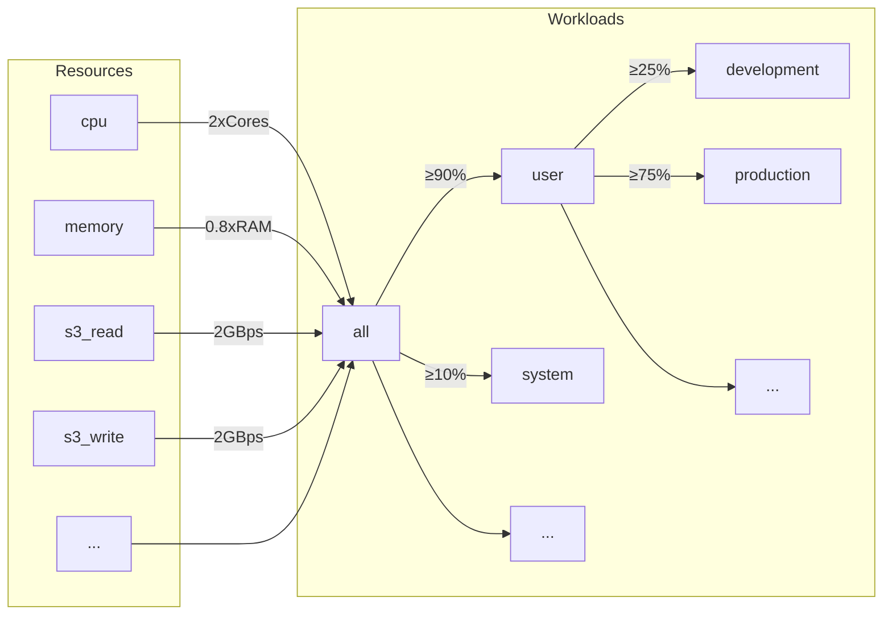
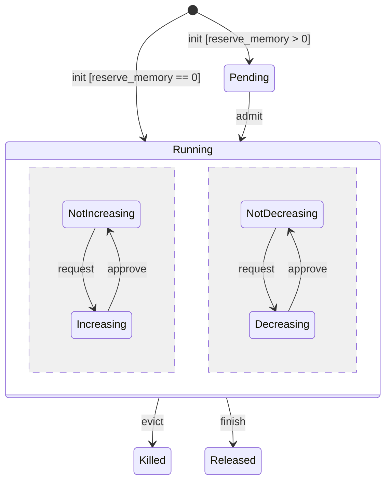
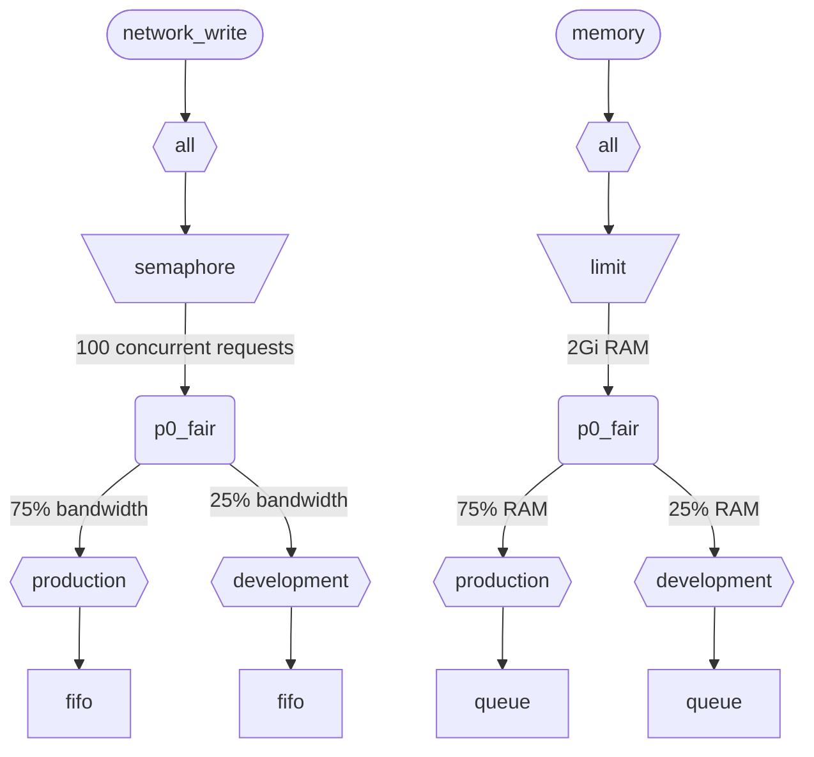

Когда ClickHouse выполняет несколько запросов одновременно, они используют общие ресурсы (CPU, память и IO). Чтобы регулировать использование и распределение ресурсов между разными рабочими нагрузками, можно применять ограничения и политики планирования. Для всех ресурсов можно настроить общую иерархию планирования. Корень иерархии представляет общие ресурсы, а листья — конкретные рабочие нагрузки, содержащие запросы на ресурсы и их выделение для конкретных запросов и фоновых процессов.

<div id="resources">
  ## Ресурсы
</div>

По умолчанию планирование рабочих нагрузок отключено. Чтобы включить его, необходимо создать ресурсы, которые будут использоваться для планирования, а также как минимум одну рабочую нагрузку. Все ресурсы независимы и могут использоваться в произвольной комбинации.

Чтобы включить планирование CPU, необходимо создать ресурс CPU для потоков MASTER или WORKER (подробности см. в разделе [Планирование CPU](#cpu_scheduling)):

```sql
CREATE RESOURCE cpu (MASTER THREAD, WORKER THREAD)
```

Чтобы включить резервирование памяти для рабочих нагрузок, необходимо создать ресурс MEMORY (подробнее см. в разделе [Резервирование памяти](#memory-reservations)):

```sql
CREATE RESOURCE memory (MEMORY RESERVATION)
```

Чтобы включить планирование слотов для запросов, необходимо создать ресурс QUERY (подробности см. в разделе [Планирование слотов для запросов](#query_scheduling)):

```sql
CREATE RESOURCE query (QUERY)
```

Чтобы включить планирование ввода-вывода для конкретного диска, необходимо создать ресурсы чтения и записи для доступа WRITE и READ:

```sql
CREATE RESOURCE resource_name (WRITE DISK disk_name, READ DISK disk_name)
-- or
CREATE RESOURCE read_resource_name (WRITE DISK write_disk_name)
CREATE RESOURCE write_resource_name (READ DISK read_disk_name)
```

Ресурс можно использовать с любым количеством дисков — для READ, WRITE или одновременно для READ и WRITE. Существует синтаксис, позволяющий использовать ресурс для всех дисков:

```sql
CREATE RESOURCE all_io (READ ANY DISK, WRITE ANY DISK);
```

Ресурсы классифицируются по режиму совместного использования:

* **Ресурсы с разделением по времени** (CPU, IO, слоты запросов) - управляют запросами на ресурсы, которые ставятся в очередь в листьях иерархии планирования. Запросы планируются в соответствии с политиками и ограничениями, заданными этой иерархией. Запросы на ресурсы создаются, когда запрос обращается к соответствующему ресурсу. Например, когда запрос читает данные с диска или использует CPU для обработки, запросы на ресурсы создаются для каждого кванта выполненной работы или для объёма байтов, отправленных или полученных через сокет.
* **Ресурсы с разделением по пространству** (память) - управляют выделением ресурсов в листьях иерархии планирования. Выделения могут быть активными или ожидающими. Ожидающие выделения блокируются, пока не освободится достаточно места или не будет вытеснено (завершено) другое выделение. Решения принимаются на основе лимитов и политик, заданных иерархией. Между выделениями и запросами (или фоновой активностью) существует взаимно однозначное соответствие. Выделение создаётся, когда запрос начинает выполняться, и освобождается, когда он завершает работу. Активные выделения могут динамически увеличиваться или уменьшаться в размере.

<div id="workloads">
  ## Иерархия рабочих нагрузок
</div>

ClickHouse предоставляет удобный синтаксис SQL для задания иерархии планирования. Все ресурсы распределяются в общей иерархии WORKLOAD. Правила распределения для отдельных ресурсов в некоторых аспектах могут различаться, но сама иерархия остаётся той же. Для каждой WORKLOAD поддерживаются необходимые узлы планировщика для каждого ресурса. Дочернюю рабочую нагрузку можно создать внутри любой другой рабочей нагрузки, формируя тем самым иерархию. ClickHouse не навязывает никакой конкретной или предопределённой структуры иерархии рабочих нагрузок.

Ниже приведён пример иерархии, которая распределяет все ресурсы между рабочими нагрузками &quot;user&quot; и &quot;system&quot; с гарантией 90% и 10% соответственно. Обратите внимание, что веса, заданные для рабочих нагрузок, используются для max-min fairness и потому дают лишь best-effort-гарантию снизу (а не ограничение или квоту сверху). Всё планирование выполняется на каждом хосте независимо, поэтому ограничения, заданные настройками `max_*`, действуют отдельно на каждом хосте. Рабочая нагрузка &quot;user&quot; дополнительно распределяет свои ресурсы между рабочими нагрузками &quot;development&quot; и &quot;production&quot;, причём у &quot;production&quot; ресурсов в 3 раза больше, чем у &quot;development&quot;:

```sql
CREATE RESOURCE cpu (MASTER THREAD, WORKER THREAD)
CREATE RESOURCE memory (MEMORY RESERVATION)
CREATE RESOURCE s3_read (READ DISK s3)
CREATE RESOURCE s3_write (WRITE DISK s3)
CREATE WORKLOAD all SETTINGS max_concurrent_threads_ratio_to_cores = 2, max_memory_ratio = 0.8, max_bytes_per_second = '2Gi'
CREATE WORKLOAD user IN all SETTINGS weight = 9
CREATE WORKLOAD system IN all
CREATE WORKLOAD development IN user
CREATE WORKLOAD production IN user SETTINGS weight = 3
```



Имя листовой рабочей нагрузки без дочерних элементов можно использовать в настройках запроса: `SETTINGS workload = 'name'`. Подробности см. в разделе [Разметка рабочих нагрузок](#workload-markup).

Для настройки рабочей нагрузки можно использовать следующие настройки:

* `priority` - (только для с разделением по времени) рабочие нагрузки одного уровня обслуживаются в соответствии со статическими значениями (меньшее значение означает более высокий приоритет). Определяет вытеснение.
* `precedence` - (только для с разделением по пространству) рабочие нагрузки одного уровня допускаются в соответствии со статическими значениями (меньшее значение означает более высокое старшинство). Определяет вытеснение и допуск.
* `weight` - рабочие нагрузки одного уровня с одинаковым статическим приоритетом или старшинством распределяют ресурсы в соответствии с весами на справедливой основе. Влияет на вытеснение и допуск.
* `max_io_requests` - ограничение на количество параллельных запросов ввода-вывода в этой рабочей нагрузке.
* `max_bytes_inflight` - ограничение на общий объём байтов, находящихся в обработке, для параллельных запросов в этой рабочей нагрузке.
* `max_bytes_per_second` - ограничение на скорость чтения или записи в байтах для этой рабочей нагрузки.
* `max_burst_bytes` - максимальное количество байтов, которое рабочая нагрузка может обработать без ограничения скорости (для каждого ресурса независимо).
* `max_concurrent_threads` - ограничение на количество потоков для запросов в этой рабочей нагрузке.
* `max_concurrent_threads_ratio_to_cores` - то же, что и `max_concurrent_threads`, но нормализованное по количеству доступных ядер CPU.
* `max_cpus` - ограничение на количество ядер CPU, используемых для обслуживания запросов в этой рабочей нагрузке.
* `max_cpu_share` - то же, что и `max_cpus`, но нормализованное по количеству доступных ядер CPU.
* `max_burst_cpu_seconds` - максимальное количество CPU-секунд, которое рабочая нагрузка может потребить без ограничения скорости из-за `max_cpus`.
* `max_memory` - ограничение на общий объём памяти, зарезервированной для этой рабочей нагрузки.

Все ограничения, заданные через настройки рабочей нагрузки, независимы для каждого ресурса. Например, рабочая нагрузка с `max_bytes_per_second = '10Mi'` будет иметь ограничение пропускной способности 10 MB/s отдельно для каждого ресурса чтения и записи. Если требуется общее ограничение для чтения и записи, рассмотрите возможность использования одного и того же ресурса для доступа READ и WRITE.

Нельзя задать разные иерархии рабочих нагрузок для разных ресурсов. Однако можно задать разные значения настройки рабочей нагрузки для конкретного ресурса:

```sql
CREATE OR REPLACE WORKLOAD all SETTINGS max_io_requests = 100, max_bytes_per_second = '1Mi' FOR network_read, max_bytes_per_second = '2Mi' FOR network_write
```

Также обратите внимание, что рабочую нагрузку или ресурс нельзя удалить, если на них ссылается другая рабочая нагрузка. Чтобы обновить определение рабочей нагрузки, используйте запрос `CREATE OR REPLACE WORKLOAD`.

<Note>
  Настройки рабочей нагрузки преобразуются в соответствующий набор узлов планировщика. Подробности на более низком уровне см. в описании [типов и параметров узлов планировщика](#hierarchy).
</Note>

<div id="workload-markup">
  ## Маркировка рабочих нагрузок
</div>

Запросы можно помечать с помощью настройки `workload`, чтобы различать разные рабочие нагрузки. Если `workload` не задана, используется значение &quot;default&quot;. Обратите внимание, что другое значение можно указать с помощью профилей настроек. Ограничения настроек можно использовать, чтобы сделать `workload` неизменяемой, если вы хотите, чтобы все запросы пользователя помечались фиксированным значением настройки `workload`.

<Warning>
  Настройка запроса `workload` может ссылаться только на листовые рабочие нагрузки (то есть рабочие нагрузки без дочерних).
</Warning>

```sql
SELECT count() FROM my_table WHERE value = 42 SETTINGS workload = 'production'
SELECT count() FROM my_table WHERE value = 13 SETTINGS workload = 'development'
```

Настройку `workload` можно также назначить для фоновых операций. Для слияний и мутаций используются настройки сервера `merge_workload` и `mutation_workload` соответственно. Эти значения также можно переопределить для конкретных таблиц с помощью настроек MergeTree `merge_workload` и `mutation_workload`.

<div id="cpu_scheduling">
  ## Планирование CPU
</div>

Чтобы включить планирование CPU для рабочих нагрузок, создайте ресурс CPU и установите ограничение на количество одновременно выполняемых потоков:

```sql
CREATE RESOURCE cpu (MASTER THREAD, WORKER THREAD)
CREATE WORKLOAD all SETTINGS max_concurrent_threads = 100
```

Когда ClickHouse server выполняет много параллельных запросов с [несколькими потоками](/ru/reference/settings/session-settings#max_threads) и все слоты CPU заняты, система переходит в состояние перегрузки. В состоянии перегрузки каждый освобождённый слот CPU заново назначается соответствующей рабочей нагрузке в соответствии с политиками планирования. Для запросов, использующих одну и ту же рабочую нагрузку, слоты распределяются по алгоритму round-robin. Для запросов из разных рабочих нагрузок слоты распределяются в соответствии с весами, приоритетами и лимитами, заданными для этих рабочих нагрузок.

Время CPU потребляется потоками, когда они не заблокированы и выполняют ресурсоёмкие задачи. Для целей планирования различают два типа потоков:

* Master thread — первый поток, который начинает выполнять запрос или фоновую операцию, такую как merge или mutation.
* Worker thread — дополнительные потоки, которые master может порождать для выполнения ресурсоёмких задач.

Может быть полезно использовать отдельные ресурсы для master- и worker-потоков, чтобы повысить отзывчивость. Большое количество worker-потоков может легко монополизировать ресурсы CPU при высоких значениях настройки запроса `max_threads`. В этом случае входящие запросы будут блокироваться и ждать слот CPU, чтобы их master-потоки могли начать выполнение. Чтобы этого избежать, можно использовать следующую конфигурацию:

```sql
CREATE RESOURCE worker_cpu (WORKER THREAD)
CREATE RESOURCE master_cpu (MASTER THREAD)
CREATE WORKLOAD all SETTINGS max_concurrent_threads = 100 FOR worker_cpu, max_concurrent_threads = 1000 FOR master_cpu
```

Это создаст отдельные ограничения для master- и worker-потоков. Даже если все 100 worker-слотов CPU заняты, новые запросы не будут блокироваться, пока доступны master-слоты CPU. Они начнут выполняться в один поток. Позже, если worker-слоты CPU станут доступны, такие запросы смогут масштабироваться и запускать свои worker-потоки. С другой стороны, такой подход не связывает общее число слотов с количеством CPU, и запуск слишком большого числа параллельных потоков скажется на производительности.

Ограничение параллелизма master-потоков не ограничивает число параллельных запросов. Слоты CPU могут освобождаться в середине выполнения запроса и затем выделяться другим потокам. Например, 4 параллельных запроса при ограничении в 2 параллельных master-потока могут все выполняться одновременно. В этом случае каждый запрос получит 50% процессорного времени CPU. Для ограничения числа параллельных запросов нужна отдельная логика, и в настоящее время для рабочих нагрузок она не поддерживается.

Для рабочих нагрузок можно использовать отдельные ограничения параллелизма потоков:

```sql
CREATE RESOURCE cpu (MASTER THREAD, WORKER THREAD)
CREATE WORKLOAD all
CREATE WORKLOAD admin IN all SETTINGS max_concurrent_threads = 10
CREATE WORKLOAD production IN all SETTINGS max_concurrent_threads = 100
CREATE WORKLOAD analytics IN production SETTINGS max_concurrent_threads = 60, weight = 9
CREATE WORKLOAD ingestion IN production
```

Этот пример конфигурации задаёт независимые пулы слотов CPU для административной и продакшен-нагрузки. Пул продакшена совместно используется аналитикой и ингестией. Кроме того, если пул продакшена перегружен, 9 из 10 освобождённых слотов при необходимости будут переназначаться аналитическим запросам. Запросы ингестии в периоды перегрузки будут получать только 1 из 10 слотов. Это может уменьшить задержку пользовательских запросов. У аналитики есть собственный лимит в 60 параллельных потоков, поэтому для поддержки ингестии всегда остаётся как минимум 40 потоков. Когда перегрузки нет, ингестия может использовать все 100 потоков.

Чтобы исключить запрос из планирования CPU, установите настройку запроса [use&#95;concurrency&#95;control](/ru/reference/settings/session-settings#use_concurrency_control) в 0.

Планирование CPU пока не поддерживается для слияний и мутаций.

Чтобы обеспечить справедливое распределение ресурсов между рабочими нагрузками, во время выполнения запроса необходимо выполнять вытеснение и динамическое уменьшение числа потоков. Вытеснение включается настройкой сервера `cpu_slot_preemption`. Если она включена, каждый поток периодически продлевает свой слот CPU (в соответствии с настройкой сервера `cpu_slot_quantum_ns`). Такое продление может блокировать выполнение, если CPU перегружен. Если выполнение блокируется на длительное время (см. настройку сервера `cpu_slot_preemption_timeout_ms`), запрос уменьшает масштаб, и число одновременно работающих потоков динамически снижается. Обратите внимание, что справедливое распределение времени CPU гарантируется между рабочими нагрузками, но между запросами внутри одной и той же рабочей нагрузки в некоторых редких случаях оно может нарушаться.

<Warning>
  Планирование слотов позволяет управлять [параллелизмом запросов](/ru/reference/settings/session-settings#max_threads), но не гарантирует справедливое распределение времени CPU, если настройка сервера `cpu_slot_preemption` не установлена в `true`; в противном случае справедливость обеспечивается на основе количества выделений слотов CPU между конкурирующими рабочими нагрузками. Это не означает равное количество секунд CPU, потому что без вытеснения слот CPU может удерживаться неограниченно долго. Поток получает слот в начале работы и освобождает его после её завершения.
</Warning>

<Note>
  При объявлении ресурса CPU настройки [`concurrent_threads_soft_limit_num`](/ru/reference/settings/server-settings/settings#concurrent_threads_soft_limit_num) и [`concurrent_threads_soft_limit_ratio_to_cores`](/ru/reference/settings/server-settings/settings#concurrent_threads_soft_limit_ratio_to_cores) перестают действовать. Вместо них для ограничения числа CPU, выделяемых для конкретной рабочей нагрузки, используется настройка рабочей нагрузки `max_concurrent_threads`. Чтобы добиться прежнего поведения, создайте только ресурс WORKER THREAD, задайте для рабочей нагрузки `all` настройку `max_concurrent_threads` равной `concurrent_threads_soft_limit_num` и используйте настройку запроса `workload = "all"`. Эта конфигурация соответствует значению &quot;fair&#95;round&#95;robin&quot; для настройки [`concurrent_threads_scheduler`](/ru/reference/settings/server-settings/settings#concurrent_threads_scheduler).
</Note>

<div id="threads_vs_cpus">
  ## Потоки и CPU
</div>

Есть два способа управлять потреблением CPU для рабочей нагрузки:

* Ограничение числа потоков: `max_concurrent_threads` и `max_concurrent_threads_ratio_to_cores`
* Троттлинг CPU: `max_cpus`, `max_cpu_share` и `max_burst_cpu_seconds`

<Warning>
  Настройки троттлинга CPU активны, только если включена настройка сервера `cpu_slot_preemption`; в противном случае они игнорируются.
</Warning>

Первый позволяет динамически управлять количеством потоков, создаваемых для запроса, в зависимости от текущей нагрузки на сервер. По сути, он снижает значение, задаваемое настройкой запроса `max_threads`. Второй ограничивает потребление CPU рабочей нагрузкой с помощью алгоритма token bucket. Он не влияет напрямую на число потоков, но ограничивает суммарное потребление CPU всеми потоками рабочей нагрузки.

Троттлинг token bucket с `max_cpus` и `max_burst_cpu_seconds` означает следующее. На любом интервале длиной `delta` секунд суммарное потребление CPU всеми запросами в рабочей нагрузке не должно превышать `max_cpus * delta + max_burst_cpu_seconds` секунд CPU. В долгосрочной перспективе это ограничивает среднее потребление значением `max_cpus`, однако кратковременно этот предел может быть превышен. Например, при `max_burst_cpu_seconds = 60` и `max_cpus=0.001` можно без троттлинга выполнять либо 1 поток в течение 60 секунд, либо 2 потока в течение 30 секунд, либо 60 потоков в течение 1 секунды. Значение по умолчанию для `max_burst_cpu_seconds` — 1 секунда. Меньшие значения могут приводить к недоиспользованию разрешенных ядер `max_cpus` при большом числе параллельных потоков.

Пока поток удерживает слот CPU, он может находиться в одном из трех основных состояний:

* **Running:** Фактически потребляет ресурсы CPU. Время, проведенное в этом состоянии, учитывается при троттлинге CPU.
* **Ready:** Ожидает, пока CPU станет доступен. Время, проведенное в этом состоянии, не учитывается при троттлинге CPU.
* **Blocked:** Выполняет операции ввода-вывода или другие блокирующие системные вызовы (например, ожидает mutex). Время, проведенное в этом состоянии, не учитывается при троттлинге CPU.

Рассмотрим пример конфигурации, которая сочетает троттлинг CPU и ограничения на число потоков:

```sql
CREATE RESOURCE cpu (MASTER THREAD, WORKER THREAD)
CREATE WORKLOAD all SETTINGS max_concurrent_threads_ratio_to_cores = 2
CREATE WORKLOAD admin IN all SETTINGS max_concurrent_threads = 2, priority = -1
CREATE WORKLOAD production IN all SETTINGS weight = 4
CREATE WORKLOAD analytics IN production SETTINGS max_cpu_share = 0.7, weight = 3
CREATE WORKLOAD ingestion IN production
CREATE WORKLOAD development IN all SETTINGS max_cpu_share = 0.3
```

Здесь мы ограничиваем общее число потоков для всех запросов до значения, в 2 раза превышающего число доступных CPU. Рабочая нагрузка Admin ограничена максимум двумя потоками, независимо от количества доступных CPU. У Admin приоритет -1 (ниже значения по умолчанию 0), и при необходимости она первой получает любой слот CPU. Когда Admin не выполняет запросы, ресурсы CPU распределяются между рабочими нагрузками production и development. Гарантированные доли процессорного времени задаются весами (4 к 1): не менее 80% получает production (если требуется), и не менее 20% — development (если требуется). Хотя веса задают гарантии, throttling CPU задаёт ограничения: production не ограничена и может потреблять 100%, тогда как для development установлен предел 30%, который действует даже при отсутствии запросов от других рабочих нагрузок. Рабочая нагрузка production не является листовой, поэтому её ресурсы распределяются между analytics и ingestion в соответствии с весами (3 к 1). Это означает, что для analytics гарантируется не менее 0.8 * 0.75 = 60%, а на основе `max_cpu_share` её предел составляет 70% от общих ресурсов CPU. В то же время для ingestion гарантируется не менее 0.8 * 0.25 = 20%, при этом верхнего предела у неё нет.

<Note>
  Если вы хотите максимально загрузить CPU на сервере ClickHouse, не используйте `max_cpus` и `max_cpu_share` для корневой рабочей нагрузки `all`. Вместо этого задайте более высокое значение `max_concurrent_threads`. Например, в системе с 8 CPU установите `max_concurrent_threads = 16`. Это позволит 8 потокам выполнять задачи CPU, а ещё 8 потокам — обрабатывать операции I/O. Дополнительные потоки создадут нагрузку на CPU, что обеспечит применение правил планирования. Напротив, значение `max_cpus = 8` никогда не создаст нагрузки на CPU, потому что сервер не сможет превысить 8 доступных CPU.
</Note>

<div id="memory-reservations">
  ## Резервирование памяти
</div>

<Note>
  Планирование с резервированием памяти — экспериментальная функция. Оно действует только при наличии ресурса `MEMORY RESERVATION`, а его SQL-интерфейс и поведение могут измениться в будущих выпусках. Оно пока не поддерживается для слияний и мутаций, а вытеснение выполняющегося запроса работает в режиме best-effort: оно срабатывает в следующей точке синхронизации памяти запроса, а не мгновенно.
</Note>

Чтобы включить резервирование памяти для рабочих нагрузок, создайте ресурс MEMORY RESERVATION и задайте хотя бы одно ограничение на общий объем зарезервированной памяти с помощью настроек рабочей нагрузки:

```sql
CREATE RESOURCE memory (MEMORY RESERVATION)
CREATE WORKLOAD all SETTINGS max_memory = '2Gi'
```

ClickHouse отслеживает выделение памяти для всех запросов и фоновых операций. Объем выделенной памяти в байтах агрегируется по иерархии планирования вплоть до корневого уровня. С каждым запросом связано выделение памяти в листовой рабочей нагрузке, к которой он относится. Если у запроса значение настройки `reserve_memory` больше нуля, выделение создается в состоянии pending. Выделение в состоянии pending резервирует запрошенный объем памяти в иерархии рабочих нагрузок. Если доступной памяти недостаточно, выделение остается в состоянии pending, пока не освободится достаточно памяти или другие выделения не будут вытеснены (завершены). Когда выделение получает допуск, оно переходит в состояние running. Выделение в состоянии running может динамически увеличиваться или уменьшаться в зависимости от потребления памяти запросом. Жизненный цикл выделения можно представить следующей диаграммой состояний:



Ожидающие выделения в листовой рабочей нагрузке обрабатываются в порядке FIFO. Если ожидающие выделения есть у нескольких рабочих нагрузок, они обрабатываются в соответствии с настройками старшинства и весов. Сначала обслуживаются рабочие нагрузки с более высоким старшинством. Дочерние рабочие нагрузки с одинаковым старшинством делят память в соответствии с весами по принципу max-min fairness, то есть первой обслуживается рабочая нагрузка с меньшим нормализованным использованием памяти (текущее использование плюс запрошенное увеличение, делённые на вес). При вытеснении применяется обратная логика. Когда нужно освободить память, первыми вытесняются рабочие нагрузки с меньшим старшинством и более высоким нормализованным использованием памяти.

Обратите внимание: ресурсы с разделением по времени используют priority, а ресурсы с разделением пространства — старшинство. Это независимые настройки, и для них можно задавать разные значения. Более высокий priority подразумевает неразрушающее вытеснение (задержку или throttling), тогда как более высокое старшинство может подразумевать разрушающее вытеснение (остановку с ошибкой). Рабочая нагрузка может иметь высокий priority для планирования CPU, но то же значение старшинства для резервирования памяти, чтобы не вытеснять другие рабочие нагрузки и не терять уже выполненную ими работу.

Каждая рабочая нагрузка с ограничением `max_memory` гарантирует, что общий объём памяти, выделенной в её поддереве, не превышает этот лимит. Если ожидающее или увеличивающееся выделение превысит лимит, запускается процедура вытеснения для освобождения памяти. Процедура вытеснения выбирает жертву, которую нужно завершить. Рабочая нагрузка, являющаяся наименьшим общим предком для инициатора и жертвы, предотвращает вытеснение в следующих ситуациях:

* Ожидающее выделение не может вытеснить выполняющиеся выделения в той же рабочей нагрузке. (Рабочие нагрузки инициатора и жертвы совпадают).
* Ожидающее выделение с меньшим старшинством никогда не завершает рабочую нагрузку с более высоким старшинством.
* Ожидающее выделение не может завершить выделение с тем же старшинством. Обратите внимание, что выполняющиеся выделения с тем же старшинством могут вытеснять друг друга на основе нормализованного использования памяти.
  Если вытеснение предотвращено или не освобождает достаточно памяти, новое выделение блокируется до тех пор, пока не освободится достаточный объём памяти. Эти правила позволяют ставить избыточные запросы в очередь в зависимости от нагрузки на память и дают удобный способ избежать ошибок MEMORY&#95;LIMIT&#95;EXCEEDED.

<Note>
  Ограничения рабочей нагрузки не зависят от других способов ограничить потребление памяти, таких как настройка запроса [max&#95;memory&#95;usage](/ru/reference/settings/session-settings#max_memory_usage). Их можно использовать вместе для более точного контроля потребления памяти. Можно задавать независимые ограничения памяти на основе пользователей (а не рабочих нагрузок). Это менее гибко и не предоставляет таких возможностей, как резервирование памяти и постановка ожидающих запросов в очередь. См. [Memory overcommit](/ru/concepts/features/configuration/settings/memory-overcommit)
</Note>

Настройка рабочей нагрузки `max_waiting_queries` ограничивает количество ожидающих выделений для рабочей нагрузки. Когда лимит достигнут, сервер возвращает ошибку `SERVER_OVERLOADED`. Обратите внимание, что `max_waiting_queries` не наследуется дочерними рабочими нагрузками и имеет смысл только для листовых рабочих нагрузок.

Планирование резервирования памяти пока не поддерживается для слияний и мутаций.

Только запросы, у которых значение настройки `reserve_memory` больше нуля, могут блокироваться в ожидании резервирования памяти. Однако запросы с `reserve_memory`, равным нулю, также учитываются в объёме памяти своей рабочей нагрузки и при необходимости могут быть вытеснены, чтобы освободить память для других ожидающих или растущих выделений. Запросы без корректной разметки рабочей нагрузки не подпадают под планирование резервирования памяти и не могут быть вытеснены планировщиком.

Чтобы обеспечить для запроса неэластичное резервирование памяти, задайте одинаковое значение для настроек запроса `reserve_memory` и `max_memory_usage`. В этом случае запрос зарезервирует фиксированный объём памяти и не сможет динамически увеличивать своё выделение. Обратите внимание, что эластичное резервирование памяти может быть увеличено выше `reserve_memory`, вплоть до `max_memory_usage`, без принудительного завершения запроса, если только не возникает нехватка памяти. Но оно не может быть уменьшено ниже `reserve_memory`, даже если фактическое потребление меньше.

Рассмотрим пример конфигурации:

```sql
CREATE RESOURCE memory (MEMORY RESERVATION)
CREATE WORKLOAD all SETTINGS max_memory = '10Gi'
CREATE WORKLOAD system IN all SETTINGS weight = 1
CREATE WORKLOAD user IN all SETTINGS weight = 9
CREATE WORKLOAD production IN user SETTINGS precedence = 1, weight = 3
CREATE WORKLOAD staging IN user SETTINGS precedence = 1, weight = 1
CREATE WORKLOAD testing IN user SETTINGS precedence = 2
```

В этом примере общий объём памяти, зарезервированной всеми запросами и системными фоновыми процессами, не может превышать 10 GiB. Системной рабочей нагрузке гарантируется не менее 1 GiB (10% от 10 GiB), а пользовательской рабочей нагрузке — не менее 9 GiB (90% от 10 GiB). Внутри пользовательской рабочей нагрузки рабочие нагрузки production и staging делят память в соответствии с весами (3 к 1) при одинаковом старшинстве 1. Рабочая нагрузка testing имеет старшинство 2, которое ниже, чем у production и staging. Поэтому рабочая нагрузка testing может использовать только ту память, которая не занята production и staging.

Если возникает нехватка памяти, первыми будут вытеснены выделения рабочей нагрузки testing. Затем, если потребуется освободить больше памяти, выделения рабочей нагрузки staging будут вытеснены раньше, чем выделения рабочей нагрузки production, если они превышают свои гарантии. Обратите внимание, что ожидающие запросы в production и staging могут вытеснять активные выделения в рабочей нагрузке testing, чтобы освободить память, но не могут вытеснять друг друга, потому что у них одинаковое старшинство. В случае нехватки памяти они будут ждать в очередях, что позволяет системе избегать ошибок MEMORY&#95;LIMIT&#95;EXCEEDED из-за слишком большого количества одновременно выполняющихся запросов.

Обратите внимание, что системная рабочая нагрузка имеет старшинство 0 (default), которое выше, чем у рабочих нагрузок production, staging и testing, но они не являются одноуровневыми рабочими нагрузками. Их наименьший общий предок — рабочая нагрузка all, и оба её потомка имеют одинаковое старшинство. Поэтому ожидающая системная рабочая нагрузка не может вытеснить ни одну из них, и наоборот. Это гарантирует, что системные процессы нельзя легко вытеснить.

<div id="query_scheduling">
  ## Планирование слотов для запросов
</div>

Чтобы включить планирование слотов для запросов для рабочих нагрузок, создайте ресурс QUERY и задайте ограничение на количество одновременных запросов или запросов в секунду:

```sql
CREATE RESOURCE query (QUERY)
CREATE WORKLOAD all SETTINGS max_concurrent_queries = 100, max_queries_per_second = 10, max_burst_queries = 20
```

Настройка рабочей нагрузки `max_concurrent_queries` ограничивает количество запросов, которые могут одновременно выполняться в рамках заданной рабочей нагрузки. Это аналог настройки запроса [`max_concurrent_queries_for_all_users`](/ru/reference/settings/session-settings#max_concurrent_queries_for_all_users) и настройки сервера [max&#95;concurrent&#95;queries](/ru/reference/settings/server-settings/settings#max_concurrent_queries). Запросы async insert и некоторые специальные запросы, такие как KILL, не учитываются в этом ограничении.

Настройки рабочей нагрузки `max_queries_per_second` и `max_burst_queries` ограничивают количество запросов для рабочей нагрузки с помощью throttler&#39;а token bucket. Это гарантирует, что за любой интервал времени `T` начнут выполняться не более `max_queries_per_second * T + max_burst_queries` новых запросов.

Настройка рабочей нагрузки `max_waiting_queries` ограничивает количество ожидающих запросов для рабочей нагрузки. Когда лимит достигнут, сервер возвращает ошибку `SERVER_OVERLOADED`. Обратите внимание, что `max_waiting_queries` не наследуется дочерними рабочими нагрузками и имеет смысл только для конечных рабочих нагрузок.

<Note>
  Заблокированные запросы будут ждать неограниченно долго и не будут отображаться в `SHOW PROCESSLIST`, пока не будут выполнены все ограничения.
</Note>

<div id="workload_entity_storage">
  ## Хранение рабочих нагрузок и ресурсов
</div>

Определения всех рабочих нагрузок и ресурсов в форме запросов `CREATE WORKLOAD` и `CREATE RESOURCE` хранятся постоянно: либо на диске в `workload_path`, либо в ZooKeeper по пути `workload_zookeeper_path`. Для обеспечения согласованности между узлами рекомендуется использовать хранилище ZooKeeper. В качестве альтернативы при хранении на диске можно использовать предложение `ON CLUSTER`.

<div id="config_based_workloads">
  ## Рабочие нагрузки и ресурсы, задаваемые конфигурацией
</div>

Помимо определений на основе SQL, рабочие нагрузки и ресурсы можно заранее задать в файле конфигурации сервера. Это полезно в облачных средах, где часть ограничений диктуется инфраструктурой, а другие могут изменяться клиентами. Сущности, задаваемые конфигурацией, имеют приоритет над сущностями, определёнными через SQL, и не могут быть изменены или удалены с помощью SQL-команд.

<div id="config_based_workloads_format">
  ### Формат конфигурации
</div>

```xml
<clickhouse>
    <resources_and_workloads>
        CREATE RESOURCE memory (MEMORY RESERVATION);
        CREATE RESOURCE s3disk_read (READ DISK s3);
        CREATE RESOURCE s3disk_write (WRITE DISK s3);
        CREATE WORKLOAD all SETTINGS max_memory = '2Gi', max_io_requests = 500 FOR s3disk_read, max_io_requests = 1000 FOR s3disk_write, max_bytes_per_second = '1280Mi' FOR s3disk_read, max_bytes_per_second = '3200Mi' FOR s3disk_write;
        CREATE WORKLOAD production IN all SETTINGS weight = 3;
    </resources_and_workloads>
</clickhouse>
```

Конфигурация использует тот же синтаксис SQL, что и команды `CREATE WORKLOAD` и `CREATE RESOURCE`. Все запросы должны быть корректными.

<div id="config_based_workloads_usage_recommendations">
  ### Рекомендации по использованию
</div>

Для облачных сред типичная настройка может включать:

1. Определите корневую рабочую нагрузку и сетевые ресурсы ввода-вывода в конфигурации, чтобы задать ограничения инфраструктуры
2. Установите `throw_on_unknown_workload`, чтобы обеспечить соблюдение этих ограничений
3. Создайте `CREATE WORKLOAD default IN all`, чтобы автоматически применять ограничения ко всем запросам (поскольку значение по умолчанию для настройки запроса `workload` — &#39;default&#39;)
4. Разрешите пользователям создавать дополнительные рабочие нагрузки в пределах настроенной иерархии

Это гарантирует, что все фоновые процессы и запросы соблюдают ограничения инфраструктуры, сохраняя при этом гибкость для пользовательских политик планирования.

Другой вариант использования — разная конфигурация для разных узлов в неоднородном кластере.

<div id="strict_resource_access">
  ## Строгий доступ к ресурсам
</div>

Чтобы принудительно применять политики планирования ресурсов ко всем запросам, предусмотрена настройка сервера `throw_on_unknown_workload`. Если она установлена в `true`, для каждого запроса должна быть указана корректная настройка запроса `workload`, иначе генерируется исключение `RESOURCE_ACCESS_DENIED`. Если она установлена в `false`, такой запрос не использует планировщик ресурсов, то есть получает неограниченный доступ к любому `RESOURCE`. Настройка запроса `use_concurrency_control = 0` позволяет запросу обходить планировщик CPU и получать неограниченный доступ к CPU. Чтобы принудительно включить планирование CPU, создайте ограничение на настройку, чтобы зафиксировать `use_concurrency_control` как неизменяемое значение только для чтения.

<Note>
  Не устанавливайте `throw_on_unknown_workload` в `true`, пока не выполнен `CREATE WORKLOAD default`. Иначе это может привести к проблемам при запуске сервера, если во время старта будет выполнен запрос без явно заданной настройки `workload`.
</Note>

<div id="hierarchy">
  ### Иерархия узлов планировщика
</div>

С точки зрения подсистемы планирования каждый ресурс представляет собой иерархию узлов планировщика. ClickHouse автоматически создает все необходимые узлы планировщика на основе определений WORKLOAD и RESOURCE. Узлы планировщика — это низкоуровневые подробности реализации, доступ к которым можно получить через [таблицу system.scheduler](/ru/reference/system-tables/scheduler).

```sql
CREATE RESOURCE network_write (WRITE DISK s3)
CREATE RESOURCE memory (MEMORY RESERVATION)
CREATE WORKLOAD all SETTINGS max_io_requests = 100, max_memory = '2Gi'
CREATE WORKLOAD development IN all
CREATE WORKLOAD production IN all SETTINGS weight = 3
```



**Типы узлов с разделением по времени:**

* `inflight_limit` (ограничение) — блокирует, если либо число одновременно обрабатываемых запросов превышает `max_requests`, либо их суммарная стоимость превышает `max_cost`; должен иметь один дочерний узел.
* `bandwidth_limit` (ограничение) — блокирует, если текущая пропускная способность превышает `max_speed` (0 означает отсутствие ограничений) или размер всплеска превышает `max_burst` (по умолчанию равен `max_speed`); должен иметь один дочерний узел.
* `fair` (политика) — выбирает следующий запрос для обслуживания из одного из дочерних узлов по принципу max-min fairness; дочерние узлы могут задавать `weight` (по умолчанию 1).
* `priority` (политика) — выбирает следующий запрос для обслуживания из одного из дочерних узлов в соответствии со статическими приоритетами (меньшее значение означает более высокий приоритет); дочерние узлы должны задавать `priority` (по умолчанию 0).
* `fifo` (очередь) — листовой узел иерархии, способный удерживать запросы, превышающие ёмкость ресурса.

**Типы узлов с разделением по пространству:**

* `limit` — гарантирует, что суммарное выделение дочернего узла никогда не превышает заданный предел, и при необходимости запускает процедуру вытеснения в поддереве; должен иметь один дочерний узел.
* `fair_allocation` — выполняет вытеснение по принципу max-min fairness; ожидающие выделения никогда не вытесняют выполняющиеся; дочерние узлы могут задавать `weight` (по умолчанию 1).
* `precedence_allocation` — выполняет вытеснение в соответствии со статическим приоритетом (меньшее значение означает более высокий приоритет); ожидающее выделение с более высоким приоритетом вытесняет выделения с более низким приоритетом; дочерние узлы должны задавать `precedence` (по умолчанию 0).
* `queue` — листовой узел иерархии, способный удерживать выполняющиеся и ожидающие выделения.

<div id="deprecated-configuration">
  ## Устаревшая XML-конфигурация
</div>

Альтернативный способ указать, какие диски использует ресурс, — это `storage_configuration` сервера:

Чтобы включить планирование ввода-вывода для конкретного диска, необходимо указать `read_resource` и/или `write_resource` в конфигурации хранилища. Так ClickHouse понимает, какой ресурс использовать для всех операций чтения и записи на данном диске. Ресурсы чтения и записи могут ссылаться на одно и то же имя ресурса, что полезно для локальных SSD или HDD. Несколько разных дисков также могут ссылаться на один и тот же ресурс, что полезно для удаленных дисков, если вы хотите обеспечить справедливое распределение пропускной способности сети, например между рабочими нагрузками &quot;production&quot; и &quot;development&quot;.

Пример:

```xml
<clickhouse>
    <storage_configuration>
        ...
        <disks>
            <s3>
                <type>s3</type>
                <endpoint>https://clickhouse-public-datasets.s3.amazonaws.com/my-bucket/root-path/</endpoint>
                <access_key_id>your_access_key_id</access_key_id>
                <secret_access_key>your_secret_access_key</secret_access_key>
                <read_resource>network_read</read_resource>
                <write_resource>network_write</write_resource>
            </s3>
        </disks>
        <policies>
            <s3_main>
                <volumes>
                    <main>
                        <disk>s3</disk>
                    </main>
                </volumes>
            </s3_main>
        </policies>
    </storage_configuration>
</clickhouse>
```

Обратите внимание, что параметры конфигурации сервера имеют приоритет над определением ресурсов через SQL.

<div id="see-also">
  ## См. также
</div>

* [system.scheduler](/ru/reference/system-tables/scheduler)
* [system.workloads](/ru/reference/system-tables/workloads)
* [system.resources](/ru/reference/system-tables/resources)
* [merge&#95;workload](/ru/reference/settings/merge-tree-settings#merge_workload) настройка MergeTree
* [merge&#95;workload](/ru/reference/settings/server-settings/settings#merge_workload) глобальная настройка сервера
* [mutation&#95;workload](/ru/reference/settings/merge-tree-settings#mutation_workload) настройка MergeTree
* [mutation&#95;workload](/ru/reference/settings/server-settings/settings#mutation_workload) глобальная настройка сервера
* [workload&#95;path](/ru/reference/settings/server-settings/settings#workload_path) глобальная настройка сервера
* [workload&#95;zookeeper&#95;path](/ru/reference/settings/server-settings/settings#workload_zookeeper_path) глобальная настройка сервера
* [cpu&#95;slot&#95;preemption](/ru/reference/settings/server-settings/settings#cpu_slot_preemption) глобальная настройка сервера
* [cpu&#95;slot&#95;quantum&#95;ns](/ru/reference/settings/server-settings/settings#cpu_slot_quantum_ns) глобальная настройка сервера
* [cpu&#95;slot&#95;preemption&#95;timeout&#95;ms](/ru/reference/settings/server-settings/settings#cpu_slot_preemption_timeout_ms) глобальная настройка сервера