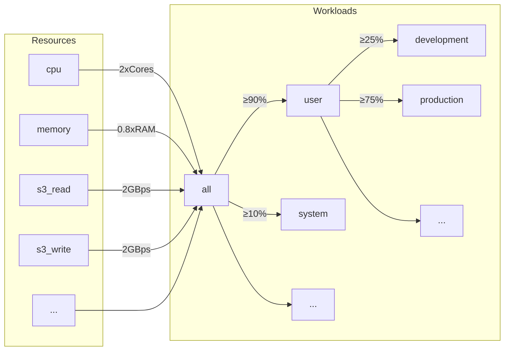
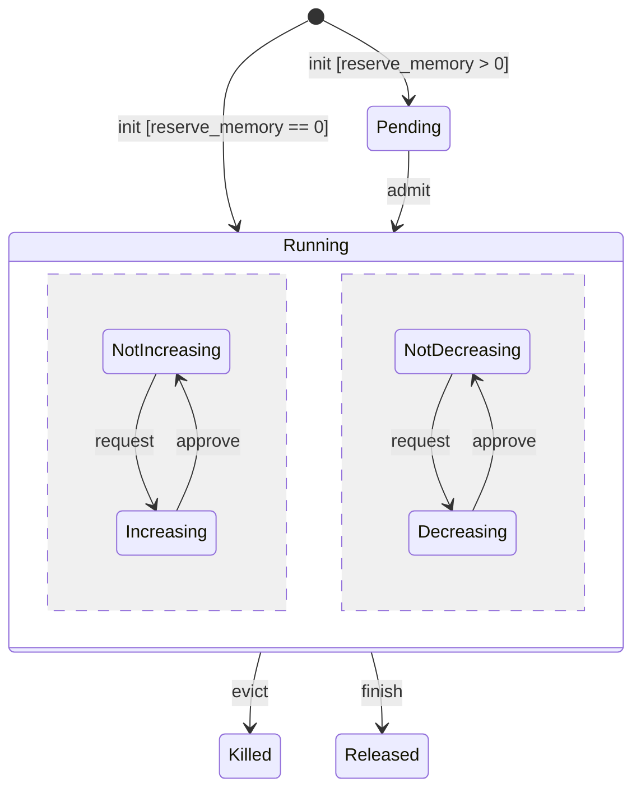
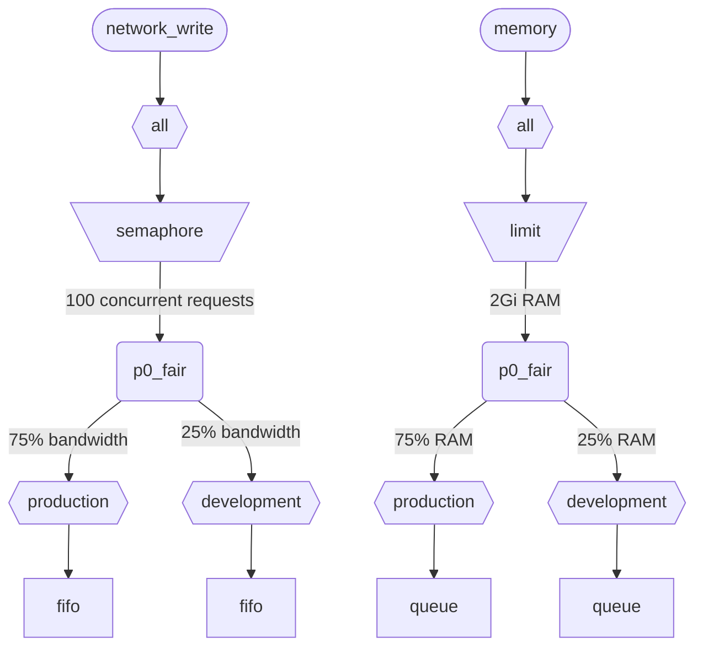

当 ClickHouse 同时执行多个查询时，这些查询可能会使用共享资源 (CPU、内存和 IO) 。可以应用调度约束和策略，以规范不同工作负载之间资源的使用和共享。对于所有资源，都可以配置统一的调度层级结构。层级根节点表示共享资源，而叶子节点则是特定的工作负载，用于承载特定查询和后台活动的资源请求与分配。

<div id="resources">
  ## 资源
</div>

默认情况下，工作负载调度是禁用的。要启用它，需要创建用于调度的资源，以及至少一个工作负载。所有资源彼此独立，可以任意组合使用。

要启用 CPU 调度，需要为 MASTER 或 WORKER 线程创建 CPU 资源 (详见 [CPU scheduling](#cpu_scheduling)) ：

```sql
CREATE RESOURCE cpu (MASTER THREAD, WORKER THREAD)
```

要为工作负载启用内存预留功能，您必须先创建 MEMORY 资源 (详见[内存预留](#memory-reservations)) ：

```sql
CREATE RESOURCE memory (MEMORY RESERVATION)
```

要启用查询槽位调度，必须先创建 QUERY 资源 (详情请参见[查询槽位调度](#query_scheduling)) ：

```sql
CREATE RESOURCE query (QUERY)
```

要为特定的 disk 启用 IO 调度，你必须为 WRITE 和 READ 访问创建读资源和写资源：

```sql
CREATE RESOURCE resource_name (WRITE DISK disk_name, READ DISK disk_name)
-- or
CREATE RESOURCE read_resource_name (WRITE DISK write_disk_name)
CREATE RESOURCE write_resource_name (READ DISK read_disk_name)
```

一个资源可用于任意数量的磁盘，可用于 READ、WRITE，或同时用于 READ 和 WRITE。还有一种语法可将一个资源用于所有磁盘：

```sql
CREATE RESOURCE all_io (READ ANY DISK, WRITE ANY DISK);
```

资源按共享模式分类：

* **时间共享资源** (CPU、IO、查询槽位) - 管理在调度层级叶子节点排队的资源请求。请求会按照层级中定义的策略和约束进行调度。当查询访问相应资源时，就会创建资源请求。例如，当查询从磁盘读取数据，或使用 CPU 进行处理时，系统会在每完成一个工作量子，或通过套接字发送或接收一定字节数时创建资源请求。
* **空间共享资源** (内存) - 管理调度层级叶子节点上的资源分配。分配可能处于运行中或待处理状态。待处理的分配会被阻塞，直到释放出足够空间，或其他分配被驱逐 (killed) 。相关决策基于层级中定义的限制和策略。分配与查询 (或后台活动) 之间是一一对应的关系。分配会在查询开始执行时创建，并在查询结束时释放。运行中的分配其大小可以动态增减。

<div id="workloads">
  ## 工作负载层级结构
</div>

ClickHouse 提供了便捷的 SQL 语法来定义调度层级结构。所有资源都分布在统一的 WORKLOAD 层级结构中。对于特定资源，分配规则的某些细节可以调整，但层级结构本身保持一致。每个 WORKLOAD 都会为每种资源维护必要的调度节点。可以在任意工作负载内创建子工作负载，从而构建出整个层级结构。ClickHouse 不会对工作负载层级结构强制规定任何特定或预定义的结构。

下面是一个层级结构示例，它将所有资源分别分配给 &quot;user&quot; 和 &quot;system&quot; 工作负载，并分别保证 90% 和 10% 的资源份额。请注意，为工作负载定义的权重用于实现 最大最小公平原则，因此只能尽力提供下限保障 (而不是上限限制或配额) 。所有调度都是在每台主机上独立进行的，因此由 `max_*` 设置定义的限制都是按主机生效的。工作负载 &quot;user&quot; 会将其资源进一步细分给 &quot;development&quot; 和 &quot;production&quot; 工作负载，其中 &quot;production&quot; 获得的资源是 &quot;development&quot; 的 3 倍：

```sql
CREATE RESOURCE cpu (MASTER THREAD, WORKER THREAD)
CREATE RESOURCE memory (MEMORY RESERVATION)
CREATE RESOURCE s3_read (READ DISK s3)
CREATE RESOURCE s3_write (WRITE DISK s3)
CREATE WORKLOAD all SETTINGS max_concurrent_threads_ratio_to_cores = 2, max_memory_ratio = 0.8, max_bytes_per_second = '2Gi'
CREATE WORKLOAD user IN all SETTINGS weight = 9
CREATE WORKLOAD system IN all
CREATE WORKLOAD development IN user
CREATE WORKLOAD production IN user SETTINGS weight = 3
```



无子级的叶子工作负载名称可在查询设置 `SETTINGS workload = 'name'` 中使用。详情请参阅 [Workload markup](#workload-markup)。

如需自定义工作负载，可以使用以下设置：

* `priority` -  (仅限时间共享) 同级工作负载按静态值提供服务 (值越小，优先级越高) 。驱动抢占。
* `precedence` -  (仅限空间共享) 同级工作负载按静态值准入 (值越小，优先次序越高) 。驱动驱逐和准入。
* `weight` - 具有相同静态优先级或 优先次序 的同级工作负载按权重以公平方式共享资源。影响抢占、驱逐和准入。
* `max_io_requests` - 此工作负载中并发 IO 请求数量的上限。
* `max_bytes_inflight` - 此工作负载中并发请求的在途总字节数上限。
* `max_bytes_per_second` - 此工作负载的字节读取或写入速率上限。
* `max_burst_bytes` - 该工作负载在不被限流的情况下可处理的最大字节数 (对每种资源分别独立计算) 。
* `max_concurrent_threads` - 此工作负载中查询可使用的线程数量上限。
* `max_concurrent_threads_ratio_to_cores` - 与 `max_concurrent_threads` 相同，但会按可用 CPU 核心数进行归一化。
* `max_cpus` - 为此工作负载中的查询提供服务时可使用的 CPU 核心数量上限。
* `max_cpu_share` - 与 `max_cpus` 相同，但会按可用 CPU 核心数进行归一化。
* `max_burst_cpu_seconds` - 该工作负载在不因 `max_cpus` 而被限流的情况下可消耗的最大 CPU 秒数。
* `max_memory` - 为此工作负载保留的总内存上限。

通过工作负载设置指定的所有限制，对每种资源都是相互独立的。例如，若某个工作负载设置了 `max_bytes_per_second = '10Mi'`，则对每个读取和写入资源都会分别施加 10 MB/s 的带宽限制。如果需要对读取和写入施加统一限制，请考虑让 READ 和 WRITE 访问使用同一资源。

无法为不同资源指定不同的工作负载层级结构。但可以为特定资源指定不同的工作负载设置值：

```sql
CREATE OR REPLACE WORKLOAD all SETTINGS max_io_requests = 100, max_bytes_per_second = '1Mi' FOR network_read, max_bytes_per_second = '2Mi' FOR network_write
```

另请注意，如果某个工作负载或资源被其他工作负载引用，则无法删除。要更新工作负载的定义，请使用 `CREATE OR REPLACE WORKLOAD` 查询。

<Note>
  工作负载设置会转换为一组合适的调度节点。有关底层细节，请参阅调度节点[类型和选项](#hierarchy)的说明。
</Note>

<div id="workload-markup">
  ## 工作负载标记
</div>

可以使用设置 `workload` 为查询打标，以区分不同的工作负载。如果未设置 `workload`，则使用值 &quot;default&quot;。请注意，也可以通过 profile 指定其他值。如果你希望某个用户的所有查询都使用固定的 `workload` 设置值进行标记，可以使用设置约束将 `workload` 固定为该值。

<Warning>
  查询设置 `workload` 只能引用叶子工作负载 (即没有子节点的工作负载) 。
</Warning>

```sql
SELECT count() FROM my_table WHERE value = 42 SETTINGS workload = 'production'
SELECT count() FROM my_table WHERE value = 13 SETTINGS workload = 'development'
```

也可以为后台活动分配 `workload` 设置。合并和变更分别使用 `merge_workload` 和 `mutation_workload` 服务器设置。这些值还可以通过 `merge_workload` 和 `mutation_workload` MergeTree 设置在特定表级别进行覆盖。

<div id="cpu_scheduling">
  ## CPU 调度
</div>

要为工作负载启用 CPU 调度，请创建 CPU 资源，并为并发线程数设置上限：

```sql
CREATE RESOURCE cpu (MASTER THREAD, WORKER THREAD)
CREATE WORKLOAD all SETTINGS max_concurrent_threads = 100
```

当 ClickHouse server 使用[多个线程](/zh/reference/settings/session-settings#max_threads)执行大量并发查询，且所有 CPU 插槽都被占用时，就会进入过载状态。在过载状态下，每个释放出的 CPU 插槽都会根据调度策略重新调度到相应的工作负载。对于共享同一工作负载的查询，插槽按 round robin 方式分配。对于属于不同工作负载的查询，插槽则按照为各工作负载指定的权重、优先级和限制进行分配。

当线程未被阻塞且正在执行 CPU 密集型任务时，就会消耗 CPU 时间。出于调度需要，这里区分两类线程：

* Master thread — 开始执行查询或 merge、变更等后台活动的第一个线程。
* Worker thread — 可由 master 派生出的额外线程，用于执行 CPU 密集型任务。

为了获得更好的响应性，可能需要将 master 线程和工作线程使用的资源分开。当查询设置 `max_threads` 的值较高时，大量工作线程很容易独占 CPU 资源。这样一来，新到达的查询就只能阻塞，等待为其 master 线程分配一个 CPU 插槽后才能开始执行。为避免这种情况，可以使用以下配置：

```sql
CREATE RESOURCE worker_cpu (WORKER THREAD)
CREATE RESOURCE master_cpu (MASTER THREAD)
CREATE WORKLOAD all SETTINGS max_concurrent_threads = 100 FOR worker_cpu, max_concurrent_threads = 1000 FOR master_cpu
```

这将对 master 线程和 worker 线程分别设置限制。即使 100 个 worker CPU 插槽全都处于忙碌状态，只要还有可用的 master CPU 插槽，新查询就不会被阻塞。它们将先以单线程开始执行。之后，如果 worker CPU 插槽可用，此类查询就可以扩展并派生出 worker 线程。另一方面，这种方法不会将插槽总数限制在 CPU 处理器数量以内，而运行过多并发线程会影响性能。

限制 master 线程的并发度，并不会限制并发查询的数量。CPU 插槽可能会在查询执行过程中途被释放，然后被其他线程重新获取。例如，在 master 线程并发限制为 2 的情况下，4 个并发查询仍然可以全部并行执行。在这种情况下，每个查询将获得一个 CPU 处理器 50% 的处理能力。要限制并发查询的数量，应使用单独的逻辑，而工作负载目前尚不支持这一点。

可以为工作负载使用独立的线程并发限制：

```sql
CREATE RESOURCE cpu (MASTER THREAD, WORKER THREAD)
CREATE WORKLOAD all
CREATE WORKLOAD admin IN all SETTINGS max_concurrent_threads = 10
CREATE WORKLOAD production IN all SETTINGS max_concurrent_threads = 100
CREATE WORKLOAD analytics IN production SETTINGS max_concurrent_threads = 60, weight = 9
CREATE WORKLOAD ingestion IN production
```

此配置示例为管理和生产环境分别提供了独立的 CPU 插槽池。生产池由分析和摄取共享。此外，如果生产池过载，在有需要时，释放的 10 个 slot 中有 9 个会被重新分配给分析查询。摄取查询在过载期间只会获得其中的 1 个 slot。这可能会改善面向用户的查询延迟。分析自身有 60 个并发线程的限制，因此始终至少会保留 40 个线程用于支持摄取。在不过载时，摄取可以使用全部 100 个线程。

要将某个查询排除在 CPU 调度之外，请将查询设置 [use&#95;concurrency&#95;control](/zh/reference/settings/session-settings#use_concurrency_control) 设为 0。

CPU 调度目前尚不支持合并和变更。

为了让工作负载获得公平的资源分配，需要在查询执行期间进行抢占和缩容。可通过 `cpu_slot_preemption` 服务器设置启用抢占。如果启用，每个线程都会定期续用其 CPU 插槽 (根据 `cpu_slot_quantum_ns` 服务器设置) 。如果 CPU 过载，这种续用可能会阻塞执行。当执行被阻塞较长时间时 (参见 `cpu_slot_preemption_timeout_ms` 服务器设置) ，查询会缩容，并且并发运行的线程数会动态减少。请注意，工作负载之间的 CPU 时间公平性可以得到保证，但在同一工作负载内部，不同查询之间的公平性在某些边缘情况下可能无法保证。

<Warning>
  Slot 调度提供了一种控制[查询并发](/zh/reference/settings/session-settings#max_threads)的方法，但除非将服务器设置 `cpu_slot_preemption` 设为 `true`，否则无法保证 CPU 时间分配的公平性；否则，只能基于竞争工作负载之间获得 CPU 插槽 分配次数的多少来实现公平。这并不意味着各方获得的 CPU 秒数相同，因为在没有抢占的情况下，CPU 插槽 可能会被无限期占用。线程会在开始时获取一个 slot，并在工作完成后释放它。
</Warning>

<Note>
  声明 CPU 资源后，[`concurrent_threads_soft_limit_num`](/zh/reference/settings/server-settings/settings#concurrent_threads_soft_limit_num) 和 [`concurrent_threads_soft_limit_ratio_to_cores`](/zh/reference/settings/server-settings/settings#concurrent_threads_soft_limit_ratio_to_cores) 设置将不再生效。此时，系统会改用工作负载设置 `max_concurrent_threads` 来限制分配给特定工作负载的 CPU 数量。若要实现之前的行为，请仅创建 WORKER THREAD 资源，将工作负载 `all` 的 `max_concurrent_threads` 设置为与 `concurrent_threads_soft_limit_num` 相同的值，并使用 `workload = "all"` 查询设置。此配置等同于将 [`concurrent_threads_scheduler`](/zh/reference/settings/server-settings/settings#concurrent_threads_scheduler) 设置为 &quot;fair&#95;round&#95;robin&quot;。
</Note>

<div id="threads_vs_cpus">
  ## 线程与 CPU
</div>

控制工作负载 CPU 消耗有两种方式：

* 线程数限制：`max_concurrent_threads` 和 `max_concurrent_threads_ratio_to_cores`
* CPU 限流：`max_cpus`、`max_cpu_share` 和 `max_burst_cpu_seconds`

<Warning>
  只有在启用 `cpu_slot_preemption` 服务器设置时，CPU 限流设置才会生效，否则会被忽略。
</Warning>

第一种方式允许根据当前服务器负载动态控制一个查询可以创建多少个线程。它实际上会降低查询设置 `max_threads` 所指定的上限。第二种方式则使用令牌桶算法对工作负载的 CPU 消耗进行限流。它不会直接影响线程数，而是限制该工作负载中所有线程的 CPU 总消耗。

使用 `max_cpus` 和 `max_burst_cpu_seconds` 的令牌桶限流含义如下：在任意长度为 `delta` 秒的时间间隔内，工作负载中所有查询的 CPU 总消耗都不能超过 `max_cpus * delta + max_burst_cpu_seconds` 个 CPU 秒。从长期来看，它将平均消耗限制在 `max_cpus`，但短期内可以超过这一限制。例如，给定 `max_burst_cpu_seconds = 60` 和 `max_cpus=0.001`，则可以在不被限流的情况下运行 1 个线程 60 秒、2 个线程 30 秒，或 60 个线程 1 秒。`max_burst_cpu_seconds` 的默认值为 1 秒。在并发线程很多时，较小的值可能会导致允许的 `max_cpus` 核心无法得到充分利用。

线程在持有 CPU 插槽时，可能处于以下三种主要状态之一：

* **Running:** 实际占用 CPU 资源。处于此状态的时间会计入 CPU 限流。
* **Ready:** 等待 CPU 可用。不计入 CPU 限流。
* **Blocked:** 正在执行 IO 操作或其他阻塞式系统调用 (例如等待互斥锁) 。不计入 CPU 限流。

下面来看一个同时结合 CPU 限流和线程数限制的配置示例：

```sql
CREATE RESOURCE cpu (MASTER THREAD, WORKER THREAD)
CREATE WORKLOAD all SETTINGS max_concurrent_threads_ratio_to_cores = 2
CREATE WORKLOAD admin IN all SETTINGS max_concurrent_threads = 2, priority = -1
CREATE WORKLOAD production IN all SETTINGS weight = 4
CREATE WORKLOAD analytics IN production SETTINGS max_cpu_share = 0.7, weight = 3
CREATE WORKLOAD ingestion IN production
CREATE WORKLOAD development IN all SETTINGS max_cpu_share = 0.3
```

这里，我们将所有查询的线程总数限制为可用 CPU 数量的 2 倍。Admin 工作负载最多只能使用两个线程，与可用 CPU 的数量无关。Admin 的优先级为 -1 (低于默认值 0) ，因此在需要时会优先获得任意 CPU 插槽。当 Admin 没有运行查询时，CPU 资源会在 production 和 development 工作负载之间分配。CPU 时间的保障份额基于权重 (4:1) ：production 至少获得 80% (如果有需要) ，development 至少获得 20% (如果有需要) 。权重决定的是保障份额，而 CPU throttling 决定的是上限：production 不受限制，可以占用 100%，而 development 的上限为 30%，即使没有其他工作负载的查询，这个上限也会生效。Production 工作负载不是叶子节点，因此它的资源会按权重 (3:1) 在 analytics 和 ingestion 之间拆分。这意味着 analytics 至少有 0.8 * 0.75 = 60% 的保障份额，并且根据 `max_cpu_share`，其总 CPU 资源上限为 70%。而 ingestion 至少有 0.8 * 0.25 = 20% 的保障份额，同时没有上限。

<Note>
  如果你希望最大化 ClickHouse server 的 CPU 利用率，请避免对根工作负载 `all` 使用 `max_cpus` 和 `max_cpu_share`。相反，应将 `max_concurrent_threads` 设置得更高。例如，在一个具有 8 个 CPU 的系统上，可设置 `max_concurrent_threads = 16`。这样一来，8 个线程可以运行 CPU 任务，同时另外 8 个线程可以处理 I/O 操作。额外的线程会制造 CPU 压力，从而确保调度规则得以执行。相比之下，设置 `max_cpus = 8` 永远不会产生 CPU 压力，因为 server 无法超过可用的 8 个 CPU。
</Note>

<div id="memory-reservations">
  ## 内存预留
</div>

<Note>
  内存预留调度目前处于 Experimental 阶段。只有在存在 `MEMORY RESERVATION` 资源时才会生效，其 SQL 接口和行为可能会在未来的发行版中发生变化。当前尚不支持合并和变更，对正在运行的查询进行驱逐也只是尽力而为：它会在查询的下一个内存同步点生效，而不是立即生效。
</Note>

要为工作负载启用内存预留，请创建 `MEMORY RESERVATION` 资源，并通过工作负载设置至少为总预留内存配置一个限制：

```sql
CREATE RESOURCE memory (MEMORY RESERVATION)
CREATE WORKLOAD all SETTINGS max_memory = '2Gi'
```

ClickHouse 会跟踪所有查询和后台活动的内存分配。已分配的字节数会沿调度层级逐级汇总到根节点。每个查询在其所属的叶子工作负载中都有一个对应的分配。如果查询的 `reserve_memory` 设置大于零，则该分配会以 pending 状态创建。处于 pending 状态的分配会在工作负载层级中预留所请求的内存量。如果没有足够的可用内存，该分配会一直保持 pending，直到释放出足够的内存，或者其他分配被逐出 (killed) 。当分配获准后，它会变为 running。处于 running 状态的分配会根据查询的内存消耗动态增大或缩小。分配的生命周期可以用下图的状态图表示：



叶子工作负载的待处理分配按 FIFO 顺序准入。当多个工作负载都有待处理分配时，会根据优先次序和权重设置决定准入顺序。优先次序更高的工作负载会先获得分配。具有相同优先次序的同级工作负载会按权重以最大最小公平原则共享内存，这意味着归一化内存使用量更低的工作负载 (即当前使用量加上请求增加量后，再除以权重) 会先获得分配。在驱逐时则采用相反的逻辑。当需要释放内存时，优先次序较低且归一化内存使用量较高的工作负载会先被驱逐。

请注意，时间共享资源使用 priority，而空间共享资源使用 优先次序。它们是彼此独立的设置，可以设为不同的值。更高的 priority 表示非破坏性抢占 (延迟或节流) ，而更高的 优先次序 则可能意味着破坏性驱逐 (报错并停止) 。某个工作负载在 CPU 调度中可以具有较高的 priority，但在内存预留中采用相同的 优先次序，以避免驱逐其他工作负载并丢失它们已经完成的工作。

每个设置了 `max_memory` 限制的工作负载都会确保其子树中已分配的总内存不超过该限制。如果待处理分配或增长中的分配会超出该限制，则会启动驱逐流程来释放内存。驱逐流程会选择一个要被终止的目标。killer 和 victim 的最近公共祖先工作负载会在以下情况下阻止驱逐：

* 待处理分配不能驱逐同一工作负载中正在运行的分配。 (killer 和 victim 工作负载相同) 。
* 优先次序较低的待处理分配绝不会终止优先次序较高的工作负载。
* 待处理分配不能终止优先次序相同的分配。请注意，优先次序相同的运行中分配可能会根据归一化内存使用量相互驱逐。
  如果驱逐被阻止，或者未能释放足够的内存，则新分配会被阻塞，直到有足够的内存被释放。这些规则允许查询在内存压力下排队等待，并提供了一种便捷方式来避免 MEMORY&#95;LIMIT&#95;EXCEEDED 错误。

<Note>
  工作负载限制独立于其他限制内存消耗的方法，例如查询设置 [max&#95;memory&#95;usage](/zh/reference/settings/session-settings#max_memory_usage)。它们可以结合使用，以更好地控制内存消耗。还可以基于用户 (而非工作负载) 设置独立的内存限制，但这种方式灵活性较差，也不提供内存预留和待处理查询排队等功能。参见 [Memory overcommit](/zh/concepts/features/configuration/settings/memory-overcommit)
</Note>

工作负载设置 `max_waiting_queries` 用于限制该工作负载的待处理分配数量。达到限制后，server 会返回错误 `SERVER_OVERLOADED`。请注意，`max_waiting_queries` 不会被子节点工作负载继承，并且仅对叶子工作负载有意义。

内存预留调度目前尚不支持合并和变更。

只有 `reserve_memory` 设置大于零的查询，才会在等待内存预留时被阻塞。不过，`reserve_memory` 为零的查询也会计入其工作负载的内存占用，必要时还可能被驱逐，以便为其他待处理或持续增长的内存分配释放内存。没有正确工作负载标记的查询不受内存预留调度的约束，也不能被调度器驱逐。

要为查询提供非弹性的内存预留，请将 `reserve_memory` 和 `max_memory_usage` 这两个查询设置设为相同的值。在这种情况下，查询会预留固定数量的内存，且无法动态增加其分配。请注意，在没有内存压力的情况下，弹性内存预留可以在不被终止的前提下，从 `reserve_memory` 增加到 `max_memory_usage`。但即使实际内存消耗更低，也不能减少到 `reserve_memory` 以下。

来看一个配置示例：

```sql
CREATE RESOURCE memory (MEMORY RESERVATION)
CREATE WORKLOAD all SETTINGS max_memory = '10Gi'
CREATE WORKLOAD system IN all SETTINGS weight = 1
CREATE WORKLOAD user IN all SETTINGS weight = 9
CREATE WORKLOAD production IN user SETTINGS precedence = 1, weight = 3
CREATE WORKLOAD staging IN user SETTINGS precedence = 1, weight = 1
CREATE WORKLOAD testing IN user SETTINGS precedence = 2
```

在此示例中，所有查询和后台活动保留的总内存不能超过 10 GiB。system 工作负载至少保证 1 GiB (10 GiB 的 10%) ，而 user 工作负载至少保证 9 GiB (10 GiB 的 90%) 。在 user 工作负载内部，production 和 staging 工作负载按权重 (3:1) 共享内存，且优先次序同为 1。testing 工作负载的优先次序为 2，低于 production 和 staging。因此，testing 工作负载只能使用 production 和 staging 未使用的内存。

如果出现内存压力，testing 工作负载的内存分配会最先被驱逐。随后，如果还需要释放更多内存，并且 staging 工作负载 和 production 工作负载 超过各自的保证值，则 staging 工作负载 的内存分配会先于 production 工作负载 的内存分配被驱逐。请注意，production 和 staging 中处于等待状态的查询可以驱逐 testing 工作负载 中正在运行的内存分配以释放内存，但它们彼此不能相互驱逐，因为它们具有相同的优先次序。在内存压力情况下，它们会在队列中等待，这使系统能够避免因并发执行的查询过多而导致的 MEMORY&#95;LIMIT&#95;EXCEEDED 错误。

请注意，system 工作负载的优先次序为 0 (default) ，高于 production、staging 和 testing 工作负载，但它们并不是同级工作负载。它们最近的共同祖先是工作负载 all，其两个子节点具有相同的优先次序。因此，处于等待状态的 system 工作负载 不能驱逐其中任何一个，反之亦然。这确保了 system 活动不容易被驱逐。

<div id="query_scheduling">
  ## 查询槽位调度
</div>

要为 工作负载 启用查询槽位调度，请创建 QUERY 资源，并为并发查询数或每秒查询数设置上限：

```sql
CREATE RESOURCE query (QUERY)
CREATE WORKLOAD all SETTINGS max_concurrent_queries = 100, max_queries_per_second = 10, max_burst_queries = 20
```

工作负载设置 `max_concurrent_queries` 用于限制给定工作负载可同时运行的并发查询数。它相当于查询设置 [`max_concurrent_queries_for_all_users`](/zh/reference/settings/session-settings#max_concurrent_queries_for_all_users) 和服务器设置 [max&#95;concurrent&#95;queries](/zh/reference/settings/server-settings/settings#max_concurrent_queries)。异步 insert 查询以及某些特定查询 (如 KILL) 不计入此限制。

工作负载设置 `max_queries_per_second` 和 `max_burst_queries` 通过令牌桶限流器限制该工作负载的查询数量。它保证在任意时间间隔 `T` 内，新开始执行的查询数不会超过 `max_queries_per_second * T + max_burst_queries`。

工作负载设置 `max_waiting_queries` 用于限制该工作负载的等待中查询数。达到该限制时，服务器会返回错误 `SERVER_OVERLOADED`。请注意，`max_waiting_queries` 不会被子工作负载继承，并且仅对叶子工作负载有意义。

<Note>
  被阻塞的查询会无限期等待，并且在所有约束条件都满足之前，不会出现在 `SHOW PROCESSLIST` 中。
</Note>

<div id="workload_entity_storage">
  ## 工作负载和资源存储
</div>

所有工作负载和资源的定义都会以 `CREATE WORKLOAD` 和 `CREATE RESOURCE` 查询的形式持久化存储在磁盘上的 `workload_path` 或 ZooKeeper 中的 `workload_zookeeper_path`。为确保节点之间的一致性，建议使用 ZooKeeper 存储。或者，也可以将 `ON CLUSTER` 子句与磁盘存储配合使用。

<div id="config_based_workloads">
  ## 基于配置的工作负载和资源
</div>

除了基于 SQL 的定义外，还可以在服务器配置文件中预先定义工作负载和资源。这在云环境中很有用，因为有些限制受基础设施约束，而另一些限制则可由客户调整。基于配置的对象优先于通过 SQL 定义的对象，且不能使用 SQL 命令修改或删除。

<div id="config_based_workloads_format">
  ### 配置格式
</div>

```xml
<clickhouse>
    <resources_and_workloads>
        CREATE RESOURCE memory (MEMORY RESERVATION);
        CREATE RESOURCE s3disk_read (READ DISK s3);
        CREATE RESOURCE s3disk_write (WRITE DISK s3);
        CREATE WORKLOAD all SETTINGS max_memory = '2Gi', max_io_requests = 500 FOR s3disk_read, max_io_requests = 1000 FOR s3disk_write, max_bytes_per_second = '1280Mi' FOR s3disk_read, max_bytes_per_second = '3200Mi' FOR s3disk_write;
        CREATE WORKLOAD production IN all SETTINGS weight = 3;
    </resources_and_workloads>
</clickhouse>
```

该配置使用与 `CREATE WORKLOAD` 和 `CREATE RESOURCE` 语句相同的 SQL 语法。所有查询都必须是有效的。

<div id="config_based_workloads_usage_recommendations">
  ### 使用建议
</div>

对于云环境，典型的设置可能包括：

1. 在配置中定义根工作负载和网络 IO 资源，以设置基础设施限制
2. 设置 `throw_on_unknown_workload` 以强制执行这些限制
3. 创建 `CREATE WORKLOAD default IN all`，以自动将限制应用于所有查询 (因为 `workload` 查询设置的默认值是 &#39;default&#39;)
4. 允许用户在已配置的层级结构内创建其他工作负载

这样可以确保所有后台活动和查询都遵守基础设施限制，同时仍为用户特定的调度策略保留灵活性。

另一个用例是为异构集群中的不同节点使用不同的配置。

<div id="strict_resource_access">
  ## 严格资源访问
</div>

为了强制所有查询遵循资源调度策略，可以使用一个服务器设置：`throw_on_unknown_workload`。如果将其设置为 `true`，则每个查询都必须使用有效的 `workload` 查询设置，否则会抛出 `RESOURCE_ACCESS_DENIED` 异常。如果将其设置为 `false`，这类查询就不会使用资源调度器，也就是说，它将获得对任意 `RESOURCE` 的无限制访问。查询设置 `use_concurrency_control = 0` 允许查询绕过 CPU 调度器，并获得对 CPU 的无限制访问。要强制启用 CPU 调度，请创建一个设置约束，使 `use_concurrency_control` 保持为只读常量值。

<Note>
  除非已执行 `CREATE WORKLOAD default`，否则不要将 `throw_on_unknown_workload` 设置为 `true`。如果在启动期间执行了未显式设置 `workload` 的查询，可能会导致服务器启动问题。
</Note>

<div id="hierarchy">
  ### 调度节点层级
</div>

从调度子系统的角度看，每个资源都对应一个调度节点层级。ClickHouse 会根据 WORKLOAD 和 RESOURCE 的定义自动创建所有必需的调度节点。调度节点属于底层实现细节，可通过 [system.scheduler](/zh/reference/system-tables/scheduler) 表查看。

```sql
CREATE RESOURCE network_write (WRITE DISK s3)
CREATE RESOURCE memory (MEMORY RESERVATION)
CREATE WORKLOAD all SETTINGS max_io_requests = 100, max_memory = '2Gi'
CREATE WORKLOAD development IN all
CREATE WORKLOAD production IN all SETTINGS weight = 3
```



**时间共享节点类型：**

* `inflight_limit` (constraint) - 如果并发进行中的请求数超过 `max_requests`，或其总成本超过 `max_cost`，则会阻塞；必须只有一个子节点。
* `bandwidth_limit` (constraint) - 如果当前带宽超过 `max_speed` (0 表示不受限制) ，或突发量超过 `max_burst` (默认为 `max_speed`) ，则会阻塞；必须只有一个子节点。
* `fair` (policy) - 按照最大最小公平原则，从其某个子节点中选择下一个要处理的请求；子节点可指定 `weight` (默认为 1) 。
* `priority` (policy) - 按照静态优先级，从其某个子节点中选择下一个要处理的请求 (值越小，优先级越高) ；子节点应指定 `priority` (默认为 0) 。
* `fifo` (queue) - 层级结构中的叶节点，可容纳超出资源容量的请求。

**空间共享节点类型：**

* `limit` - 确保子节点的总分配量不超过限制；必要时会在子树中触发驱逐流程；必须只有一个子节点。
* `fair_allocation` - 按照最大最小公平原则执行驱逐；待处理分配绝不会驱逐正在运行的分配；子节点可指定 `weight` (默认为 1) 。
* `precedence_allocation` - 按照静态优先次序执行驱逐 (值越小，优先次序越高) ；高优先次序的待处理分配会驱逐低优先次序的分配；子节点应指定 `precedence` (默认为 0) 。
* `queue` - 层级结构中的叶节点，可容纳正在运行和待处理的分配。

<div id="deprecated-configuration">
  ## 已弃用的 XML 配置
</div>

另一种指定资源使用哪些磁盘的方式，是通过 server 的 `storage_configuration`：

要为特定磁盘启用 IO 调度，必须在存储配置中指定 `read_resource` 和/或 `write_resource`。这样可以告诉 ClickHouse，对于给定磁盘的每个读写请求应使用哪个资源。读取资源和写入资源可以指向同一个资源名称，这对于本地 SSD 或 HDD 很有用。多个不同的磁盘也可以指向同一个资源，这对于远程磁盘很有用：例如，如果你希望在 &quot;production&quot; 和 &quot;development&quot; 工作负载 之间公平分配网络带宽。

示例：

```xml
<clickhouse>
    <storage_configuration>
        ...
        <disks>
            <s3>
                <type>s3</type>
                <endpoint>https://clickhouse-public-datasets.s3.amazonaws.com/my-bucket/root-path/</endpoint>
                <access_key_id>your_access_key_id</access_key_id>
                <secret_access_key>your_secret_access_key</secret_access_key>
                <read_resource>network_read</read_resource>
                <write_resource>network_write</write_resource>
            </s3>
        </disks>
        <policies>
            <s3_main>
                <volumes>
                    <main>
                        <disk>s3</disk>
                    </main>
                </volumes>
            </s3_main>
        </policies>
    </storage_configuration>
</clickhouse>
```

请注意，服务器配置选项的优先级高于通过 SQL 定义资源。

<div id="see-also">
  ## 另请参阅
</div>

* [system.scheduler](/zh/reference/system-tables/scheduler)
* [system.workloads](/zh/reference/system-tables/workloads)
* [system.resources](/zh/reference/system-tables/resources)
* [merge&#95;workload](/zh/reference/settings/merge-tree-settings#merge_workload) MergeTree 设置
* [merge&#95;workload](/zh/reference/settings/server-settings/settings#merge_workload) 全局服务器设置
* [mutation&#95;workload](/zh/reference/settings/merge-tree-settings#mutation_workload) MergeTree 设置
* [mutation&#95;workload](/zh/reference/settings/server-settings/settings#mutation_workload) 全局服务器设置
* [workload&#95;path](/zh/reference/settings/server-settings/settings#workload_path) 全局服务器设置
* [workload&#95;zookeeper&#95;path](/zh/reference/settings/server-settings/settings#workload_zookeeper_path) 全局服务器设置
* [cpu&#95;slot&#95;preemption](/zh/reference/settings/server-settings/settings#cpu_slot_preemption) 全局服务器设置
* [cpu&#95;slot&#95;quantum&#95;ns](/zh/reference/settings/server-settings/settings#cpu_slot_quantum_ns) 全局服务器设置
* [cpu&#95;slot&#95;preemption&#95;timeout&#95;ms](/zh/reference/settings/server-settings/settings#cpu_slot_preemption_timeout_ms) 全局服务器设置